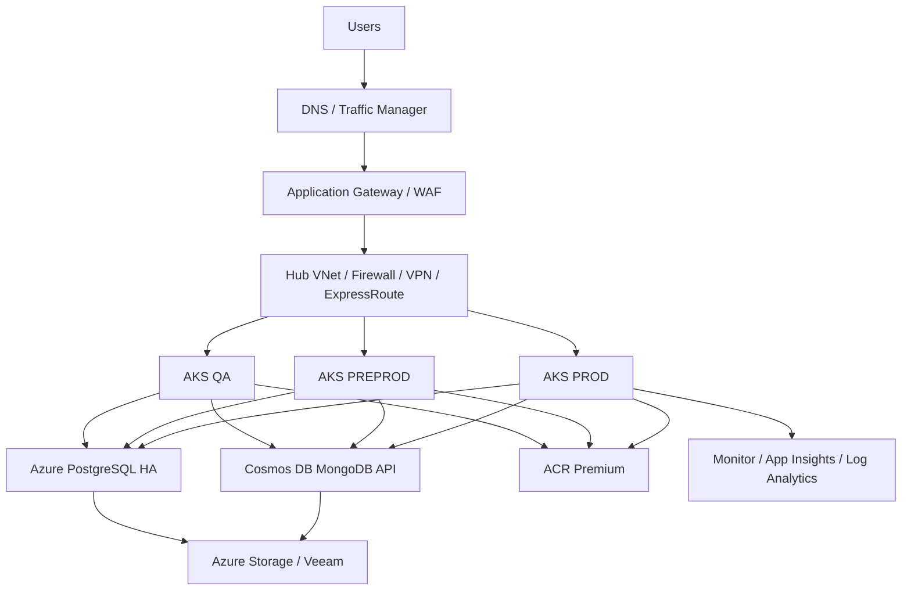

# Azure Current Architecture and Cost - 2026

**Decision:** Retain Azure in the near term and optimize before any migration.

## Architecture

## Resources and purpose

| Resource | Current role |
|---|---|
| AKS QA, PREPROD, PROD | Runs approximately 25 containerized microservices |
| PostgreSQL 13 HA | Relational data, backups, DR read replica |
| Cosmos DB MongoDB API | Users, sessions, events, cache, multi-region data |
| ACR Premium | Container images and build artifacts |
| Storage accounts | Application data, logs, artifacts, backup data |
| Veeam | VM/database/application backup to Azure storage |
| VNets, NSGs, VPN, ExpressRoute | Segmentation and hybrid connectivity |
| WAF, DNS, Bastion, Key Vault | Edge protection, name resolution, administration, secrets |
| Azure Monitor and ELK | Metrics, logs, alerts, application tracing |

## Compute, storage, and backup

| Area | Current repository basis |
|---|---|
| AKS workers | 16 visible workbook nodes; older architecture documents show 25-26 nodes, reconcile before resizing |
| PostgreSQL | Approximately 1 TB provisioned, approximately 650 GB used |
| Object/application storage | Approximately 1 TB application data plus logs and artifacts |
| Backup | Approximately 2 TB repository allocation; daily/incremental and weekly full policies |
| DR | Paired-region backup/read replica; RPO approximately 4 hours and RTO approximately 2 hours |

## Cost

| Cost view | Monthly | Annual | Three-year |
|---|---:|---:|---:|
| Authoritative Azure subscription baseline | **$23,754** | **$285,048** | **$855,144** |
| Architecture-mapped visible floor | $6,352 | $76,224 | $228,672 |
| Visible detail rows only | $9,011 | $108,132 | $324,396 |

The `$23,754/month` subscription total is the control total. The smaller numbers are incomplete mapping views and must not be treated as the full bill.

## People and operations

Azure minimizes incremental platform staffing because AKS, PostgreSQL, monitoring, networking, and backup are managed services. The team still needs application ownership, cloud security, FinOps, and vendor management. No new datacenter, hardware, VMware, or physical backup staff is required.

## Why Azure is best now

- Known actual bill and no migration disruption.
- No Cosmos DB replacement or database compatibility project.
- No new hardware, facilities, VMware licensing, or backup repository.
- Lowest immediate operational risk.

## Actions before final approval

1. Reconcile all seven subscription totals to resource IDs and owners.
2. Right-size AKS and apply autoscaling.
3. Validate or remove the QA Container Instance.
4. Apply storage lifecycle and backup retention policies.
5. Confirm the actual AKS node count and database/DR requirements.
