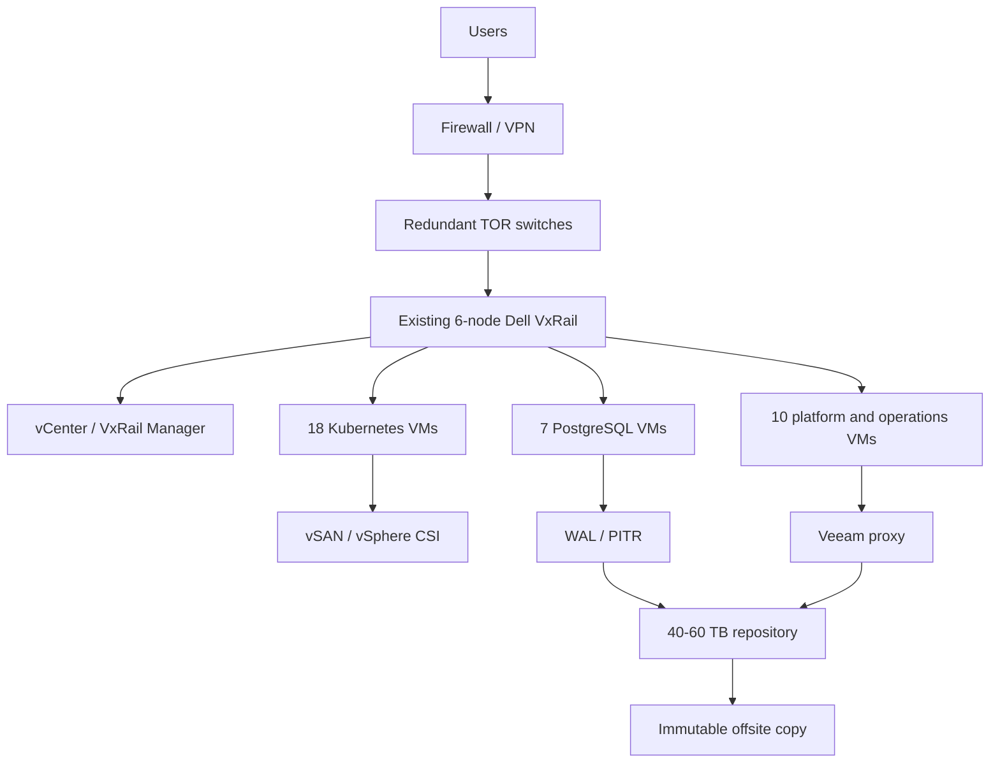

# Existing Six-Node VxRail Expansion - 2026

**Decision:** Preferred on-premises option, but only after memory and N+1 validation.

## Architecture

## Servers, VMs, and disks

| Workload | VM count | Size per VM | Total RAM | Storage |
|---|---:|---|---:|---:|
| Kubernetes control plane | 3 | 8 vCPU / 32 GB | 96 GB | 450 GB |
| QA workers | 3 | 12 vCPU / 48 GB | 144 GB | 600 GB |
| PREPROD workers | 9 | 16 vCPU / 64 GB | 576 GB | 2.25 TB |
| PROD workers | 12 | 24 vCPU / 96 GB | 1,152 GB | 3.6 TB |
| QA PostgreSQL | 1 | 8 vCPU / 32 GB | 32 GB | 600 GB |
| PREPROD PostgreSQL Patroni | 3 | 16 vCPU / 64 GB | 192 GB | 2.1 TB |
| PROD PostgreSQL Patroni | 3 | 32 vCPU / 128 GB | 384 GB | 4.5 TB |
| Platform/operations | 10 | 8 vCPU / 32 GB | 320 GB | 2.5 TB |
| **Finance model** | **35 instances** |  | **2.22-2.90 TB** | **14.2-16.6 TB** |

The repository has inconsistent summaries: the detailed role rows add to 44 allocations while the finance model calls the target 35 instances. The approved build sheet must resolve this before procurement.

## Existing cluster capacity

| Resource | Current state | Decision impact |
|---|---:|---|
| Hosts | 6 Dell VxRail nodes | Reuse sunk hardware |
| CPU | 721.75 GHz free | CPU is not the main constraint |
| Memory | 1.38 TB free | Binding constraint; add certified RAM |
| vSAN | 90.86 TB free | Storage is sufficient before policy/growth reserve |
| Resilience | N+1 target | Do not consume all free capacity |

## One-time expansion cost

| Item | Low | High |
|---|---:|---:|
| Certified RAM and installation | $120,000 | $300,000 |
| vSphere/vSAN entitlement uplift | $25,000 | $100,000 |
| Backup, network, power additions | $20,000 | $70,000 |
| Validation and implementation | $15,000 | $40,000 |
| **Expansion total** | **$180,000** | **$510,000** |

## Annual fully loaded operating cost

| Area | Low | High |
|---|---:|---:|
| Hardware, VMware, power/cooling | $145,000 | $390,000 |
| PostgreSQL and Mongo operations | $48,000 | $168,000 |
| Storage, backup, network, monitoring, security | $86,000 | $282,000 |
| People and operations | $180,000 | $400,000 |
| Refresh reserve | $15,000 | $40,000 |
| **Annual total** | **$390,000** | **$980,000** |

## Migration and platform choice

Migration is budgeted at **$180,000-$420,000** over approximately 20-28 weeks. Canonical Kubernetes is the lowest commercial platform cost at `$18,000-$55,000/year`; Rancher Prime is `$35,000-$90,000/year`; OpenShift is `$90,000-$180,000/year`.

## Why choose it

Choose expansion for data sovereignty, local latency, predictable utilization, or a funded datacenter strategy. Do not choose it solely because hardware already exists: DBA, platform, backup, security, power, support, and on-call work become internal responsibilities.
