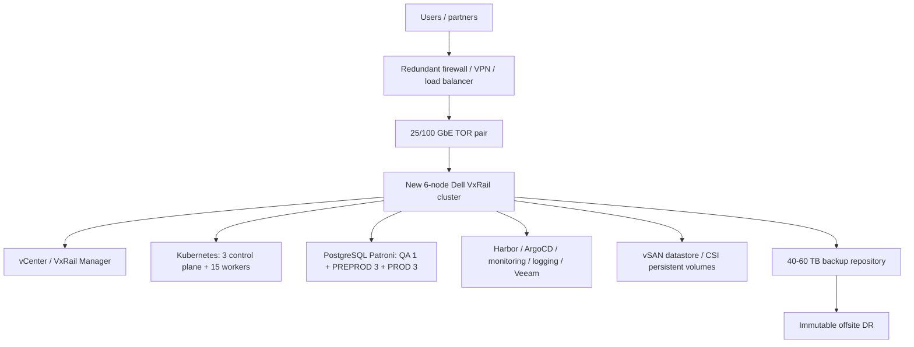

# New Dell VxRail Cluster - 2026

**Decision:** Buy only when existing capacity cannot be expanded or a separate lifecycle/security boundary is required.

## Architecture

## Physical and virtual design

| Layer | Required design |
|---|---|
| Cluster | 6 production Dell VxRail nodes, N+1 capacity |
| Virtualization | VMware vSphere/vCenter, VxRail Manager, vSAN |
| Kubernetes | 18 VM instances: 3 control plane and 15 workers across QA/PREPROD/PROD |
| Databases | 7 PostgreSQL VMs plus Mongo-compatible production replica set |
| Storage | vSAN for VM/PVC data; separate 40-60 TB backup repository |
| Network | Redundant TOR, management, vMotion, vSAN, Kubernetes, database, backup, ingress VLANs |
| Operations | Veeam, Kasten or equivalent, Harbor, ArgoCD, Prometheus, Grafana, ELK/Loki |

## Servers, disks, and capacity

The 35-VM planning model assigns approximately **556-724 vCPU, 2.22-2.90 TB RAM, and 14.2-16.6 TB logical storage** before vSAN policy overhead, snapshots, N+1 reserve, and growth. Final Dell node SKUs must be sized from measured workload demand, not this budgetary model alone.

## Initial acquisition budget

| Item | Low | High |
|---|---:|---:|
| Six Dell VxRail nodes | $600,000 | $1,200,000 |
| VMware/vSphere and management licensing | $150,000 | $400,000 |
| TOR switches, optics, cabling | $50,000 | $120,000 |
| Dedicated backup repository | $25,000 | $80,000 |
| Firewall, VPN, load balancing | $30,000 | $100,000 |
| Rack, UPS, PDUs, power | $50,000 | $150,000 |
| Commissioning and spares | $40,000 | $120,000 |
| Initial subtotal | $945,000 | $2,170,000 |
| **Approval envelope with contingency** | **$1,040,000** | **$2,390,000** |

## Annual and three-year TCO

| Cost | Low | High |
|---|---:|---:|
| Fully loaded annual operations | $390,000 | $980,000 |
| Migration program | $180,000 | $420,000 |
| **Three-year TCO** | **$2.39M** | **$5.75M** |

Operations include hardware support, VMware, power/cooling, backup/DR, security, Linux/Kubernetes support, DBA work, staffing, and refresh reserve. People cost assumes 2 FTE minimum and 3-4 FTE for realistic 24x7 ownership.

## Why choose it

Choose a new cluster for lifecycle isolation, compliance, a clean capacity block, or when the current VxRail cannot accept certified RAM while retaining N+1. It is the most expensive option and is not a cost-saving replacement for the measured Azure bill.

## Approval gates

- Dell/Broadcom configuration and support quote.
- Confirm rack, power, cooling, UPS, and network capacity.
- Validate backup repository, immutable offsite copy, and restore tests.
- Approve staffing and operational ownership.
- Complete PostgreSQL and Cosmos compatibility testing.
