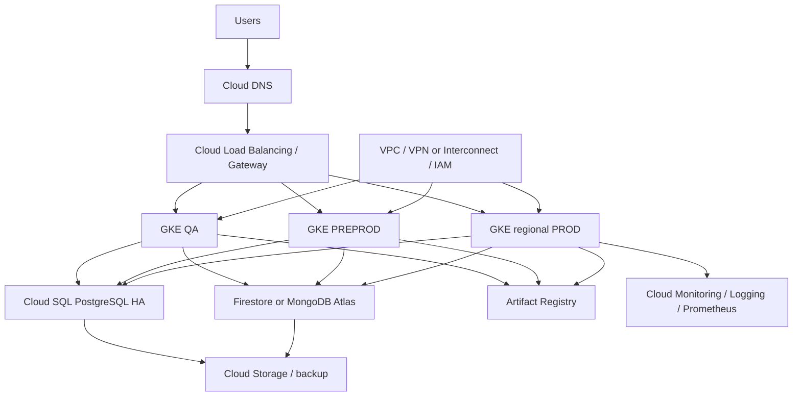

# GCP Architecture and Cost - 2026

**Decision:** Strategic cloud alternative; do not migrate to GCP for cost alone.

## Architecture

## Resource mapping

| Azure source | GCP target | Purpose / risk |
|---|---|---|
| AKS | GKE Standard, private nodes, regional PROD | Managed Kubernetes; manifests, ingress, IAM, and networking must be rebuilt |
| PostgreSQL | Cloud SQL HA, PITR, cross-region backup | Managed relational database; validate extensions and pooling |
| Cosmos DB MongoDB API | Firestore or MongoDB Atlas | No direct equivalent; API/query/index compatibility is the largest risk |
| ACR | Artifact Registry | Images, scanning, replication |
| Azure Storage | Cloud Storage lifecycle tiers | Application data, logs, artifacts, backup |
| Azure Monitor | Cloud Monitoring, Cloud Logging, Managed Prometheus | Metrics, logs, traces, alerts |
| VPN/ExpressRoute | VPC, Cloud VPN or Interconnect | Hybrid connectivity; Interconnect adds fixed cost |
| Veeam/Azure backup | Backup for GKE, Cloud SQL backups, Cloud Storage retention | Multiple services are needed for full recovery coverage |

## Compute, storage, and backup assumptions

| Area | Planning assumption |
|---|---|
| Kubernetes | GKE Standard, private nodes, QA/PREPROD isolation, regional PROD |
| Database | Cloud SQL HA with PITR and cross-region backup |
| Document data | Firestore or MongoDB Atlas after compatibility proof |
| Storage | Standard/Nearline/Coldline lifecycle policies |
| Logs | Retention and exclusions must be controlled; log volume drives cost |
| Backup | GKE, Cloud SQL, object storage, and optional third-party protection |
| Billing | 730 hours/month, one primary region, moderate traffic, no GPU workload |

## Monthly cost

| Area | Low | High |
|---|---:|---:|
| GKE and compute workers | $3,200 | $7,200 |
| GKE management | $75 | $300 |
| Cloud SQL PostgreSQL HA | $3,050 | $6,950 |
| Cosmos replacement | $1,150 | $4,400 |
| Storage and backup | $1,450 | $5,000 |
| Artifact Registry | $175 | $650 |
| Load balancing, VPC, VPN, DNS | $1,500 | $4,200 |
| Monitoring, logging, security | $2,150 | $5,900 |
| Visible range | $12,750 | $32,675 |
| **Approval envelope with support, egress, contingency** | **$14,000** | **$36,000** |

## One-time migration

| Workstream | Low | High |
|---|---:|---:|
| Landing zone, IAM, network, security | $15,000 | $35,000 |
| GKE and CI/CD/GitOps conversion | $20,000 | $45,000 |
| PostgreSQL and Cosmos-compatible migration | $20,000 | $55,000 |
| Images, secrets, storage, DNS, integrations | $15,000 | $35,000 |
| Testing, cutover, rollback, hypercare | $10,000 | $25,000 |
| **Total** | **$80,000** | **$195,000** |

Three-year steady-state planning is approximately **$584,000-$1.49M**, before making staffing and application remediation fully comparable with on-premises.

## People and operations

GCP reduces infrastructure ownership, but requires cloud platform engineering, SRE, data migration, FinOps, security, and application remediation. Cloud SQL reduces DBA infrastructure work; Cosmos replacement and data migration remain substantial risks.

## Why choose GCP

Choose GCP when GKE, BigQuery/analytics, global networking, Google-native services, or a committed-use agreement creates measurable business value. Require a pricing calculator export, egress model, retention model, and Cosmos compatibility proof before approval.
