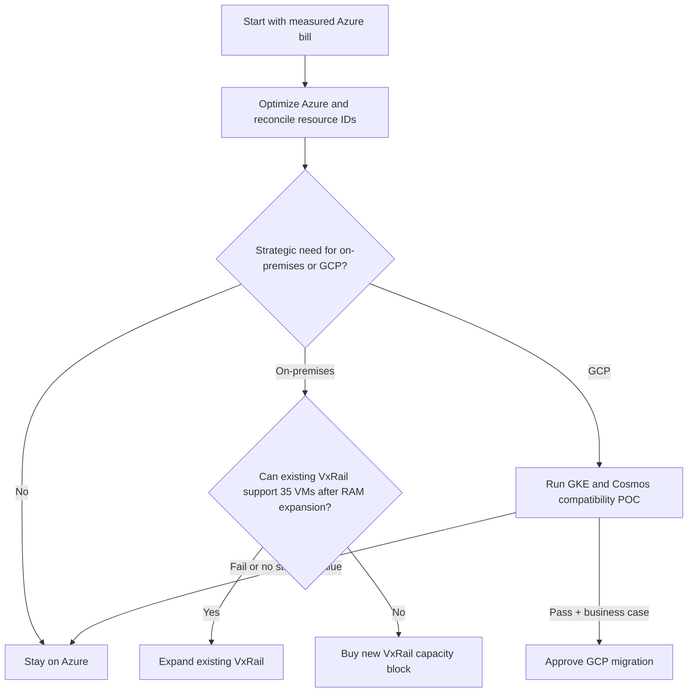

# Azure vs Existing VxRail vs New VxRail vs GCP

**Executive decision report | 2026-09-09**

## Final recommendation

**1. Azure:** best immediate financial and operational choice. It has a measured `$23,754/month` control total, no migration disruption, and clear optimization actions.

**2. Existing VxRail expansion:** preferred on-premises route when sovereignty, latency, or regulation requires on-premises. Expand certified memory and supporting capacity for the 35-VM plan; budget **$140k-$460k**, with a practical approval envelope of **$155k-$510k**. The current cluster has an estimated **844 GB RAM gap** against the 35-VM schedule before reserve.

**3. New VxRail:** only when the existing cluster cannot be expanded safely or a separate hardware boundary is required. Budget **$1.04M-$2.39M initially** and **$2.39M-$5.75M over three years**.

**4. GCP:** strategic cloud alternative, not a default cost-saving move. Budget **$14k-$36k/month** and **$80k-$195k migration** until actual pricing and Cosmos compatibility are proven.

## All-options comparison

| Option | Three-year planning cost | Migration effort | Primary benefit | Primary concern | Recommendation |
|---|---:|---|---|---|---|
| Azure existing | **$855,144** current bill | Low | Lowest risk; no platform migration | Monthly cloud spend | **Choose now and optimize** |
| Existing VxRail expansion | **$1.30M-$3.39M** in the 35-VM model | $180k-$420k | Sovereignty and reuse of hardware | RAM gap, staffing, maintenance | Choose if on-premises is required |
| New VxRail cluster | **$2.39M-$5.75M** | $180k-$420k | New capacity and lifecycle boundary | Capital and operations | Only if expansion fails |
| GCP | **$584k-$1.49M** planning estimate | $80k-$195k | GKE, analytics, Google ecosystem | Cosmos redesign and estimate uncertainty | POC only with strategic justification |

## Cost basis

- Azure: supplied workbook subscription total, not an illustrative architecture figure.
- Existing VxRail: 35 VMs, 556 vCPU, 2.22 TB RAM, 14.2 TB logical storage; expansion, operations, staffing, and migration included.
- New VxRail: six-node acquisition, VMware/vSAN licensing, network, backup, facilities, operations, and migration included.
- GCP: GKE, Cloud SQL, Cosmos replacement, registry, storage, backup, network, monitoring, contingency, and migration range.

## Decision flow

## Executive approval checklist

- [ ] Azure Cost Management export reconciled to current architecture.
- [ ] 35-VM sizing and ownership approved.
- [ ] Existing VxRail DIMM compatibility and N+1 admission control validated.
- [ ] Operations staffing budget approved: 2 FTE minimum; 3-4 FTE realistic for 24x7.
- [ ] Immutable offsite backup and restore testing approved.
- [ ] GCP pricing calculator and Cosmos compatibility proof completed before any cloud-to-cloud decision.

## Presentation conclusion

Choose **Azure now**. Choose **existing VxRail expansion** only for a clear on-premises requirement. Choose **new VxRail** only when expansion is technically impossible. Choose **GCP** only when its strategic capabilities outweigh migration risk and the commercial model is validated.
