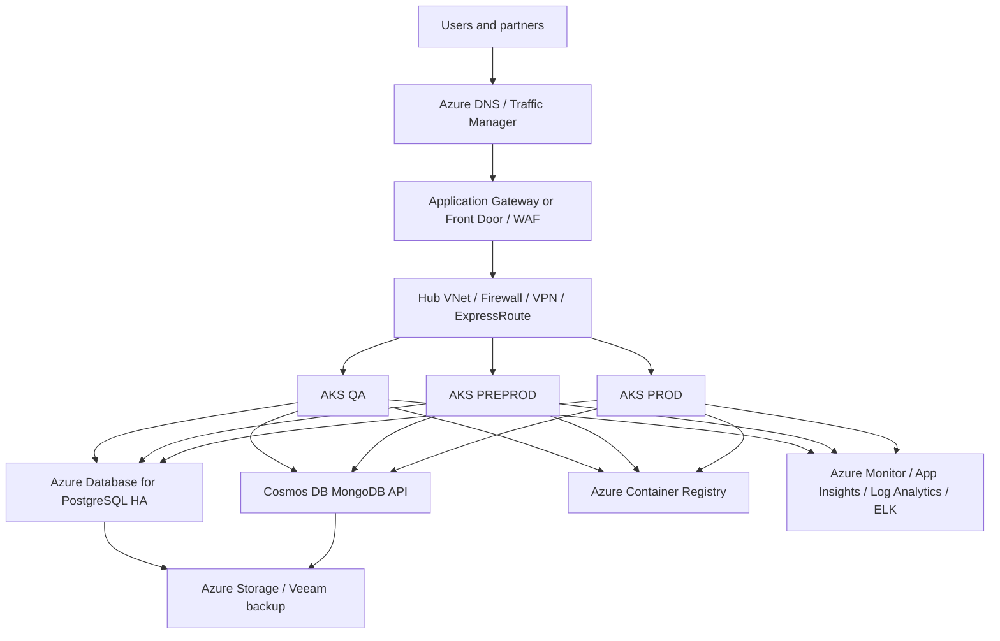
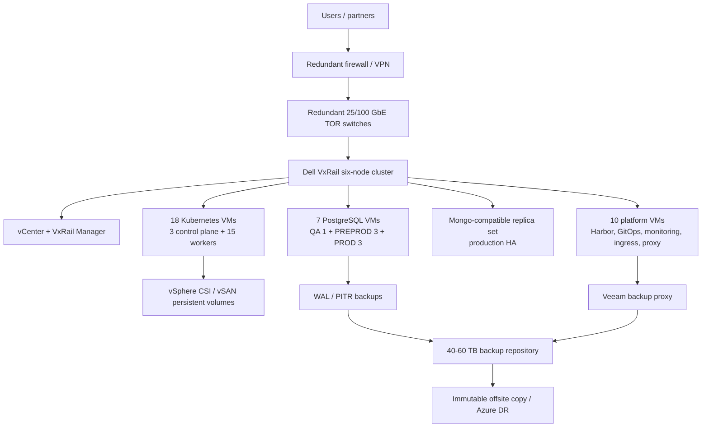
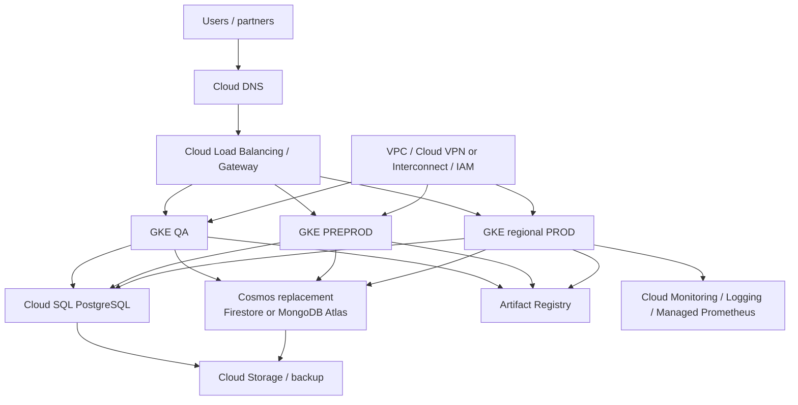

# Azure, Existing VxRail, New Dell Cluster, and GCP
## Full Architecture, VM Sizing, Cost, and Decision Report - 2026

**Prepared:** 2026-09-20  
**Source repository:** [Shasi19/Azure-VxRail-VMware-Migration](https://github.com/Shasi19/Azure-VxRail-VMware-Migration)  
**Primary source:** [19-Cost-Comparison-2026.md](../docs/Azure-VxRail-VMware-Migration/19-Cost-Comparison-2026.md)  
**Currency:** USD; budgetary planning ranges, not vendor quotations

> This report consolidates the repository's current Azure architecture, six-node VxRail design, 35-VM target schedule, new Dell/VxRail acquisition model, and GCP workstream. It includes infrastructure, software, backup, facilities, people, operating cost, and migration cost.

## 1. Executive Decision

| Option | Steady-state / operating view | One-time migration or acquisition | Three-year planning view | Decision |
|---|---:|---:|---:|---|
| Existing Azure | `$23,754/month` measured subscription baseline; `$855,144` for 3 years | Low / no platform migration | `$855,144` before growth and optimization | Best immediate financial and operational choice |
| Existing six-node VxRail expansion | `$390,000-$1,020,000/year` fully loaded operations | `$180,000-$510,000` expansion + `$180,000-$420,000` migration | `$1.53M-$3.99M` | Best on-premises route only when sovereignty, latency, or control is required |
| New six-node Dell VxRail cluster | `$390,000-$980,000/year` fully loaded operations | `$1.04M-$2.39M` acquisition + `$180,000-$420,000` migration | `$2.39M-$5.75M` | Buy only when existing capacity cannot be expanded or a separate lifecycle boundary is required |
| GCP | `$14,000-$36,000/month` approval envelope | `$80,000-$195,000` migration | `$584,000-$1.49M` steady-state planning range plus migration | Strategic cloud option; not a cost-only migration decision |

### Recommendation

1. **Near term:** retain Azure and optimize it while reconciling the `$23,754/month` Cost Management total to resource IDs.
2. **If on-premises is mandatory:** expand the existing VxRail only after Dell validates certified memory, host compatibility, and N+1 capacity. Use Canonical Kubernetes for lowest commercial platform cost or Rancher Prime for stronger multi-cluster governance.
3. **Do not buy a new Dell cluster to save money alone.** The new-cluster option carries major capital, support, facilities, staffing, and migration costs.
4. **Use GCP only with a business driver** such as GKE, Google analytics, global networking, or an existing commercial commitment, and only after a Cosmos DB compatibility proof of concept.

## 2. Existing Architecture

### 2.1 Current Azure architecture

| Layer | Existing resource and purpose |
|---|---|
| Application | Approximately 25 containerized microservices, including API gateway, authentication, user/order/payment services, Redis, and RabbitMQ |
| Kubernetes | AKS environments for QA, PREPROD, and PROD; visible workbook detail contains 16 AKS workers across four entries |
| PostgreSQL | Azure Database for PostgreSQL 13, HA, backup retention, and DR read replica |
| NoSQL | Cosmos DB using MongoDB API, multi-region replication, session/event/cache collections |
| Registry | Azure Container Registry Premium for images and artifacts |
| Storage | Azure Storage for application data, logs, artifacts, and backup repositories |
| Backup | Veeam Backup & Replication v12 plus Azure storage; database WAL/PITR and application backup policies |
| Network | VNets, NSGs, ExpressRoute, VPN Gateway, Bastion, load balancing, DNS, WAF, and Key Vault |
| Observability | Azure Monitor, Application Insights, Log Analytics, Prometheus/Grafana, and ELK |

### 2.2 Current Azure cost basis

The authoritative workbook control total is **$23,754/month** or **$285,048/year**, including seven subscription totals. The visible resource-detail rows total only `$9,011/month` and are incomplete. Directly mapped architecture rows total approximately `$6,352/month`, which is a scope floor, not the full bill.

| Azure mapped item | Visible monthly cost | Cost treatment |
|---|---:|---|
| AKS QA, PREPROD, PROD | `$2,370` | 16 visible AKS nodes; reconcile with target sizing |
| PostgreSQL | `$719` | Only named PREPROD row visible; confirm QA/PROD allocation |
| Cosmos DB MongoDB API | `$396` | QA, PREPROD, and PROD visible rows |
| Mapped Storage Accounts | `$2,298` | Application and backup storage rows |
| Named managed disk | `$330` | Include only after owner/resource mapping |
| Azure Bastion | `$239` | Visible mapped networking item |
| Architecture-mapped subtotal | **`$6,352`** | Partial planning floor |
| Subscription control total | **`$23,754`** | Use as current financial baseline |

## 3. On-Premises Target Architecture

### 3.1 Existing six-node cluster facts

| Resource | Current reported state | Effect on plan |
|---|---:|---|
| Hosts | 6 Dell VxRail nodes, one cluster | Reusable for on-premises option |
| CPU | 871.58 GHz capacity; 721.75 GHz free | CPU is not the controlling constraint |
| Memory | 4.5 TB total; 3.11 TB used; 1.38 TB free | Memory is the controlling constraint |
| vSAN | 247.66 TB total; 156.8 TB used; 90.86 TB free | Storage is sufficient for the 35-VM logical footprint, subject to policy overhead |
| Resilience | N+1 target, vSphere HA/DRS, vSAN FTT | Preserve reserve; do not consume all free capacity |
| Network | Redundant converged switching; management, vMotion, vSAN, Kubernetes, database, backup, and ingress VLANs | Validate ports, optics, throughput, MTU, and firewall rules |

### 3.2 Component purpose and on-premises equivalent

| Current Azure capability | On-premises implementation | Purpose |
|---|---|---|
| AKS | kubeadm Kubernetes on Oracle Linux VMs, Calico, MetalLB, vSphere CSI | Run microservices with environment isolation and persistent storage |
| Azure PostgreSQL | PostgreSQL 15 with Patroni, etcd, HAProxy/Keepalived | HA, automatic failover, WAL archiving, PITR |
| Cosmos DB MongoDB API | MongoDB-compatible service or Percona/MongoDB replica set | Replace document, event, session, and cache data; requires compatibility testing |
| ACR | Harbor with replication and vulnerability scanning | Private image registry, signing, scanning, and deployment source |
| Azure Storage | vSAN datastores plus MinIO and NFS/SMB where needed | Object, file, PVC, artifact, and application data |
| Azure Monitor/App Insights | Prometheus, Grafana, Alertmanager, ELK/Loki, exporters | Metrics, logs, alerting, dashboards, and audit evidence |
| Azure Backup/Veeam | Veeam VM backup, Kasten or equivalent namespace backup, PostgreSQL WAL/PITR | VM, Kubernetes, database, and immutable offsite recovery |
| Azure networking | vSphere distributed switches, VLANs, firewall zones, VPN, DNS, MetalLB | Segmentation, ingress, hybrid connectivity, and east-west control |
| Azure Bastion/Key Vault | Hardened bastion, MFA, Vault or equivalent secrets manager | Privileged administration and secret protection |

## 4. 35-VM Schedule for the Existing Six-Node Cluster

The target schedule below is the repository's finance/TCO model. It is intentionally larger than the workbook's 16 visible AKS worker nodes and must be approved before ordering.

| VM group | Count | Size per VM | Total vCPU | Total RAM | Logical storage |
|---|---:|---|---:|---:|---:|
| Kubernetes control plane, shared | 3 | 8 vCPU / 32 GB / 150 GB | 24 | 96 GB | 450 GB |
| QA Kubernetes workers | 3 | 12 vCPU / 48 GB / 200 GB | 36 | 144 GB | 600 GB |
| PREPROD Kubernetes workers | 9 | 16 vCPU / 64 GB / 250 GB | 144 | 576 GB | 2,250 GB |
| PROD Kubernetes workers | 12 | 24 vCPU / 96 GB / 300 GB | 288 | 1,152 GB | 3,600 GB |
| QA PostgreSQL | 1 | 8 vCPU / 32 GB / 600 GB | 8 | 32 GB | 600 GB |
| PREPROD PostgreSQL Patroni | 3 | 16 vCPU / 64 GB / 700 GB | 48 | 192 GB | 2,100 GB |
| PROD PostgreSQL Patroni | 3 | 32 vCPU / 128 GB / 1.5 TB | 96 | 384 GB | 4,500 GB |
| Platform and operations | 10 | 8 vCPU / 32 GB / 250 GB | 80 | 320 GB | 2,500 GB |
| **Detailed role-allocation total** | **44 listed role allocations** |  | **724** | **2,896 GB** | **16.6 TB** |

> The detailed role table above preserves the repository's listed resource requirements, but its role allocations sum to 44. The finance model calls the target **35 VM instances**: 18 Kubernetes VMs, 7 database VMs, and 10 platform/operations VMs. This is a source-document inconsistency that must be resolved, not silently averaged. Final VM inventory must be produced from the approved build sheet before purchase.

### 4.1 Kubernetes count

| Environment | Worker VMs | Shared control plane | Kubernetes VMs |
|---|---:|---:|---:|
| QA | 3 | Shared 3 | 6 logical memberships |
| PREPROD | 9 | Shared 3 | 12 logical memberships |
| PROD | 12 | Shared 3 | 15 logical memberships |
| **Physical VM instances** | **24** | **3** | **18** |

The workbook shows **16 visible AKS workers**. The difference is a reconciliation item, not an automatic requirement to buy hardware. Confirm whether one PROD node is omitted, whether autoscaling changed the snapshot, or whether the target design includes growth buffer.

### 4.2 Capacity gate

The repository reports approximately **1.38 TB free RAM**, while the 35-VM finance schedule assigns approximately **2.90 TB RAM** before vSphere overhead, vSAN policy overhead, N+1 reserve, snapshots, and growth. The conservative gap is therefore approximately **1.52 TB**. Another platform-costing view calculates a smaller **844 GB** gap using a lower 556-vCPU/2.22-TB model. Both views agree on the decision: **memory must be validated and probably expanded before all environments are placed on the current cluster.**

## 5. Existing VxRail Expansion Cost

### One-time expansion

| Item | Low | High | Purpose |
|---|---:|---:|---|
| Certified RAM kits and installation | `$120,000` | `$300,000` | Add approximately 1.5-2.0 TB supported memory |
| vSphere/vSAN entitlement uplift | `$25,000` | `$100,000` | License/core/capacity adjustment |
| Backup, network, and power additions | `$20,000` | `$70,000` | Repository, ports, optics, UPS/PDU, cabling |
| Capacity validation and implementation | `$15,000` | `$40,000` | Rebalance, evacuate, test, and acceptance |
| **Expansion total** | **`$180,000`** | **`$510,000`** | Existing six-node cluster retained |

### Fully loaded annual operating cost

| Cost area | Annual low | Annual high | Includes |
|---|---:|---:|---|
| VxRail hardware support | `$60,000` | `$150,000` | Parts, firmware, onsite response |
| VMware/vSphere/vSAN | `$50,000` | `$150,000` | Subscription, management, storage |
| PostgreSQL HA and DBA | `$36,000` | `$120,000` | Patroni, WAL/PITR, failover, patching |
| Mongo-compatible database | `$12,000` | `$48,000` | Replica set, backup, upgrades |
| Storage/PVC/object storage | `$6,000` | `$24,000` | vSAN, MinIO, snapshots, growth |
| Backup and offsite DR | `$25,000` | `$75,000` | Veeam, repository, immutable copy, restore tests |
| Network/firewall/VPN/DNS | `$12,000` | `$48,000` | Switching, security, certificates, connectivity |
| Monitoring and logging | `$18,000` | `$60,000` | Prometheus, Grafana, ELK/Loki, retention |
| OS/security/platform support | `$25,000` | `$75,000` | Linux, CVE response, hardening, vendor support |
| People and operations | `$180,000` | `$400,000` | 2 FTE minimum; 3-4 FTE realistic for 24x7 |
| Refresh and spare reserve | `$15,000` | `$40,000` | Lifecycle, replacement, test capacity |
| **Annual fully loaded total** | **`$390,000`** | **`$980,000`** | Use `$1.02M` high case where expansion uplift is included |

### On-premises Kubernetes platform choices

| Platform | Platform support/year | Common operations/month | Total monthly planning range | Best reason |
|---|---:|---:|---:|---|
| OpenShift | `$90,000-$180,000` | `$39,500-$106,700` | `$47,000-$121,700` | Enterprise controls, Red Hat support, certified operators |
| SUSE Rancher Prime | `$35,000-$90,000` | `$39,500-$106,700` | `$42,400-$114,200` | Multi-cluster governance and distribution flexibility |
| Canonical Kubernetes | `$18,000-$55,000` | `$39,500-$106,700` | `$41,000-$111,300` | Lowest commercial platform cost; more internal ownership |

**Recommendation:** Canonical for cost-sensitive internal teams; Rancher Prime when multi-cluster governance is worth the premium; OpenShift only with a clear Red Hat/compliance requirement.

### People and operational work

On-premises does not remove cost; it changes the cost owner. The operating model must fund VMware/VxRail, Linux/Kubernetes, DBA, backup, security, and on-call coverage. Two shared FTE is the minimum credible model. Three to four FTE is more realistic for production ownership, leave coverage, patching, incident response, restore testing, database failover, and 24x7 support.

Recurring work includes monthly OS and database patching, quarterly Kubernetes upgrades, quarterly VxRail lifecycle planning, monthly backup restore samples, quarterly full restore/failover tests, certificate and secret rotation, vulnerability remediation, and capacity reviews.

## 6. New Dell VxRail Cluster Cost

### Initial acquisition

| Item | Low | High |
|---|---:|---:|
| Six Dell VxRail nodes | `$600,000` | `$1,200,000` |
| VMware/vSphere and management licensing | `$150,000` | `$400,000` |
| 25/100 GbE TOR switches, optics, cabling | `$50,000` | `$120,000` |
| Dedicated 40-60 TB backup repository | `$25,000` | `$80,000` |
| Firewall, VPN, load balancing | `$30,000` | `$100,000` |
| Rack, UPS, PDUs, power distribution | `$50,000` | `$150,000` |
| Datacenter commissioning and spares | `$40,000` | `$120,000` |
| Initial subtotal | `$945,000` | `$2,170,000` |
| **Approval envelope with 10% contingency** | **`$1,040,000`** | **`$2,390,000`** |

Annual operating cost is **$390,000-$980,000**, covering hardware support, VMware, power/cooling, backup/DR, security/platform support, staffing, and refresh reserve. Add **$180,000-$420,000** for the migration program. Resulting three-year TCO is **$2.39M-$5.75M**.

A new cluster is justified when the existing cluster cannot accept supported memory, cannot preserve N+1, is at lifecycle end, lacks a separate security/failure boundary, or the organization needs a dedicated capacity block. It is not justified by an assumed Azure saving.

## 7. GCP Target Architecture

| Azure capability | GCP target | Purpose and risk |
|---|---|---|
| AKS | GKE Standard, private nodes, regional PROD | Managed Kubernetes and autoscaling; rebuild manifests, ingress, identity, and networking |
| PostgreSQL | Cloud SQL HA with PITR and cross-region backup | Managed database; validate extensions, sizing, pooling, and replication |
| Cosmos DB MongoDB API | Firestore or MongoDB Atlas on GCP | No automatic one-to-one replacement; query/index/API compatibility is the largest risk |
| ACR | Artifact Registry | Image replication, scanning, and deployment source |
| Azure Storage | Cloud Storage with lifecycle tiers | Application data, artifacts, logs, backup, and retention |
| Azure Monitor | Cloud Monitoring, Cloud Logging, Managed Prometheus | Metrics, logs, alerts, traces, and retention controls |
| VNet/VPN/ExpressRoute | VPC, Cloud VPN or Cloud Interconnect, Cloud DNS | Hybrid access; Interconnect adds fixed cost and is justified only for sustained traffic |
| Veeam/Azure backup | Backup for GKE, Cloud SQL backups, Cloud Storage retention, optional third-party backup | No single service replaces every VM/database/Kubernetes recovery requirement |

### GCP monthly budgetary model

| Cost area | Monthly low | Monthly high |
|---|---:|---:|
| GKE and Compute Engine worker capacity | `$3,200` | `$7,200` |
| GKE cluster management | `$75` | `$300` |
| Cloud SQL PostgreSQL HA | `$3,050` | `$6,950` |
| Cosmos replacement | `$1,150` | `$4,400` |
| Cloud Storage and backup | `$1,450` | `$5,000` |
| Artifact Registry | `$175` | `$650` |
| Load balancing, VPC, VPN, DNS | `$1,500` | `$4,200` |
| Monitoring, logging, security | `$2,150` | `$5,900` |
| Visible model range | `$12,750` | `$32,675` |
| **Approval envelope with support, egress variability, and contingency** | **`$14,000`** | **`$36,000`** |

### One-time GCP migration

| Workstream | Low | High |
|---|---:|---:|
| Discovery, landing zone, IAM, network, security | `$15,000` | `$35,000` |
| GKE, CI/CD, and GitOps conversion | `$20,000` | `$45,000` |
| PostgreSQL and Cosmos-compatible data migration | `$20,000` | `$55,000` |
| Images, secrets, storage, DNS, integrations | `$15,000` | `$35,000` |
| Testing, cutover, rollback, hypercare | `$10,000` | `$25,000` |
| **Total** | **`$80,000`** | **`$195,000`** |

GCP's three-year steady-state range is approximately **$584,000-$1.49M**, before treating all staffing and application remediation consistently with the on-premises model. The low end must not be compared with Azure until egress, backup retention, support, logging, and database semantics are normalized.

## 8. Cost Comparison Including People and Operations

| Cost dimension | Azure | Existing VxRail expansion | New Dell cluster | GCP |
|---|---|---|---|---|
| Compute/platform | Managed AKS and Azure services in measured bill | Existing hosts, but VMware/vSAN and platform support remain | New hardware plus VMware/vSAN | GKE and compute usage |
| Database operations | Mostly managed | DBA, Patroni, failover, PITR, upgrades owned internally | Same, plus new platform | Cloud SQL managed; Cosmos replacement risk |
| Kubernetes operations | Azure platform reduces lifecycle work | Kubernetes upgrades, CNI, CSI, registry, ingress owned internally | Same, with new hardware lifecycle | GKE reduces control-plane burden, but application/platform migration remains |
| Backup/DR | Veeam/Azure storage and managed backups | Repository, immutable copy, restore tests, WAL/PITR | New repository and DR design | Multiple GCP backup products; data egress and retention matter |
| People | Lowest incremental staffing burden | 2 FTE minimum; 3-4 FTE realistic | 2-4 FTE plus datacenter operations | Cloud engineering, SRE, data migration, and FinOps effort |
| Facilities | Included in cloud service prices | Existing datacenter power/cooling must be allocated | New rack, UPS, power, cooling, spares | Cloud facilities are provider-managed |
| Migration | None if retained | `$180k-$420k` | `$180k-$420k` | `$80k-$195k` plus Cosmos remediation risk |
| Main uncertainty | Unallocated Azure subscription costs | Memory headroom and staffing allocation | Quote, licensing, facilities, staffing | Cosmos compatibility, egress, logs, discounts |

## 9. Why This Is the Best Decision

### Best immediate decision: Azure

Azure has the only measured and currently operating baseline: `$23,754/month`. Retaining it avoids migration downtime, application redesign, Cosmos replacement, data transfer, and new operational ownership. The first action should be Cost Management reconciliation, AKS autoscaling, QA Container Instance validation/removal, database right-sizing, and storage lifecycle tuning.

### Best on-premises decision: expand existing VxRail, conditionally

Existing VxRail reuses sunk hardware and can provide sovereignty, predictable local latency, and control over data placement. It is only financially credible when datacenter, support, and staff costs are already funded or shared across other workloads. The memory gap and N+1 requirement must be resolved first.

### New Dell cluster: technically clean, financially weakest

A new cluster gives a clean lifecycle and capacity boundary, but it adds up to `$2.39M` of initial capital, new licensing, facilities, backup, support, and staffing. It should be approved for capacity, lifecycle, isolation, or compliance reasons, not as a generic cloud-cost reduction.

### GCP: best only for strategic cloud value

GCP offers GKE, strong global networking, analytics, and Google-native services. It does not remove the migration burden and has no direct Cosmos DB equivalent. The GCP case is valid when those capabilities have measurable business value or a committed-use agreement materially changes the price.

## 10. Approval Gates

- Reconcile Azure's `$23,754/month` subscription total to resource IDs, owners, and architecture components.
- Confirm whether the final Kubernetes target is 16 visible AKS workers or 15 on-premises workers plus 3 shared control-plane VMs.
- Produce an authoritative 35-VM build sheet; resolve the repository's summarized count differences before procurement.
- Obtain Dell/Broadcom quotes for DIMMs, VxRail support, vSphere/vSAN entitlement, and N+1 capacity.
- Verify Veeam VUL/workload entitlement and size the repository from retention and deduplication tests.
- Approve at least 2 FTE shared operations; use 3-4 FTE for realistic 24x7 production ownership.
- Test PostgreSQL extensions, failover, WAL/PITR, and restore timing.
- Run Cosmos-to-MongoDB/Firestore compatibility testing before on-premises or GCP commitment.
- Define immutable offsite backup, restore tests, RTO/RPO, and security ownership.
- Replace all planning ranges with vendor quotes and a normalized three-year TCO before financial approval.

## 11. Repository References

- [Current Azure architecture](../docs/Azure-VxRail-VMware-Migration/02-Current-State-Architecture.md)
- [On-premises target architecture](../docs/Azure-VxRail-VMware-Migration/03-Target-State-Architecture.md)
- [Azure vs on-premises cost comparison](../docs/Azure-VxRail-VMware-Migration/19-Cost-Comparison-2026.md)
- [On-premises Dell VxRail TCO](../docs/Azure-VxRail-VMware-Migration/21-OnPrem-VxRail-TCO-2026.md)
- [Kubernetes platform costing](../deliverables/Platform-Costing-Comparison-2026.md)
- [GCP architecture and cost](../docs/GCP-Migration/01-GCP-Architecture-and-Cost.md)
- [All-options decision](../deliverables/Azure-OnPrem-GCP-Decision-2026.md)
- [GKE pricing](https://cloud.google.com/kubernetes-engine/pricing)
- [Cloud SQL pricing](https://cloud.google.com/sql/pricing)
- [Cloud Storage pricing](https://cloud.google.com/storage/pricing)
- [Google Cloud Pricing Calculator](https://cloud.google.com/products/calculator)
