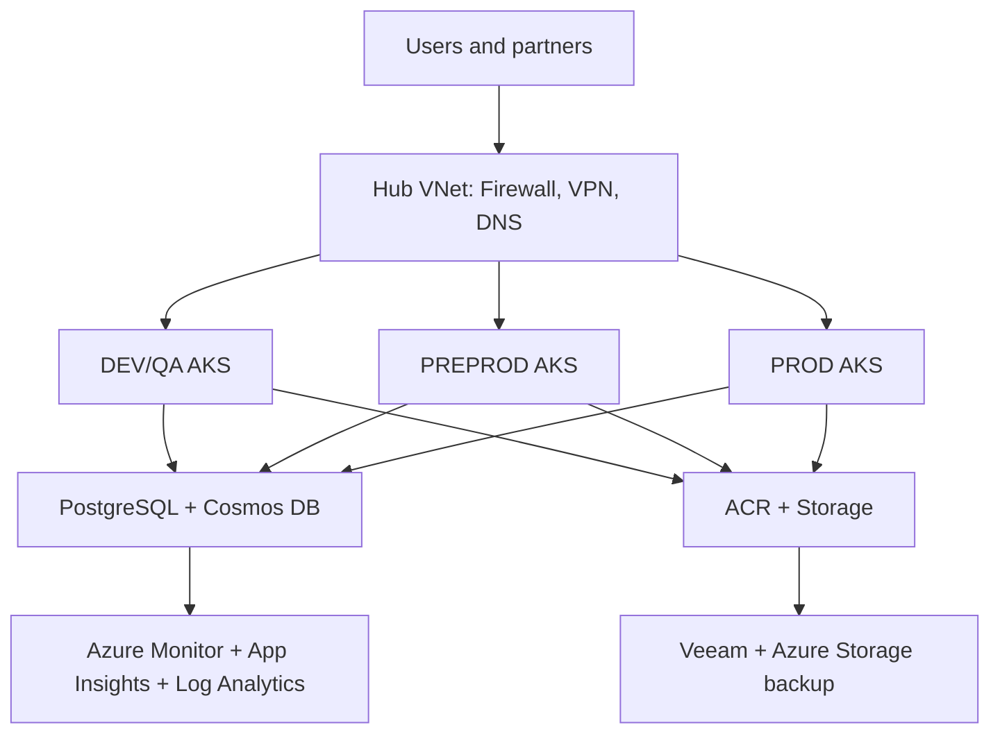
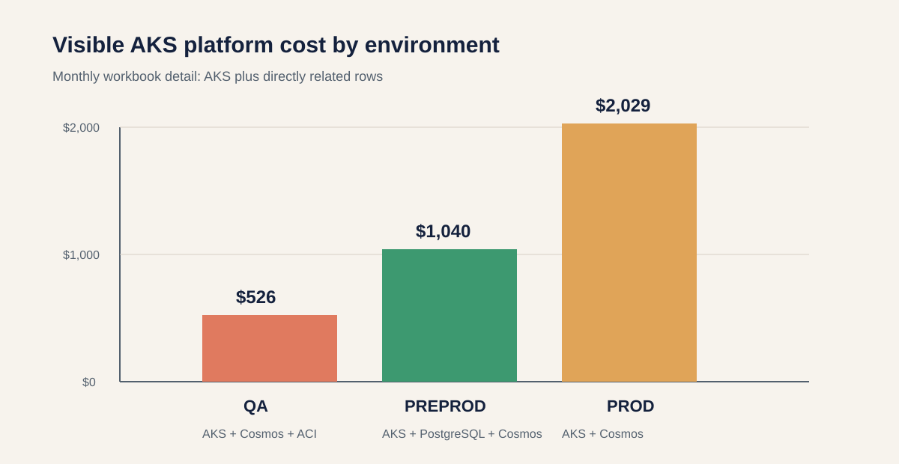

# Current Azure Architecture and Cost (Final Presentation Report)

**Date:** 2026-09-09  
**Source:** [Current architecture](../docs/Azure-VxRail-VMware-Migration/01-Architecture-Overview.md) and supplied workbook `DI_Cost_Optimization_2026.xlsx`

## Executive Summary

The current architecture contains hub-and-spoke VNets, four AKS environments, Cosmos DB, PostgreSQL Flexible Server, ACR, Storage Accounts, VPN/Firewall/DNS, Application Gateway/WAF, monitoring, and backup.

The supplied workbook gives the financial control total of **$23,754/month** or **$285,048/year**. The architecture-mapped rows visible in the workbook total **$6,352/month**, but this is only a floor because ACR, monitoring, shared networking, and several database/networking resources are not separately identifiable in the workbook detail.

**Recommendation:** retain Azure in the immediate term and optimize the current architecture. Do not compare on-premises or GCP against only the AKS line item; use the full subscription control total and reconcile all architecture resources by resource ID.

## Current Architecture

| Architecture component | Current configuration | Cost treatment |
|---|---|---|
| AKS | DEV/QA, PREPROD, PROD; system and user pools; PROD spot pool | Workbook-visible AKS rows: **$2,370/month** |
| Cosmos DB MongoDB API | Non-prod throughput and production multi-region/auto-scale | Workbook-visible rows: **$396/month** |
| PostgreSQL Flexible Server | HA production, read replica, backups | One visible PREPROD row: **$719/month**; full estate requires Cost Management export |
| ACR | Standard non-prod, Premium/geo-replicated production | Not separately identified in visible workbook rows |
| Storage | Blob, queue, logs, backups, artifacts; production geo-redundancy | Mapped visible storage: **$2,298/month** |
| Network/security | VPN Gateway, Firewall, DNS, WAF/Application Gateway, Bastion, ExpressRoute | Bastion visible: **$239/month**; remainder requires resource mapping |
| Monitoring/backup | Azure Monitor, App Insights, Log Analytics, ELK, Veeam | Not fully separately identified; do not omit from comparison |

## Workbook Cost View

| View | Monthly | Annualized | Meaning |
|---|---:|---:|---|
| Full Azure subscription control total | **$23,754** | **$285,048** | Use for financial baseline |
| Visible architecture-mapped floor | **$6,352** | **$76,224** | Directly mapped rows only; incomplete |
| Visible workbook detail subtotal | **$9,011** | **$108,132** | Reconciliation control, not migration scope |

## Environment view

| Environment | AKS cost | Directly related visible rows | Partial platform total |
|---|---:|---|---:|
| QA | $284/month | Cosmos $132 + Container Instance $110 | **$526** |
| PREPROD | $189/month | PostgreSQL $719 + Cosmos $132 | **$1,040** |
| PROD | $1,897/month | Cosmos $132 | **$2,029** |

## Optimization Actions

1. Reconcile all resource IDs from Cost Management to the architecture inventory.
2. Apply AKS autoscaling after application-owner approval.
3. Validate and remove the unused QA Container Instance if confirmed.
4. Apply lifecycle management only to mapped application and backup storage.
5. Validate high-CPU VMs before resizing or migrating them.
6. Measure log, backup, egress, WAF, and shared-networking spend separately.

## Decision

Azure is the best immediate option because it has the lowest migration risk and a measured actual bill. GCP requires a cloud-to-cloud rebuild; on-premises requires capacity expansion and operational ownership. Revisit the decision after Azure optimization and a resource-level reconciliation.

## Official Azure pricing verification links

- [Azure Pricing Calculator](https://azure.microsoft.com/en-us/pricing/calculator/)
- [AKS pricing](https://azure.microsoft.com/en-us/pricing/details/kubernetes-service/)
- [Azure Database for PostgreSQL Flexible Server pricing](https://azure.microsoft.com/en-us/pricing/details/postgresql/flexible-server/)
- [Azure Cosmos DB pricing](https://azure.microsoft.com/en-us/pricing/details/cosmos-db/)
- [Azure Container Registry pricing](https://azure.microsoft.com/en-us/pricing/details/container-registry/)
- [Azure Blob Storage pricing](https://azure.microsoft.com/en-us/pricing/details/storage/blobs/)
- [Azure VPN Gateway pricing](https://azure.microsoft.com/en-us/pricing/details/vpn-gateway/)
- [Azure Firewall pricing](https://azure.microsoft.com/en-us/pricing/details/azure-firewall/)
- [Azure Application Gateway pricing](https://azure.microsoft.com/en-us/pricing/details/application-gateway/)
- [Azure Monitor pricing](https://azure.microsoft.com/en-us/pricing/details/monitor/)
- [Azure DNS pricing](https://azure.microsoft.com/en-us/pricing/details/dns/)
