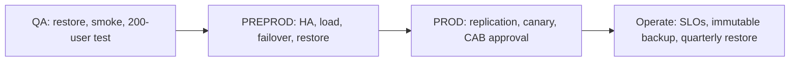
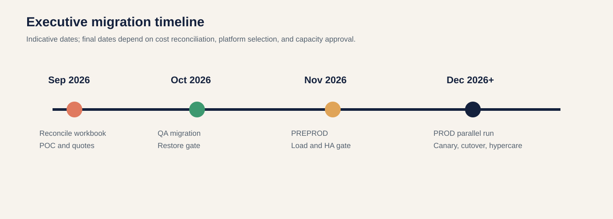

# Executive AKS Cost and Migration Pack (V2)

**Audience:** CTO, directors, finance, and migration steering committee  
**Decision:** Validate QA, prove PREPROD, and gate PROD on restore, replication, and capacity evidence.

## Environment costs from workbook

| Environment | AKS nodes | AKS/month | Partial visible platform total |
|---|---:|---:|---:|
| QA | 3 | $284 | **$526** |
| PREPROD | 2 | $189 | **$1,040** |
| PROD | 11 across two rows | $1,897 | **$2,029** |
| **Total** | **16** | **$2,370** | **$3,595** |

## Gated migration flow

## Timeline

## Operating model

| Capability | QA | PREPROD | PROD |
|---|---|---|---|
| Backup | Weekly namespace; DB as needed | Daily namespace and DB | Frequent WAL, daily namespace, immutable offsite copy |
| Restore testing | Before sign-off | Monthly during migration | Quarterly full restore; annual DR exercise |
| Ownership | Platform + QA | Platform + DBA + performance | 24x7 platform, DBA, security, network, service owner |

## Executive risks

- Workbook PROD shows 11 AKS nodes while the target design plans 12 workers plus 3 control-plane VMs.
- VxRail free memory is below the full target design; capacity approval is required.
- Logical replication must be proven for the exact Azure PostgreSQL service before promising zero-downtime migration.
- RPO must be the last confirmed replication point, not automatically zero.
- Same-site NAS is not enough for site-loss DR; require an immutable offsite copy.

## New VxRail purchase impact

If a new six-node cluster is purchased, budget **$1.04M-$2.39M initially**, **$390k-$980k/year operationally**, and **$2.39M-$5.75M over three years including migration**. See [V3 full TCO](./OnPrem-VxRail-TCO-2026-V3.md).

## Recommendation

Azure is the best immediate financial and operational choice. On-premises should proceed only when sovereignty, latency, regulation, or existing datacenter strategy justifies the additional capital and operating burden.
