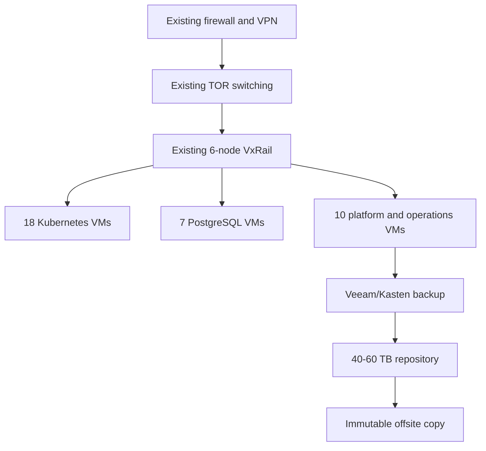

# Existing Dell VxRail Expansion for 35 VMs

**Date:** 2026-09-09  
**Decision:** Add capacity to the existing six-node VxRail cluster; do not buy a new cluster.

## Executive Summary

This report models a literal **35-VM planning scenario**:

- 18 Kubernetes VMs: 3 control-plane, 3 QA workers, 3 PREPROD workers, 9 PROD workers.
- 7 database VMs: 1 QA PostgreSQL, 3 PREPROD Patroni, 3 PROD Patroni.
- 10 platform/operations VMs: registry, GitOps, monitoring/logging, ingress/VPN/bastion, and backup proxy.

The schedule requires approximately **556 vCPU, 2.22 TB RAM, and 16.6 TB logical storage**. The repository reports **1.38 TB free RAM** and **90.86 TB free storage**, so the binding gap is approximately **844 GB RAM** after allowing no additional N+1 reserve. Final Dell host compatibility and vSphere admission-control calculations are mandatory.

## Architecture

## 35-VM sizing schedule

| VM group | Count | Per VM | Total vCPU | Total RAM | Storage |
|---|---:|---|---:|---:|---:|
| Kubernetes control plane | 3 | 8 vCPU / 32 GB / 150 GB | 24 | 96 GB | 450 GB |
| QA workers | 3 | 12 vCPU / 48 GB / 200 GB | 36 | 144 GB | 600 GB |
| PREPROD workers | 3 | 16 vCPU / 64 GB / 250 GB | 48 | 192 GB | 750 GB |
| PROD workers | 9 | 24 vCPU / 96 GB / 300 GB | 216 | 864 GB | 2,700 GB |
| QA PostgreSQL | 1 | 8 vCPU / 32 GB / 600 GB | 8 | 32 GB | 600 GB |
| PREPROD PostgreSQL | 3 | 16 vCPU / 64 GB / 700 GB | 48 | 192 GB | 2,100 GB |
| PROD PostgreSQL | 3 | 32 vCPU / 128 GB / 1.5 TB | 96 | 384 GB | 4,500 GB |
| Platform/operations | 10 | 8 vCPU / 32 GB / 250 GB | 80 | 320 GB | 2,500 GB |
| **Total** | **35** | | **556** | **2,224 GB** | **14.2 TB** |

Storage is shown as logical VM disks. Add vSAN policy overhead, snapshots, growth, and N+1 reserve before final sizing.

## One-time expansion cost

| Item | Low | High |
|---|---:|---:|
| 0.85-1.5 TB certified Dell RAM expansion and installation | $80,000 | $250,000 |
| vSphere/vSAN entitlement uplift | $25,000 | $100,000 |
| Backup, network, optics, UPS/PDU additions | $20,000 | $70,000 |
| Capacity validation, rebalance, burn-in, acceptance | $15,000 | $40,000 |
| **Expansion total** | **$140,000** | **$460,000** |

Recommended approval envelope: **$155,000-$510,000** after contingency. The exact memory quantity depends on DIMM population and the current VxRail model.

## Annual operating cost

| Category | Low/year | High/year |
|---|---:|---:|
| Existing hardware/support uplift | $15,000 | $40,000 |
| VMware/vSAN subscription uplift | $25,000 | $100,000 |
| Backup/offsite storage and support | $25,000 | $75,000 |
| OS/security/certificates/platform support | $25,000 | $75,000 |
| Operations staffing allocation | $180,000 | $400,000 |
| Power/cooling and refresh reserve | $50,000 | $130,000 |
| **Annual total** | **$320,000** | **$820,000** |

Operational effort includes monthly OS/CVE patching, quarterly Kubernetes upgrades, vSphere/VxRail lifecycle windows, database failover and PITR testing, backup restore tests, certificate rotation, security remediation, capacity reviews, incidents, and on-call. Two FTE is a minimum shared model; 3-4 FTE is more realistic for 24x7 production ownership.

## Migration effort

**$180,000-$420,000 over 20-28 weeks**, covering discovery, platform build, QA, PREPROD rehearsal, PROD replication/cutover, security, governance, and hypercare.

## Three-year comparison

| Option | Initial expansion | Migration | 3-year operations | Total |
|---|---:|---:|---:|---:|
| Azure current bill | $0 | $0 | $855,144 | **$855,144** |
| Existing VxRail expansion - low | $155,000 | $180,000 | $960,000 | **$1,295,000** |
| Existing VxRail expansion - high | $510,000 | $420,000 | $2,460,000 | **$3,390,000** |

## Justification

Choose this option when data sovereignty, latency, regulatory control, or datacenter ownership matters. It reuses the current cluster and avoids a second six-node purchase. Do not approve until the VxRail model, DIMM compatibility, admission control, and 24x7 operating ownership are confirmed.
