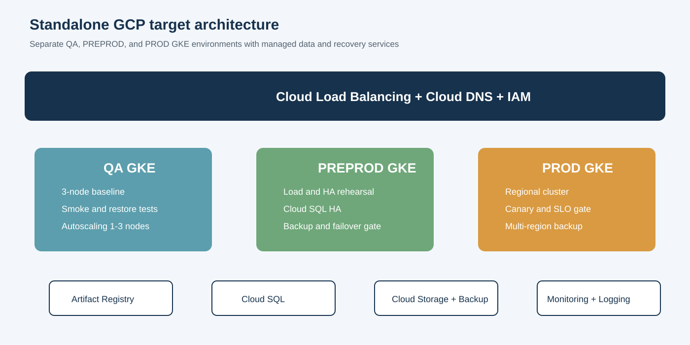
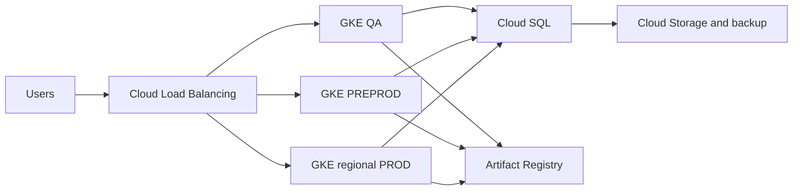

# GCP vs Azure vs On-Premises (Standalone GCP V1)

**This report is intentionally separate from the Azure/on-premises workstream.**

## Recommendation

- **Best immediate choice:** Azure, because it is the current operating platform with a measured `$23,754/month` baseline and no cloud-to-cloud migration disruption.
- **Best full-purchase on-premises choice:** only when sovereignty, latency, regulation, or datacenter strategy justifies a new VxRail TCO of `$2.39M-$5.75M` over three years.
- **Best cloud alternative:** GCP when GKE, Google analytics, global networking, or negotiated commercial value is strategically important.

## Three-way side-by-side comparison

| Option | Three-year planning cost | One-time migration | Capacity / operations | Decision |
|---|---:|---:|---|---|
| Azure existing | $855,144 current bill | Low | Managed platform; optimize current resources | Best immediate choice |
| Existing VxRail expansion for 35 VMs | $1.53M-$3.99M | $180k-$420k | Add about 1.52 TB RAM; operate 35 VMs | Best on-premises route if sovereignty is required |
| New six-node VxRail for 35 VMs | $2.39M-$5.75M | $180k-$420k | New hardware, licenses, facilities, and operations | Only if existing hosts cannot be expanded |
| GCP | Approximately $584k-$1.49M steady-state plus $80k-$195k migration | $80k-$195k | GKE, Cloud SQL, Cosmos replacement, managed operations | Best alternative cloud for strategic GCP value |

## GCP budget

- Steady-state planning range: **$14,000-$36,000/month** including contingency.
- One-time migration: **$80,000-$195,000**.
- Main uncertainty: Cosmos DB replacement and application compatibility.

## GCP target architecture

## Environment baseline

| Environment | AKS nodes | AKS/month | Partial visible platform total |
|---|---:|---:|---:|
| QA | 3 | $284 | **$526** |
| PREPROD | 2 | $189 | **$1,040** |
| PROD | 11 | $1,897 | **$2,029** |
| **Total** | **16** | **$2,370** | **$3,595** |

## GCP monthly cost model

| Area | Monthly range |
|---|---:|
| GKE and Compute Engine | $3,200-$7,200 |
| GKE management | $75-$300 |
| Cloud SQL | $3,050-$6,950 |
| Cosmos replacement | $1,150-$4,400 |
| Storage and backup | $1,450-$5,000 |
| Registry, network, monitoring, security | $3,825-$8,825 |
| **Calculated total** | **$12,750-$32,675** |
| **Approval envelope** | **$14,000-$36,000** |

## Decision gates

1. Reconcile Azure Cost Management by resource ID.
2. Build a GCP Pricing Calculator model with actual region, traffic, log, backup, and database assumptions.
3. Complete a Cosmos compatibility proof.
4. Prove GKE latency, availability, security, and restore.
5. Approve a three-year TCO and migration business case.

Full source report: [01-GCP-Architecture-and-Cost.md](../docs/GCP-Migration/01-GCP-Architecture-and-Cost.md)
