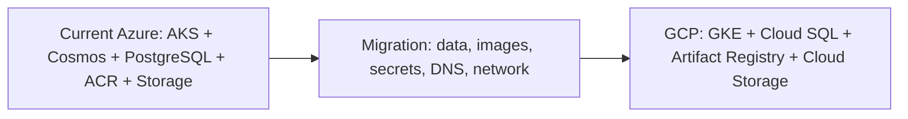

# GCP vs Azure Comparison

**Date:** 2026-09-09  
**Scope:** Current Azure architecture from `01-Architecture-Overview.md` compared with a GCP GKE target.

## Recommendation

Keep Azure immediately and optimize it. Choose GCP only when GKE, Google analytics, global networking, or negotiated Google commercial value creates a strategic benefit greater than the migration and Cosmos DB replacement risk.

## Architecture mapping

| Azure | GCP |
|---|---|
| AKS | GKE Standard; separate QA, PREPROD, and regional PROD |
| PostgreSQL Flexible Server | Cloud SQL for PostgreSQL with HA/PITR |
| Cosmos DB MongoDB API | Firestore, MongoDB Atlas on GCP, or application redesign; no automatic equivalence |
| ACR | Artifact Registry |
| Blob/queue storage | Cloud Storage and Pub/Sub where queue semantics require it |
| Azure Monitor/App Insights | Cloud Monitoring, Logging, Managed Service for Prometheus |
| VPN/ExpressRoute/Firewall | VPC, Cloud VPN or Interconnect, firewall policies |
| Azure Backup/Veeam | Backup for GKE, Cloud SQL backups, Cloud Storage retention, and optional third-party backup |

## Cost comparison

| Cost area | Azure current | GCP planning model |
|---|---:|---:|
| Monthly run rate | **$23,754 measured subscription total** | **$14,000-$36,000 approval envelope** |
| Annualized run rate | $285,048 | $168,000-$432,000 |
| One-time migration | Low | $80,000-$195,000 |
| Three-year service cost | $855,144 | $504,000-$1,296,000 |
| Three-year including migration | $855,144 | **$584,000-$1,491,000** |

The GCP range is not a quote. It depends on region, GKE compute mode, Cloud SQL HA, Cosmos replacement, egress, log volume, backup retention, and committed-use discounts.

## Side-by-side decision

| Factor | Azure | GCP |
|---|---|---|
| Migration risk | Low; current platform | High; cloud-to-cloud rebuild |
| Database risk | Current services already operate | Cosmos compatibility is the main risk |
| Cost confidence | Measured bill | Budgetary estimate until calculator model is built |
| Operations | Azure managed services | GCP managed services, but new platform skills required |
| Best justification | Immediate stability and optimization | GKE/analytics/global strategy or negotiated commercial value |

## Approval gates

1. Reconcile Azure Cost Management to the architecture by resource ID.
2. Build a GCP Pricing Calculator export using real region, traffic, logs, backup, and HA assumptions.
3. Complete a Cosmos DB compatibility proof.
4. Prove GKE performance, security, restore, and SLOs.
5. Approve the three-year business case before production migration.
