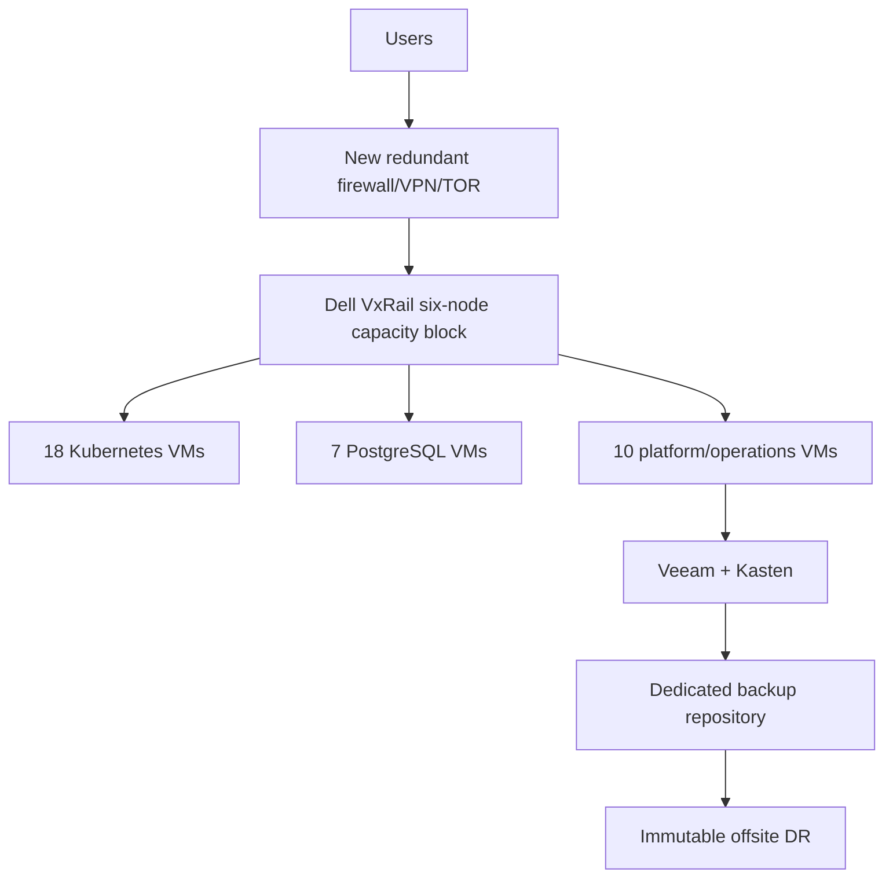

# New Dell VxRail Capacity Block for 35 VMs

**Date:** 2026-09-09  
**Decision:** Buy a new six-node VxRail cluster only if the existing cluster cannot be expanded safely.

## Executive Summary

The same 35-VM planning schedule requires approximately **556 vCPU, 2.22 TB RAM, and 14.2 TB logical storage**. A new six-node VxRail capacity block provides a clean N+1 boundary, new support terms, and independent lifecycle management, but it adds substantial capital cost.

## New-cluster architecture

## Acquisition budget

| Category | Low | High |
|---|---:|---:|
| Six production VxRail nodes | $600,000 | $1,200,000 |
| VMware/vSphere/vSAN licensing | $150,000 | $400,000 |
| TOR switching, optics, cabling | $50,000 | $120,000 |
| Backup repository and disks | $25,000 | $80,000 |
| Firewall/VPN/load balancing | $30,000 | $100,000 |
| Rack, UPS, PDUs, power | $50,000 | $150,000 |
| Commissioning, spares, acceptance | $40,000 | $120,000 |
| **Subtotal** | **$945,000** | **$2,170,000** |
| **Approval envelope with contingency** | **$1,040,000** | **$2,390,000** |

These are budgetary ranges, not Dell/Broadcom quotations.

## Annual operating cost

| Category | Low/year | High/year |
|---|---:|---:|
| Dell hardware support | $60,000 | $150,000 |
| VMware/vSAN support | $50,000 | $150,000 |
| Power, cooling, rack, UPS | $35,000 | $90,000 |
| Backup and immutable offsite DR | $25,000 | $75,000 |
| OS/security/platform support | $25,000 | $75,000 |
| Operations staffing | $180,000 | $400,000 |
| Refresh reserve | $15,000 | $40,000 |
| **Annual total** | **$390,000** | **$980,000** |

## Migration effort

Budget **$180,000-$420,000** over approximately 20-28 weeks for design, build, QA, PREPROD, PROD replication, cutover, security, governance, and hypercare.

## Three-year comparison

| Option | Acquisition | Migration | 3-year operations | Total |
|---|---:|---:|---:|---:|
| Azure current bill | $0 | $0 | $855,144 | **$855,144** |
| New VxRail - low | $1,040,000 | $180,000 | $1,170,000 | **$2,390,000** |
| New VxRail - high | $2,390,000 | $420,000 | $2,940,000 | **$5,750,000** |

## Justification

Select a new cluster only when the existing cluster cannot accept the required memory, cannot maintain N+1 admission control, or the organization needs an independent hardware/lifecycle boundary. It is not the recommended cost-saving path against the current Azure bill.
