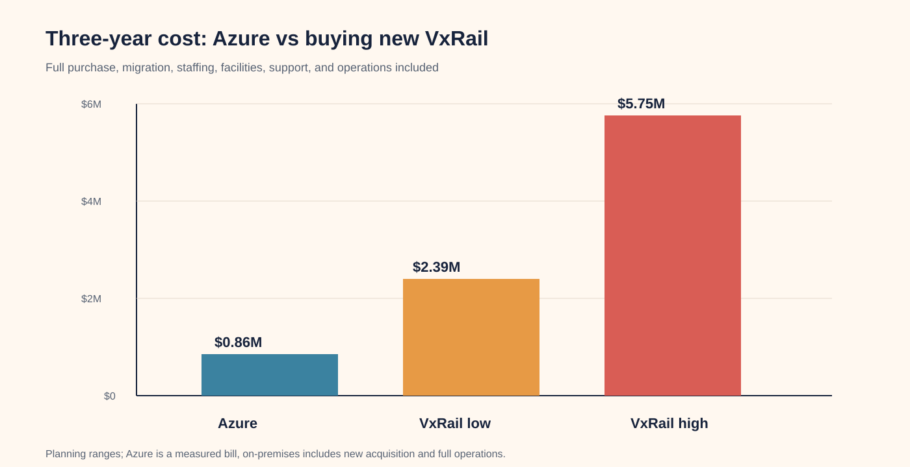
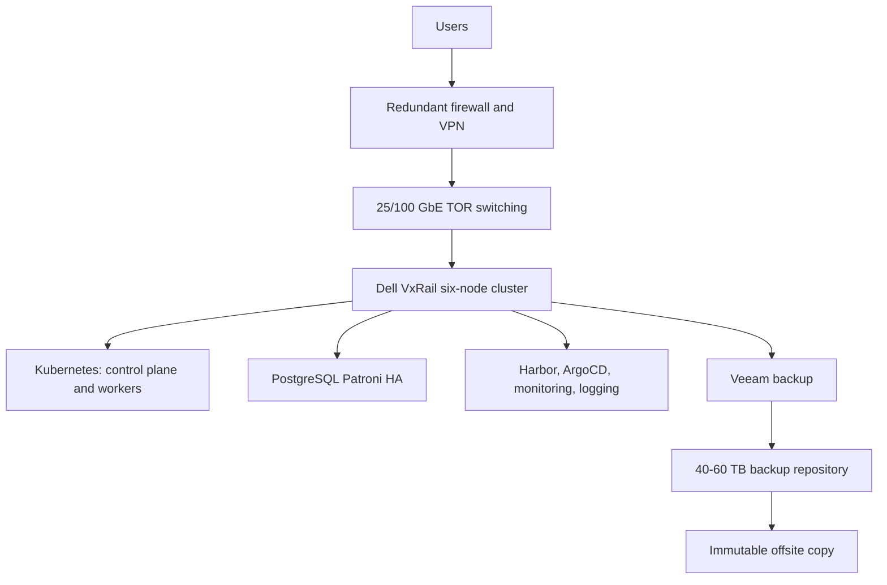
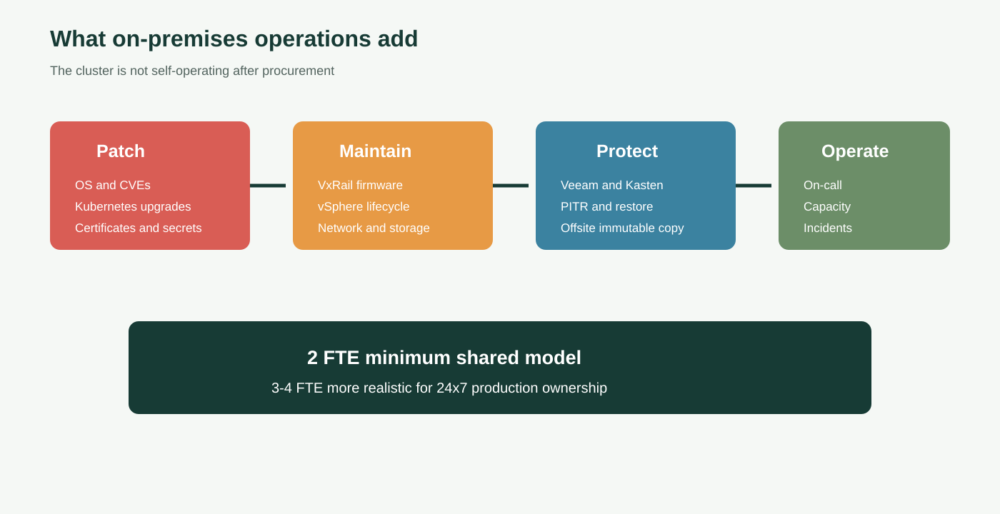

# On-Premises Dell VxRail TCO, 35-VM Capacity, and Operations (V4)

**Version:** V4
**Audience:** CTO, directors, finance, infrastructure, and migration steering committee

## Executive decision

For the requested 35-VM target:

- Existing-cluster expansion: **$180k-$510k one time**.
- New six-node cluster: **$1.04M-$2.39M initial**.
- Annual operations: **$390k-$980k**.
- Migration program: **$180k-$420k**.
- Three-year expansion TCO: **$1.53M-$3.99M**.
- Three-year new-cluster TCO: **$2.39M-$5.75M**.
- Three-year Azure baseline: **$855,144** at the current `$23,754/month` bill.

## Architecture

## 35-VM schedule

| Group | Count | Per VM | Total |
|---|---:|---|---:|
| Kubernetes control plane | 3 | 8 vCPU / 32 GB / 150 GB | 3 |
| Kubernetes workers | 24 | QA 12/48/200 GB; PREPROD 16/64/250 GB; PROD 24/96/300 GB | 24 |
| PostgreSQL | 7 | QA 8/32/600 GB; PREPROD 16/64/700 GB; PROD 32/128/1.5 TB | 7 |
| Platform/operations | 10 | 8 vCPU / 32 GB / 250 GB | 10 |
| **Total** | **35 VM instances** | **35 requested VMs** | **35** |

The total is **35 VM instances**: 18 Kubernetes, 7 database, and 10 platform/operations.

Capacity required is approximately **724 vCPU, 2.90 TB RAM, and 16.6 TB logical storage**. Current reported free capacity is **1.38 TB RAM and 90.86 TB storage**, so memory needs approximately **1.52 TB additional capacity**; storage is sufficient.

## Full acquisition budget

| Category | Low | High |
|---|---:|---:|
| Six VxRail nodes | $600,000 | $1,200,000 |
| VMware/vSphere licensing | $150,000 | $400,000 |
| TOR switches, optics, cabling | $50,000 | $120,000 |
| Backup repository | $25,000 | $80,000 |
| Firewall/VPN/load balancing | $30,000 | $100,000 |
| Rack, UPS, PDUs, power | $50,000 | $150,000 |
| Commissioning and spares | $40,000 | $120,000 |
| Approval envelope with contingency | **$1,040,000** | **$2,390,000** |

## Annual operating cost

| Category | Low/year | High/year |
|---|---:|---:|
| Hardware support | $60,000 | $150,000 |
| VMware support | $50,000 | $150,000 |
| Power and cooling | $35,000 | $90,000 |
| Backup and offsite DR | $25,000 | $75,000 |
| OS/security/platform support | $25,000 | $75,000 |
| Operations staffing | $180,000 | $400,000 |
| Refresh reserve | $15,000 | $40,000 |
| **Total** | **$390,000** | **$980,000** |

## Operational effort

- OS patching: 3-6 engineer-days/month.
- Kubernetes upgrades: 5-10 engineer-days/quarter.
- VxRail/vSphere lifecycle: 3-8 engineer-days per maintenance window.
- Database patching, failover, PITR, backup checks, restore tests, certificate rotation, vulnerability remediation, capacity reviews, incidents, and on-call are continuous.
- Two FTE is a minimum shared model; 3-4 FTE is more realistic for 24x7 production ownership.

## Migration effort

| Workstream | Cost |
|---|---:|
| Discovery and design | $25,000-$50,000 |
| Platform and network build | $45,000-$100,000 |
| QA migration | $20,000-$45,000 |
| PREPROD rehearsal | $30,000-$65,000 |
| PROD replication, cutover, hypercare | $50,000-$120,000 |
| Governance and security | $10,000-$40,000 |
| **Total** | **$180,000-$420,000** |

## Recommendation

Remain on Azure and optimize first. If on-premises is required, expand the existing VxRail cluster with certified RAM and capacity additions first, budgeted at $180k-$510k. Buy a new cluster only if the existing hosts cannot safely support the 35-VM design. Require Dell/Broadcom quotes, facilities approval, 2-4 FTE ownership, capacity validation, database compatibility, and immutable offsite DR.

Full source report: [21-OnPrem-VxRail-TCO-2026.md](../docs/Azure-VxRail-VMware-Migration/21-OnPrem-VxRail-TCO-2026.md)
