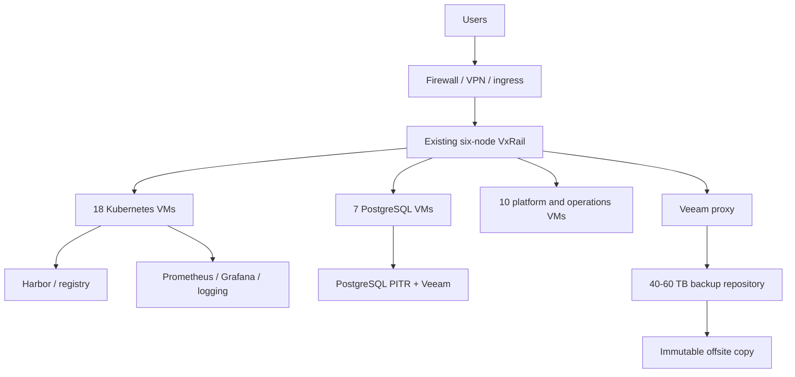

# Kubernetes Platform and On-Premises Costing Comparison (V4)

**Date:** 2026-09-09  
**Audience:** CTO, directors, finance, infrastructure, and migration steering committee  
**Scope:** 35-VM target on the existing VxRail cluster, with OpenShift, SUSE Rancher Prime, and Canonical Kubernetes comparison

## Executive answer

For the requested 35-VM target, use these as planning numbers:

- **Existing VxRail expansion:** `$155,000-$510,000` one time, plus **$39,500-$106,700/month** for shared operations and platform support.
- **OpenShift:** **$47,000-$121,700/month**, or **$564,000-$1,460,000/year** including common infrastructure operations.
- **SUSE Rancher Prime:** **$42,400-$114,200/month**, or **$509,000-$1,370,000/year** including common infrastructure operations.
- **Canonical Kubernetes:** **$41,000-$111,300/month**, or **$492,000-$1,335,000/year** including common infrastructure operations.
- Migration effort is separate: **$180,000-$420,000** over approximately 20-28 weeks.

These are budgetary ranges, not quotes. The largest cost is not Kubernetes software alone; it is the combined cost of VMware/VxRail support, database operations, backup, monitoring, security, facilities, and people.

## 1. 35-VM target architecture

| VM group | Count | Per-VM size | Total vCPU | Total RAM | Storage |
|---|---:|---|---:|---:|---:|
| Kubernetes control plane | 3 | 8 vCPU / 32 GB / 150 GB | 24 | 96 GB | 450 GB |
| QA workers | 3 | 12 vCPU / 48 GB / 200 GB | 36 | 144 GB | 600 GB |
| PREPROD workers | 3 | 16 vCPU / 64 GB / 250 GB | 48 | 192 GB | 750 GB |
| PROD workers | 9 | 24 vCPU / 96 GB / 300 GB | 216 | 864 GB | 2,700 GB |
| PostgreSQL | 7 | QA 8/32/600 GB; PREPROD 16/64/700 GB; PROD 32/128/1.5 TB | 152 | 608 GB | 7,200 GB |
| Platform/operations | 10 | 8 vCPU / 32 GB / 250 GB | 80 | 320 GB | 2,500 GB |
| **Total** | **35** | | **556** | **2,224 GB** | **14.2 TB** |

Current reported free capacity is about **1.38 TB RAM** and **90.86 TB storage**. The 35-VM plan therefore needs about **844 GB additional RAM**, before admission-control reserve, vSAN overhead, snapshots, and growth. Dell must validate DIMM compatibility and N+1 capacity.

## 2. Common monthly and annual on-premises cost

These costs apply regardless of Kubernetes distribution. They are allocated to the 35-VM target and exclude the one-time expansion and migration program.

| Cost component | Monthly low | Monthly high | Annual low | Annual high | Why it is required |
|---|---:|---:|---:|---:|---|
| VxRail hardware support | $5,000 | $12,500 | $60,000 | $150,000 | Parts, firmware, onsite response, support contract |
| VMware/vSphere/vSAN | $4,200 | $12,500 | $50,000 | $150,000 | Hypervisor, management, storage, subscription/support |
| PostgreSQL HA and DBA operations | $3,000 | $10,000 | $36,000 | $120,000 | Patroni, WAL/PITR, failover, patching, tuning, support |
| Mongo-compatible database | $1,000 | $4,000 | $12,000 | $48,000 | Replica set, backup, upgrades, compatibility operations |
| vSAN/PVC and object storage | $500 | $2,000 | $6,000 | $24,000 | Persistent volumes, MinIO, snapshots, growth allocation |
| Backup and offsite DR | $2,100 | $6,250 | $25,000 | $75,000 | Veeam, repository, immutable copy, restore tests |
| Network, firewall, VPN, DNS | $1,000 | $4,000 | $12,000 | $48,000 | Switching, security edge, certificates, connectivity |
| Monitoring and logging | $1,500 | $5,000 | $18,000 | $60,000 | Prometheus, Grafana, ELK/Loki, retention, alerting |
| OS, security, and platform support | $2,100 | $6,250 | $25,000 | $75,000 | Linux subscriptions, CVEs, hardening, vendor support |
| Operations staffing | $15,000 | $33,333 | $180,000 | $400,000 | 2 FTE minimum; 3-4 FTE realistic for 24x7 ownership |
| Refresh and spare reserve | $1,250 | $3,333 | $15,000 | $40,000 | Replacement, lifecycle, testing, spares |
| **Common operating subtotal** | **$39,500** | **$106,700** | **$474,000** | **$1,280,000** | Before Kubernetes platform support |

## 3. Kubernetes platform cost by option

| Platform | License/support monthly | License/support annual | Common operations monthly | **Total monthly** | **Total annual** |
|---|---:|---:|---:|---:|---:|
| Red Hat OpenShift | $7,500-$15,000 | $90,000-$180,000 | $39,500-$106,700 | **$47,000-$121,700** | **$564,000-$1,460,000** |
| SUSE Rancher Prime | $2,917-$7,500 | $35,000-$90,000 | $39,500-$106,700 | **$42,400-$114,200** | **$509,000-$1,370,000** |
| Canonical Kubernetes | $1,500-$4,583 | $18,000-$55,000 | $39,500-$106,700 | **$41,000-$111,300** | **$492,000-$1,335,000** |

> The platform license column is budgetary. OpenShift and Rancher Prime are quote-based. Canonical Kubernetes software is open source; the paid range represents Ubuntu Pro and Canonical support.

### Monthly cost bars

```mermaid
xychart-beta
    title "Monthly on-premises operating range"
    x-axis [Canonical, Rancher, OpenShift]
    y-axis "USD per month" 0 --> 125000
    bar [41000, 42400, 47000]
    bar [111300, 114200, 121700]
```

## 4. One-time costs

| Item | Low | High |
|---|---:|---:|
| Existing VxRail certified RAM expansion | $80,000 | $250,000 |
| Licensing uplift, backup, network, power, validation | $75,000 | $260,000 |
| **Existing-cluster expansion** | **$155,000** | **$510,000** |
| Migration program | $180,000 | $420,000 |
| **Expansion plus migration cash requirement** | **$335,000** | **$930,000** |

A new six-node cluster is a separate decision: **$1.04M-$2.39M initial** and **$2.39M-$5.75M three-year TCO**.

## 5. Justification by platform

### OpenShift

Choose OpenShift when Red Hat support, certified operators, security/compliance controls, or an existing Red Hat agreement has high business value. It is the most integrated enterprise platform in this comparison, but the highest recurring subscription and skills cost makes it difficult to justify purely on cost.

### SUSE Rancher Prime

Choose Rancher Prime when central multi-cluster management, distribution flexibility, and enterprise support matter. It is a practical middle option, but downstream operating systems, Kubernetes clusters, storage, backup, and databases still require budget and skilled ownership.

### Canonical Kubernetes

Choose Canonical when minimizing platform subscription cost and staying close to upstream Kubernetes are priorities. It is the lowest commercial platform-cost option, but it transfers more lifecycle, Linux, Juju/Cluster API, security, and upgrade responsibility to the internal team.

## 6. Recommendation

For this workload and current information, **Azure is the best immediate choice** because it is already operating and its measured subscription cost is known. If on-premises is mandatory, **expand the existing VxRail cluster** after Dell validates memory and N+1 capacity. Use **Canonical Kubernetes** for the lowest commercial platform cost, or **Rancher Prime** when centralized multi-cluster governance justifies the premium. Choose OpenShift only for a clear Red Hat enterprise requirement.

## 7. Official Pricing Verification Links

Use these links to replace planning ranges with current prices or vendor quotes. Prices vary by region, contract term, support tier, core/node entitlement, committed-use discount, and reseller agreement.

| Cost area | Official verification source |
|---|---|
| OpenShift subscription | [Red Hat OpenShift pricing](https://www.redhat.com/en/technologies/cloud-computing/openshift/pricing) |
| SUSE Rancher Prime | [SUSE Rancher Prime](https://www.suse.com/products/rancher/) and [SUSE how to buy](https://www.suse.com/how-to-buy/) |
| Canonical Kubernetes / Ubuntu Pro | [Canonical Kubernetes](https://ubuntu.com/kubernetes), [Ubuntu Pro pricing](https://ubuntu.com/pricing/pro) |
| Dell VxRail hardware | [Dell VxRail](https://www.dell.com/en-us/shop/servers-storage-and-networking/sf/virtualization/vxrail) - request configuration quote |
| VMware/Broadcom vSphere and vSAN | [VMware Cloud Foundation](https://www.vmware.com/products/cloud-foundation) - request entitlement quote |
| Veeam backup licensing | [Veeam pricing](https://www.veeam.com/pricing.html) |
| Azure pricing calculator | [Azure Pricing Calculator](https://azure.microsoft.com/en-us/pricing/calculator/) |
| GCP pricing calculator | [Google Cloud Pricing Calculator](https://cloud.google.com/products/calculator) |
| AWS comparison reference, if required | [AWS Pricing Calculator](https://calculator.aws/) |
