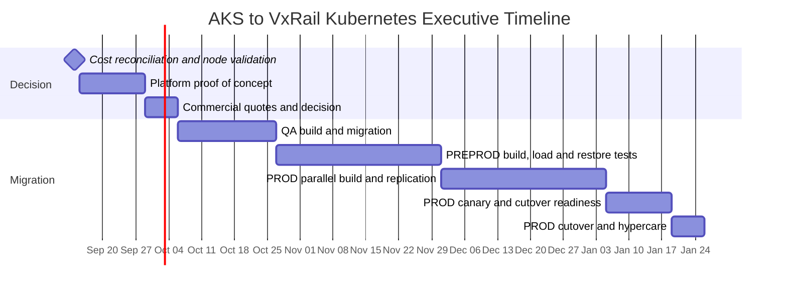

# Executive AKS Cost and Migration Pack (V2)

**Audience:** Directors, CTO, architecture board, finance, and migration steering committee  
**Date:** 2026-09-09  
**Document version:** V2 - current management decision pack  
**Decision requested:** Approve the environment-by-environment validation and a controlled Kubernetes platform proof of concept before selecting OpenShift, SUSE Rancher Prime, or Canonical Kubernetes.

## Executive Decision Summary

- The workbook shows **16 AKS nodes** and **$2,370/month** of AKS cost: QA `$284`, PREPROD `$189`, and PROD `$1,897`.
- Directly related visible rows add PostgreSQL, Cosmos DB, and one QA Container Instance, producing partial platform subtotals of QA `$526`, PREPROD `$1,040`, and PROD `$2,029` per month.
- The visible subtotal is **not a complete environment bill**. Shared networking, storage, backup, monitoring, ingress, and unallocated subscription costs require an Azure Cost Management export.
- PROD is inconsistent between the workbook and the repository target: workbook detail shows 11 PROD AKS nodes, while the target design plans 12 PROD workers plus 3 control-plane VMs.
- Recommended sequence: validate QA, prove the selected platform in PREPROD, then migrate PROD only after a live replication and restore rehearsal.

## 1. Workbook-Based AKS Inventory

| Environment | AKS configuration in workbook | AKS monthly cost | Directly related visible resources | Partial monthly total |
|---|---|---:|---|---:|
| QA | 3 x Standard D2s v4; 6 vCPU and 24 GiB total | $284 | Cosmos DB $132; QA Container Instance $110, marked for removal | **$526** |
| PREPROD | 2 x Standard D2s v4; 4 vCPU and 16 GiB total | $189 | PostgreSQL $719; Cosmos DB $132 | **$1,040** |
| PROD | 4 x Standard D4s v4 plus 7 x Standard D4as v6; 44 vCPU and 176 GiB total | $1,897 | Cosmos DB $132 | **$2,029** |
| **Visible total** | **16 AKS nodes** | **$2,370** | **$1,225 directly related** | **$3,595** |

### Cost interpretation

| View | Monthly | Annualized | Use |
|---|---:|---:|---|
| AKS service rows only | $2,370 | $28,440 | Kubernetes compute baseline |
| Visible AKS plus directly related rows | $3,595 | $43,140 | Environment planning floor |
| Azure subscription total from Cost Summary | $23,754 | $285,048 | Financial baseline; includes shared/unallocated spend |

The `$3,595/month` figure is a **planning floor**, not a complete platform TCO. It excludes the shared services that make an environment production-ready: network gateways, load balancing, storage, backup, monitoring, registry, security controls, and operations.

## 2. Management View by Environment

### QA: low-cost validation lane

**Current visible cost:** `$526/month` (`$284` AKS + `$132` Cosmos DB + `$110` QA Container Instance).  
**Action:** Confirm the Container Instance is unused and remove it only after application-owner approval. Configure AKS autoscaling with minimum 1 and maximum 3 nodes. Validate Cosmos DB resize in QA before applying the same change to production.

**Exit criteria:** six on-prem Kubernetes nodes Ready, image and secret migration complete, database restore checks pass, smoke tests pass, and a 200-user test produces no Sev-1/Sev-2 issue.

### PREPROD: resilience and performance rehearsal

**Current visible cost:** `$1,040/month` (`$189` AKS + `$719` PostgreSQL + `$132` Cosmos DB).  
**Action:** Use this environment to prove the selected Kubernetes distribution, Patroni failover, persistent storage, ingress, monitoring, backup restore, and load behaviour. Confirm whether the PostgreSQL resize recommendation preserves the required 16 vCPU/64 GB target on-premises.

**Exit criteria:** 12-node target cluster Ready, three PostgreSQL members healthy, replication lag is within target, load test reaches the agreed user count, backup restore completes, and a documented failover has passed.

### PROD: controlled live migration

**Current visible cost:** `$2,029/month` (`$1,897` AKS + `$132` Cosmos DB).  
**Action:** Reconcile the 11 workbook AKS nodes with the repository's 12-worker target. Do not reduce or add nodes based on cost alone; use CPU, memory, pod requests/limits, P95 latency, and availability objectives. Establish the live replication and rollback gates before cutover approval.

**Exit criteria:** 15-node on-prem target Ready, database replication stable for at least 14 days, restore rehearsal passed, canary traffic passed for 72 hours, DNS rollback tested, and executive change approval recorded.

## 3. Target Operating Model

| Capability | QA | PREPROD | PROD |
|---|---|---|---|
| Platform | Selected Kubernetes distribution | Same distribution and version | Same distribution and version |
| Availability | Best effort | HA rehearsal | HA with anti-affinity and failure-domain testing |
| Change window | Business hours | Planned test windows | Approved maintenance window and CAB/change record |
| Monitoring | Node, pod, application health | SLO, load, DB replication, backup | SLO, error budget, security, replication, business KPIs |
| Backup | Weekly namespace and daily DB as needed | Daily namespace and DB backups | Daily namespace, frequent WAL archive, immutable offsite copy |
| Restore testing | At least once before sign-off | At least monthly during migration | Quarterly full restore and annual disaster exercise |
| Ownership | Platform + QA | Platform + DBA + performance team | 24x7 on-call, platform, DBA, security, network, service owner |

## 4. Recommended Timeline

## 5. Migration and Backup Plan Changes Required

### Required migration corrections

1. Reconcile PROD's 11 workbook AKS nodes against the target's 12 worker nodes before capacity approval.
2. Replace placeholder credentials and plaintext passwords in runbooks with Key Vault, a secret manager, or one-time injected credentials. Never commit passwords to Git.
3. Treat Azure PostgreSQL logical replication support and `pglogical` availability as a formal PROD gate. Confirm the exact Azure service tier/version and test it in a non-production subscription before promising zero-downtime cutover.
4. Change PROD rollback language from guaranteed `RPO = 0` to **RPO equal to the last confirmed replication point**. A replication lag alert must block cutover.
5. Add explicit DNS TTL, certificate, firewall, external dependency, and observability validation to the canary gate.

### Required backup and DR corrections

1. Add an immutable, offsite copy for PROD backups. A NAS on the same VxRail site is not sufficient for site-loss recovery.
2. Define backup success metrics: job success, last successful restore point, repository capacity, WAL archive age, and Kasten export age.
3. Perform restore tests before each environment sign-off: namespace/PVC restore, database PITR, VM restore, and complete cluster rebuild for PROD.
4. Record the Kasten K10 entitlement and supported version for the selected Kubernetes distribution. Do not assume all K10 capabilities are license-free.
5. Keep application-consistent database backups separate from VM snapshots; VM backups alone are not a substitute for PostgreSQL PITR.

## 6. Executive Risks and Decisions

| Risk / decision | Impact | Required owner / gate |
|---|---|---|
| PROD node-count mismatch | Under-sizing or unnecessary capital allocation | Infrastructure architecture sign-off |
| Incomplete workbook detail | Understates true platform cost | Finance and Azure Cost Management reconciliation |
| VxRail free memory below target design | Migration cannot run all environments concurrently | Infrastructure capacity gate |
| Logical replication capability | Could invalidate zero-downtime plan | DBA and Azure platform validation |
| Same-site backup only | Site loss may exceed stated RTO/RPO | DR and security approval |
| Platform license/support choice | Multi-year financial and staffing commitment | CTO/steering committee decision |

## Sources

- [Azure cost workbook](../../../../Downloads/DI_Cost_Optimization_2026.xlsx) - supplied source; not committed because it may contain tenant billing data.
- [Current Azure architecture](./02-Current-State-Architecture.md)
- [Target architecture](./03-Target-State-Architecture.md)
- [QA migration plan](./15-QA-Migration-Plan.md)
- [PREPROD migration plan](./16-PREPROD-Migration-Plan.md)
- [PROD migration plan](./17-PROD-Migration-Plan.md)
- [Application backup and DR plan](./18-Application-Backup-DR-Plan.md)