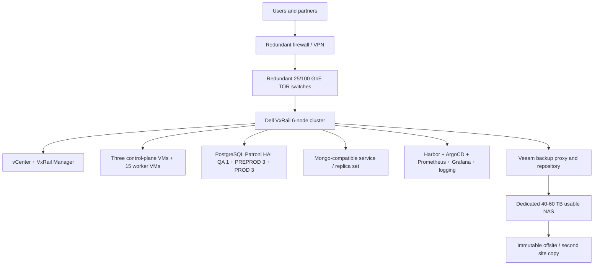

# On-Premises Dell VxRail TCO and Operations (V3)

**Prepared:** 2026-09-09  
**Document version:** V3 - full purchase, operations, and migration effort model  
**Audience:** CTO, directors, finance, infrastructure, and migration steering committee

## Executive Decision

If a new six-node Dell VxRail cluster must be purchased, on-premises is **not automatically cheaper** than the current Azure bill. A realistic budgetary model is:

- **Initial purchase and implementation:** **$1.0M-$2.2M**.
- **Annual operating cost:** **$390k-$930k/year**, including support, facilities, software, staffing, and maintenance.
- **Migration program:** **$180k-$420k** one time.
- **Three-year on-premises TCO:** **$2.35M-$5.41M**, before residual value and tax effects.
- **Three-year Azure baseline:** **$855,144** at the workbook's current `$23,754/month`, before Azure growth or optimization.

On-premises becomes financially attractive only when the VxRail hardware is already owned or heavily discounted, facilities and staff are already funded, utilization is high, and data sovereignty or latency has business value. With a new cluster purchase and new operating capacity, **staying on Azure and optimizing the current architecture is the lower-risk financial decision**. A new VxRail purchase should be justified by sovereignty, control, predictable high utilization, or an existing datacenter strategy, not by an assumed cloud-cost saving.

## 1. Target On-Premises Architecture

### Compute and storage design

| Layer | Required design |
|---|---|
| Physical cluster | Six Dell VxRail nodes, N+1 failure tolerance, dual power, dual network paths |
| Virtualization | VMware vSphere/vCenter and VxRail Manager; quote licensing separately from hardware |
| Kubernetes | Three control-plane VMs, QA 3 workers, PREPROD 9 workers, PROD 12 workers; reconcile against workbook's 16 AKS nodes |
| Databases | QA single PostgreSQL VM; three-node PREPROD Patroni; three-node PROD Patroni; Mongo-compatible production replica set |
| Storage | vSAN for VM/PVC data; separate backup repository; MinIO or equivalent for object semantics |
| Network | Management, vMotion, vSAN, Kubernetes, database, backup, ingress, and migration VLANs |
| Backup/DR | Veeam VM backup, Kasten or equivalent namespace backup, PostgreSQL WAL/PITR, immutable offsite copy |

## 2. Full Acquisition Budget

These are **budgetary 2026 USD ranges**, not Dell, Broadcom, reseller, or facilities quotes. Configuration, region, support tier, contract term, and discounts can change them substantially.

| Purchase category | Low | High | What it includes |
|---|---:|---:|---|
| Six Dell VxRail nodes | $600,000 | $1,200,000 | Six production-class nodes with CPU, 4-5 TB RAM total, NVMe/vSAN capacity, rails, and warranties |
| VMware/vSphere and management licensing | $150,000 | $400,000 | Three-year planning allowance; obtain a Broadcom/Dell quote for exact core entitlement |
| 25/100 GbE TOR switching, optics, cabling | $50,000 | $120,000 | Redundant switches, optics, DACs/fiber, installation, and port expansion |
| Dedicated backup repository | $25,000 | $80,000 | 40-60 TB usable NAS or hardened repository, disks, spare capacity |
| Firewall, VPN, load-balancing additions | $30,000 | $100,000 | Redundant security edge, VPN, certificates, and optional hardware load balancer |
| Rack, UPS, PDUs, power distribution | $50,000 | $150,000 | Rack work, dual PDUs, UPS allocation, cabling, and installation |
| Datacenter commissioning and spares | $40,000 | $120,000 | Hardware installation, burn-in, spare disks/PSUs, acceptance testing |
| **Initial acquisition subtotal** | **$945,000** | **$2,170,000** | Before tax and contingency |
| **Recommended approval envelope with 10% contingency** | **$1,040,000** | **$2,390,000** | Use for early capital planning |

## 3. Annual Operating Cost

| Operating category | Low/year | High/year | Activities covered |
|---|---:|---:|---|
| Dell VxRail hardware support | $60,000 | $150,000 | 24x7 support, parts replacement, firmware lifecycle, onsite response |
| VMware/vSphere subscription/support | $50,000 | $150,000 | Renewal/subscription, support, and management components |
| Datacenter power and cooling | $35,000 | $90,000 | Six-node load, UPS losses, cooling, rack, and facility allocation |
| Backup, DR, and offsite storage | $25,000 | $75,000 | NAS refresh, immutable/offsite copy, Veeam/Kasten support and media |
| OS, security, certificates, and platform support | $25,000 | $75,000 | Oracle Linux/Ubuntu support, security tools, certificates, vendor support |
| Platform operations staffing | $180,000 | $400,000 | 2-4 FTE allocation across VMware, Linux/Kubernetes, DBA, backup, and on-call |
| Hardware/software refresh reserve | $15,000 | $40,000 | Spares, lifecycle refresh, testing, and replacement reserve |
| **Annual operating total** | **$390,000** | **$980,000** | Fully loaded planning range |

The lower end assumes existing staff absorb the platform and facilities are already funded. The upper end is more appropriate when 24x7 coverage, dedicated engineers, and external support are required.

## 4. Operational Effort and Maintenance

| Activity | Typical cadence | Effort planning | Owner |
|---|---|---:|---|
| OS patching for Kubernetes, DB, and utility VMs | Monthly; emergency CVEs as needed | 3-6 engineer-days/month | Linux/platform |
| Kubernetes version and add-on upgrades | Quarterly | 5-10 engineer-days/quarter | Kubernetes platform |
| vSphere/VxRail firmware and lifecycle | Quarterly planning; maintenance windows 2-4 times/year | 3-8 engineer-days/window | VMware/VxRail |
| PostgreSQL patching, failover, and PITR test | Monthly; quarterly failover | 2-5 engineer-days/month | DBA |
| Backup monitoring and restore tests | Daily checks; monthly sample restore; quarterly full restore | 2-5 engineer-days/month | Backup/platform |
| Vulnerability, certificate, and secret rotation | Monthly / expiry-driven | 2-4 engineer-days/month | Security/platform |
| Capacity, performance, and cost review | Monthly | 1-3 engineer-days/month | Architecture/finance |
| Incident response and on-call | Continuous | 0.5-1.5 FTE equivalent | Operations |

Budgetary staffing implication: **2 FTE is a minimum shared-service model; 3-4 FTE is more realistic for production ownership with on-call, DBA, backup, and security responsibilities.**

## 5. Migration Effort and Cost

| Workstream | Duration | Cost range | Deliverables |
|---|---:|---:|---|
| Discovery, dependency mapping, and detailed design | 3-4 weeks | $25,000-$50,000 | Resource map, target sizing, security and cutover design |
| VxRail build, network, vSphere, and Kubernetes platform | 5-8 weeks | $45,000-$100,000 | Cluster, VLANs, Kubernetes, registry, GitOps, monitoring |
| QA migration and test | 3 weeks | $20,000-$45,000 | Restore, images, secrets, smoke and load tests |
| PREPROD migration and rehearsal | 5 weeks | $30,000-$65,000 | HA, performance, backup restore, failover, rollback rehearsal |
| PROD replication, canary, and cutover | 6-8 weeks | $50,000-$120,000 | Live replication, canary, DNS cutover, hypercare |
| Project management, security, and change governance | Throughout | $10,000-$40,000 | CAB, audit, communications, risk and acceptance evidence |
| **Migration program total** | **20-28 weeks** | **$180,000-$420,000** | Excludes application redesign and major remediation |

## 6. Three-Year TCO Comparison

| Scenario | Initial purchase | Migration | 3-year operations | Three-year total |
|---|---:|---:|---:|---:|
| Azure current bill | $0 | $0 | $855,144 | **$855,144** |
| On-premises, low | $1,040,000 | $180,000 | $1,170,000 | **$2,390,000** |
| On-premises, high | $2,390,000 | $420,000 | $2,940,000 | **$5,750,000** |

This is not an apples-to-apples accounting result: Azure's number is an observed service bill and may omit internal staff; on-premises includes capital acquisition, staffing, facilities, and migration effort. It is nevertheless the correct decision view when leadership is considering buying a new cluster.

## 7. Recommendation

**Best immediate choice:** remain on Azure and optimize the architecture-mapped services while completing a resource-ID reconciliation. The current measured bill and zero migration disruption outweigh uncertain GCP/on-prem savings.

**Best on-premises choice:** purchase VxRail only if data sovereignty, latency, regulatory control, or an existing datacenter strategy is worth the additional `$1.5M-$4.9M` three-year cost versus the current Azure baseline. Do not approve based on hardware cost alone.

**Required executive gates:** obtain Dell/Broadcom quotes, confirm facilities capacity, approve 2-4 FTE operational ownership, resolve VxRail memory headroom, test all database compatibility, and approve an immutable offsite DR design.

## Assumptions

- Figures are USD budgetary ranges for 2026 and are not vendor quotations.
- Six nodes are assumed to provide N+1 capacity and enough vSAN storage; final node SKU must be sized from measured workload demand.
- Hardware acquisition includes new cluster purchase even though an existing cluster is available, per the request.
- Azure baseline uses the supplied workbook's `$23,754/month` subscription total.
- Taxes, financing, depreciation, resale value, datacenter lease, and application remediation are excluded.