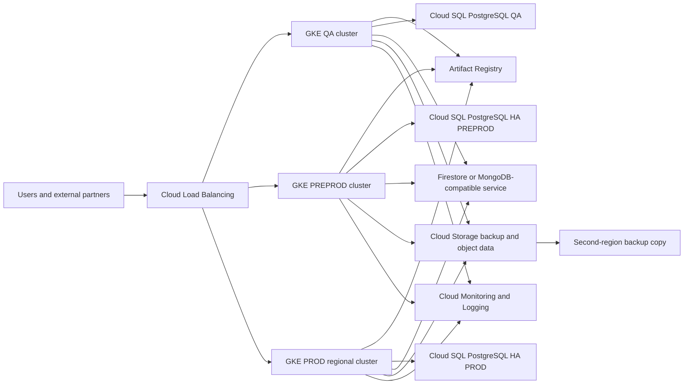

# GCP Migration Architecture and Cost (Standalone)

**Version:** GCP V1  
**Prepared:** 2026-09-09  
**Source baseline:** `DI_Cost_Optimization_2026.xlsx`  
**Scope:** Move the current Azure AKS-oriented workload to Google Cloud; this document is separate from the Azure/on-premises V1/V2 packs.

## Executive Recommendation

For a cloud destination, **GCP is technically credible and operationally strong**, especially if the organization values GKE, Google-native analytics, global networking, or future data/AI services. However, the supplied workbook baseline is only **$23,754/month**, and the existing six-node VxRail investment is already available. On the information currently available:

1. **Best financial option:** use existing VxRail/on-premises capacity, subject to resolving the memory constraint and adding operational cost to the TCO.
2. **Best managed-cloud option:** retain Azure unless a GCP business driver, committed-use discount, or workload-specific capability justifies migration. A cloud-to-cloud move creates migration cost without removing the need to pay for managed compute, storage, networking, backup, and operations.
3. **When GCP wins:** choose GCP if GKE, BigQuery/analytics, Google networking, regional availability, or an existing Google Cloud agreement has strategic value, and accept a migration budget of approximately **$80,000-$180,000 one time** plus a modeled monthly run rate of approximately **$18,000-$34,000** before negotiated discounts.

This is a decision recommendation, not a final quote. GCP pricing depends heavily on region, machine family, committed-use discounts, data egress, log volume, Cloud SQL HA, and the selected database replacement for Cosmos DB.

## 1. Source Workload Inventory

| Environment | AKS nodes in workbook | AKS monthly cost | Directly visible related rows | Partial visible platform cost |
|---|---:|---:|---|---:|
| QA | 3 x Standard D2s v4 | $284 | Cosmos DB $132; Container Instance $110 | **$526** |
| PREPROD | 2 x Standard D2s v4 | $189 | PostgreSQL $719; Cosmos DB $132 | **$1,040** |
| PROD | 4 x Standard D4s v4 + 7 x Standard D4as v6 | $1,897 | Cosmos DB $132 | **$2,029** |
| **Visible total** | **16 AKS nodes** | **$2,370** | **$1,225** | **$3,595** |

The full Azure subscription baseline is **$23,754/month**. The environment figures above are a partial inventory, not complete environment bills. Shared storage, backup, monitoring, network, ingress, and unallocated subscription charges must be reconciled before comparing providers.

## 2. Proposed GCP Architecture

### GCP resource mapping

| Azure capability | GCP target | Design notes |
|---|---|---|
| AKS | GKE Standard | One cluster per environment for isolation; regional PROD cluster; private nodes and authorized control plane access |
| Azure PostgreSQL | Cloud SQL for PostgreSQL | HA regional instance for PREPROD/PROD; PITR and cross-region backup; validate extensions and connection-pooling behaviour |
| Cosmos DB | Firestore, MongoDB Atlas on GCP, or application redesign | No automatic one-to-one migration; choose based on MongoDB/API compatibility and query/index behaviour |
| ACR | Artifact Registry | Replicate images, scan artifacts, and update deployment references |
| Azure Storage | Cloud Storage | Use Standard/Nearline/Coldline lifecycle rules; quantify retrieval and replication charges |
| Azure Backup / Veeam | Backup for GKE, Cloud SQL backups, Cloud Storage retention, and optional third-party backup | Backup for GKE is not a complete VM/database DR replacement |
| Azure Monitor/App Insights | Cloud Monitoring, Cloud Logging, Managed Service for Prometheus, Trace/Error Reporting | Set log exclusions and retention before production to control spend |
| Azure Load Balancer | Cloud Load Balancing and Gateway API | Use regional/external load balancers only where required |
| VNet/VPN | VPC, Cloud VPN or Cloud Interconnect, Cloud DNS, firewall policies | Cloud Interconnect is justified only for sustained hybrid traffic and required latency |

## 3. GCP Budgetary Cost Model

These are **planning ranges in USD per month**, not vendor quotes. They assume 730 hours/month, GKE Standard, production HA for Cloud SQL, one primary region, moderate traffic, and no major GPU workload.

| Cost area | QA | PREPROD | PROD | Total range / month | Basis |
|---|---:|---:|---:|---:|---|
| GKE/Compute Engine worker capacity | $250-$600 | $450-$1,100 | $2,500-$5,500 | **$3,200-$7,200** | GKE nodes sized to current AKS footprint plus PROD headroom; discounts can reduce this |
| GKE cluster management | $0-$75 | $0-$75 | $75-$150 | **$75-$300** | $0.10/cluster-hour; free credit may offset eligible zonal/Autopilot cluster fee |
| Cloud SQL PostgreSQL | $150-$450 | $900-$2,000 | $2,000-$4,500 | **$3,050-$6,950** | HA, storage, backups, replicas, and selected machine size |
| Cosmos replacement | $100-$500 | $250-$900 | $800-$3,000 | **$1,150-$4,400** | Firestore or MongoDB Atlas; must be quoted after compatibility assessment |
| Cloud Storage and backup | $150-$500 | $300-$1,000 | $1,000-$3,500 | **$1,450-$5,000** | Current 65 TB backup footprint needs lifecycle/retention validation |
| Artifact Registry | $25-$100 | $50-$150 | $100-$400 | **$175-$650** | Artifact storage and network operations |
| Load balancing, VPC, VPN, DNS | $250-$700 | $350-$1,000 | $900-$2,500 | **$1,500-$4,200** | Includes private connectivity allowance; Interconnect may add substantial fixed cost |
| Monitoring, logging, security | $250-$700 | $400-$1,200 | $1,500-$4,000 | **$2,150-$5,900** | Strongly dependent on log volume, retention, Prometheus metrics, and scanning |
| **Budgetary total** | **$1,175-$3,625** | **$2,700-$7,425** | **$8,875-$21,550** | **$12,750-$32,675** | Before migration labor, support, and negotiated discounts |

The row ranges are intentionally conservative and have uncertainty. The sum of the visible range endpoints is **$12,750-$32,675/month**. A practical approval envelope including cloud support, egress variability, and 10% contingency is **$14,000-$36,000/month**. Do not compare the low end to the Azure total until the same data transfer, backup retention, support, and database semantics are included.

### One-time GCP migration cost

| Workstream | Planning range |
|---|---:|
| Discovery, landing zone, IAM, network, security | $15,000-$35,000 |
| GKE platform build and CI/CD/GitOps conversion | $20,000-$45,000 |
| PostgreSQL and Cosmos-compatible data migration | $20,000-$55,000 |
| Image, secret, storage, DNS, and integration migration | $15,000-$35,000 |
| Testing, cutover, rollback rehearsal, and hypercare | $10,000-$25,000 |
| **Total one-time GCP migration** | **$80,000-$195,000** |

The main unknown is the Cosmos DB replacement. If the application is tightly coupled to Cosmos APIs, redesign and test effort may exceed this range.

## 4. Azure vs GCP vs On-Premises

| Decision factor | Azure existing | GCP migration | Existing VxRail/on-premises |
|---|---|---|---|
| Current monthly baseline | **$23,754 actual workbook total** | New estimate **$14,000-$36,000** after migration | Incremental run cost low, but shared platform/staff/facility costs must be allocated |
| Migration effort | None | High: cloud-to-cloud rebuild and data transfer | High: application, database, network, and operational migration |
| Kubernetes | AKS already operating | GKE managed control plane and mature autoscaling | Self-managed or supported distribution; more internal responsibility |
| Database risk | Existing services | Cosmos replacement is the largest risk | PostgreSQL/Mongo-compatible self-management and DR responsibility |
| Existing investment | Preserves current cloud operations | Does not reuse Azure commitments | Reuses six-node VxRail, vSphere, and existing operations |
| Cost predictability | Known actual bill, optimize first | Depends on usage and discounts | Low incremental cash cost but higher ownership/TCO complexity |
| Best strategic fit | Lowest-risk immediate choice | Best when Google ecosystem is strategic | Best when sovereignty and existing VxRail capacity dominate |

## 5. Final Recommendation

**Do not move the workload to GCP solely to reduce cost.** The current Azure bill is a measured `$23,754/month`; GCP has a plausible steady-state range, but the one-time migration and Cosmos replacement risk can eliminate savings for several years.

Recommended decision order:

1. **Near term:** remain on Azure while applying the workbook recommendations: AKS autoscaling, QA Container Instance validation/removal, database right-sizing, and storage lifecycle management.
2. **Strategic on-premises option:** proceed with a phased VxRail proof of capacity and restore, but resolve the reported memory shortfall before committing all environments.
3. **GCP option:** run a funded GCP discovery/POC only if GKE, Google analytics, or a commercial commitment creates measurable business value. Require a GCP pricing calculator export and a Cosmos compatibility test before approval.

On current evidence, **Azure is the best immediate business decision because it has the lowest migration risk and a known actual bill**. **On-premises can be the best long-term cost decision if existing VxRail capacity is genuinely available and staffing/facility costs are already sunk. GCP is the best alternative cloud only when its strategic capabilities or negotiated pricing outweigh the migration cost.**

## Official Pricing References

- [GKE pricing](https://cloud.google.com/kubernetes-engine/pricing)
- [Cloud SQL pricing](https://cloud.google.com/sql/pricing)
- [Cloud Storage pricing](https://cloud.google.com/storage/pricing)
- [Google Cloud pricing calculator](https://cloud.google.com/products/calculator)