# 🚀 Azure to On-Premises Migration
## Presentation Index

> **One-stop visual guide** for executives, architects, and engineers

---

```
╔═══════════════════════════════════════════════════════════════════════════╗
║                                                                           ║
║    ██████╗ ██████╗ ███████╗███╗   ███╗██╗███████╗███████╗               ║
║   ██╔══██╗██╔══██╗██╔════╝████╗ ████║██║██╔════╝██╔════╝               ║
║   ██████╔╝██████╔╝█████╗  ██╔████╔██║██║███████╗█████╗                 ║
║   ██╔═══╝ ██╔══██╗██╔══╝  ██║╚██╔╝██║██║╚════██║██╔══╝                 ║
║   ██║     ██║  ██║███████╗██║ ╚═╝ ██║██║███████║███████╗               ║
║   ╚═╝     ╚═╝  ╚═╝╚══════╝╚═╝     ╚═╝╚═╝╚══════╝╚══════╝               ║
║                                                                           ║
║        Azure Cloud  ──────────────►  On-Premises                         ║
║        $552,000/yr                   $150,000/yr                          ║
║        99.95% SLA                    99.99% SLA                           ║
║        5,000 req/s                   10,000 req/s                         ║
║                                                                           ║
╚═══════════════════════════════════════════════════════════════════════════╝
```

---

## 📁 Presentation Documents

| # | Document | Audience | Purpose |
|---|----------|----------|---------|
| [01](./01-Executive-Presentation.md) | **Executive Presentation** | CTO, Board | Business case, ROI, timeline, benefits |
| [02](./02-HLD-High-Level-Design.md) | **HLD — High Level Design** | Architects, Tech Leads | Architecture overview, design decisions |
| [03](./03-LLD-Low-Level-Design.md) | **LLD — Low Level Design** | Engineers | Component specs, IPs, configs, sequences |

---

## 🎯 Quick Stats

```mermaid
graph LR
    subgraph BEFORE["BEFORE  -  Azure"]
        B1["💰 $552,000/year"]
        B2["📊 99.95% availability"]
        B3["⚡ 5,000 req/sec"]
        B4["👥 5,000 concurrent users"]
        B5["🔒 Vendor lock-in"]
        B6["📍 Data in Microsoft DC"]
    end

    subgraph ARROW["Migration"]
        ARR["26-Week\nMigration"]
    end

    subgraph AFTER["AFTER  -  On-Premises"]
        A1["💰 $150,000/year\n💚 -73% cost"]
        A2["📊 99.99% availability\n💚 4× more reliable"]
        A3["⚡ 10,000 req/sec\n💚 2× throughput"]
        A4["👥 10,000 users\n💚 2× capacity"]
        A5["🔓 Full control\n💚 No lock-in"]
        A6["📍 Data on-premises\n💚 Full sovereignty"]
    end

    BEFORE --> ARROW --> AFTER

    style BEFORE fill:#fde8e8,stroke:#c62828
    style AFTER fill:#e8f5e9,stroke:#1b5e20
    style ARROW fill:#fff3e0,stroke:#e65100
```



---

**Version**: 2.0 | **Date**: July 2026 | **Classification**: Internal Use Only
