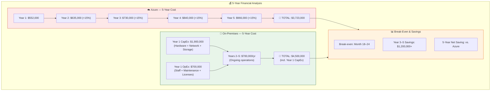
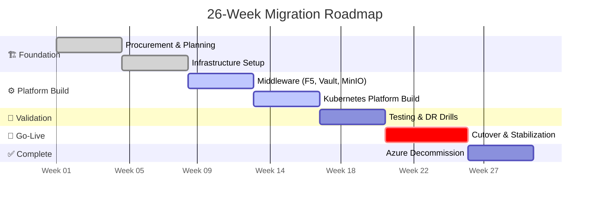
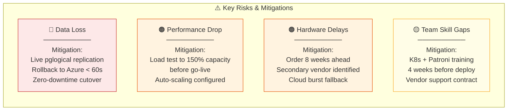
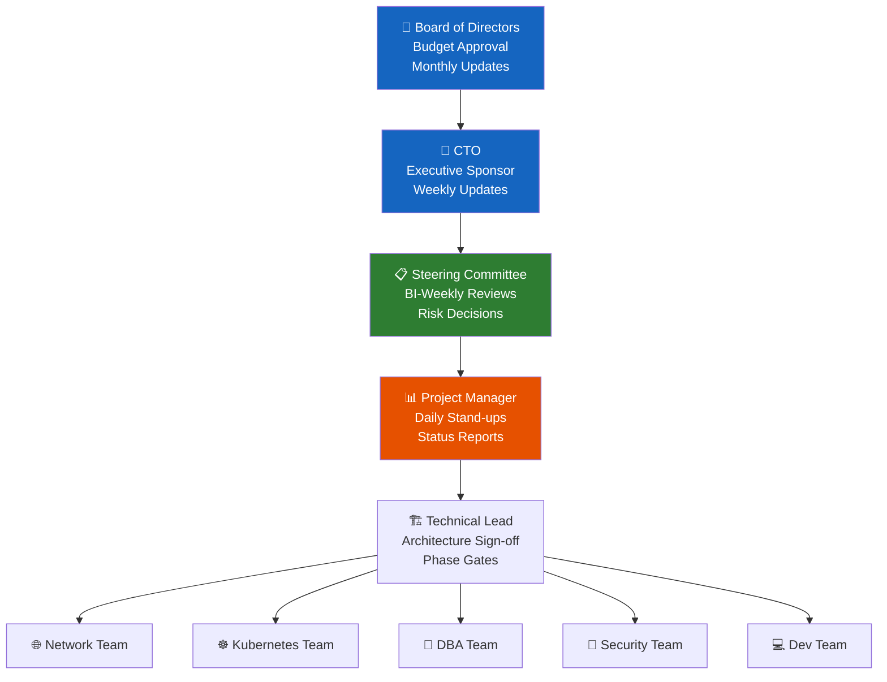

# 🎯 Executive Presentation
## Azure to On-Premises Migration

---

## Slide 1: The Business Case

```
╔══════════════════════════════════════════════════════════════════════════════╗
║                                                                              ║
║  WHY MIGRATE FROM AZURE TO ON-PREMISES?                                      ║
║  ══════════════════════════════════════                                       ║
║                                                                              ║
║  🔴 CURRENT PROBLEMS              🟢 WHAT WE GAIN                            ║
║  ─────────────────────            ──────────────                             ║
║  💸 $552,000/yr cloud bill        💰 Save $400,000/yr (after 18 months)     ║
║  📈 15% cost growth annually      📉 Predictable fixed costs                 ║
║  🔒 Azure vendor lock-in          🔓 Technology independence                 ║
║  📍 Data in Microsoft DCs         🏢 100% data sovereignty                   ║
║  ⚙️  Limited customization        🛠️  Full infrastructure control            ║
║  📶 Noisy-neighbor latency        ⚡ Dedicated resources, lower latency      ║
║  📜 Shared compliance model       🛡️  Own security infrastructure            ║
║                                                                              ║
╚══════════════════════════════════════════════════════════════════════════════╝
```

---

## Slide 2: Financial Overview



| Year | Azure Cost | On-Prem Cost | Cumulative Saving |
|------|-----------|-------------|------------------|
| Year 1 (migration) | $552,000 | $2,600,000 | -$2,048,000 |
| Year 2 | $635,000 | $700,000 | -$2,113,000 |
| Year 3 | $730,000 | $700,000 | -$2,083,000 |
| Year 4 | $840,000 | $700,000 | -$1,943,000 |
| Year 5 | $966,000 | $700,000 | **-$1,677,000** |
| **5-Year Total** | **$3,723,000** | **$5,400,000** | *(CapEx-heavy upfront)* |

> 💡 **Key Insight**: After Year 2, on-prem costs $400K+/yr less than Azure. ROI positive by Year 3.

---

## Slide 3: Migration Timeline



---

## Slide 4: What Changes for Users?

```
╔══════════════════════════════════════════════════════════════════╗
║  IMPACT ON END USERS                                             ║
╠══════════════════════════════════════════════════════════════════╣
║                                                                  ║
║  ✅ ZERO DOWNTIME during migration (blue/green cutover)         ║
║                                                                  ║
║  ✅ SAME URL — app.company.com stays identical                  ║
║                                                                  ║
║  ✅ FASTER — response time target < 150ms (was 180ms)           ║
║                                                                  ║
║  ✅ MORE RELIABLE — 99.99% uptime (was 99.95%)                  ║
║                                                                  ║
║  ✅ SAME FEATURES — all functionality preserved                  ║
║                                                                  ║
║  ✅ YOUR DATA is now stored on-premises (compliance win)         ║
║                                                                  ║
╚══════════════════════════════════════════════════════════════════╝
```

---

## Slide 5: Risk Summary & Mitigation



---

## Slide 6: Success Criteria

```
┌─────────────────────────────────────────────────────────────────────┐
│                    GO-LIVE SUCCESS DEFINITION                        │
├─────────────────────────────────────────────────────────────────────┤
│                                                                      │
│  🎯 PERFORMANCE                                                      │
│     • Response time P95 < 200ms ............. measured by Prometheus │
│     • Error rate < 0.1% ...................... measured by Grafana   │
│     • Throughput > 10,000 req/s .............. verified by k6 test  │
│                                                                      │
│  🎯 RELIABILITY                                                      │
│     • 99.99% uptime in first 30 days ......... Grafana dashboard    │
│     • DB failover tested RTO < 5 min ......... DR drill verified    │
│     • Backup running daily ................... Bacula reports        │
│                                                                      │
│  🎯 FINANCIAL                                                        │
│     • Azure costs dropping month-over-month... Finance dashboard     │
│     • On-prem OpEx within budget ............. CFO approval         │
│                                                                      │
│  🎯 TEAM                                                             │
│     • Ops team running independently ......... No vendor calls      │
│     • Runbooks complete & tested ............. Reviewed by CTO      │
│     • Monitoring dashboards understood ........ Team sign-off       │
│                                                                      │
└─────────────────────────────────────────────────────────────────────┘
```

---

## Slide 7: Project Governance



---

**Document Version**: 2.0 | **Date**: July 2026 | **Audience**: Executive / Board
