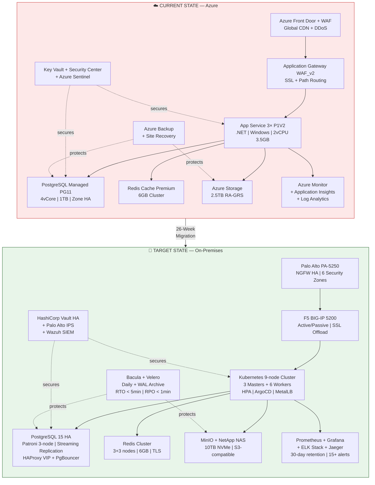
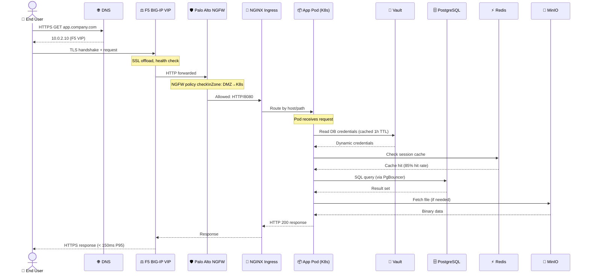
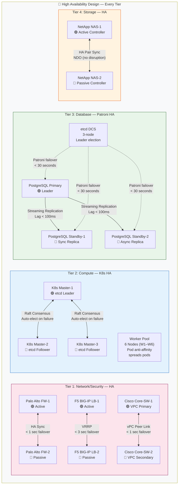
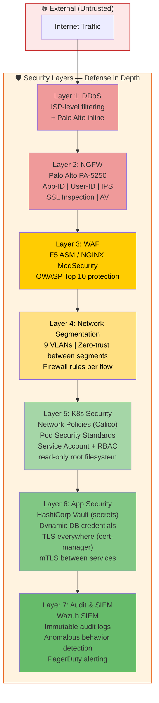

# 🏗️ High Level Design (HLD)
## Azure to On-Premises Migration

---

## HLD Overview

```
┌───────────────────────────────────────────────────────────────────────────┐
│                    HIGH LEVEL DESIGN SUMMARY                              │
├──────────────────────┬────────────────────────────────────────────────────┤
│  Design Principle    │  Implementation                                    │
├──────────────────────┼────────────────────────────────────────────────────┤
│  High Availability   │  No single point of failure at any tier           │
│  Defense in Depth    │  6 security zones, NGFW + WAF + Vault + RBAC     │
│  GitOps              │  All deployments from Git via ArgoCD              │
│  Immutable Infra     │  Containers, Helm charts, Ansible — no manual     │
│  Observable          │  Prometheus, Grafana, ELK, Jaeger, Alertmanager   │
│  Scalable            │  Kubernetes HPA auto-scales 2→5 pods on demand    │
│  Recoverable         │  RTO < 5 min (DB), RPO < 1 min, daily backups    │
└──────────────────────┴────────────────────────────────────────────────────┘
```

---

## HLD Diagram 1: Current vs Target — Side by Side



---

## HLD Diagram 2: Traffic Flow



---

## HLD Diagram 3: Availability & HA Design



---

## HLD Diagram 4: CI/CD & GitOps Pipeline

```mermaid
flowchart LR
    DEV["👨‍💻 Developer\npushes code"] --> GL

    subgraph GITLAB_CI["🦊 GitLab CI Pipeline"]
        GL["GitLab\nRepository"] --> BUILD["Build Stage\ndotnet build\ndocker build"]
        BUILD --> TEST["Test Stage\nunit tests\nintegration tests"]
        TEST --> SCAN["Security Stage\nTrivy image scan\nSAST scan"]
        SCAN --> PUSH["Push Stage\ndocker push\nHarbor Registry"]
        PUSH --> UPDATE["Update Stage\ngit commit image tag\nto GitOps repo"]
    end

    subgraph GITOPS["🔄 ArgoCD GitOps"]
        UPDATE --> GITOPS_REPO["GitOps Repository\nHelm values\nK8s manifests"]
        GITOPS_REPO --> ARGO["ArgoCD\nDetects change\nAutomatically syncs"]
    end

    subgraph K8S_DEPLOY["☸️ Kubernetes Deployment"]
        ARGO --> STAGING["Deploy to\nStaging namespace"]
        STAGING --> SMOKE["Automated\nSmoke Tests"]
        SMOKE -->|"✅ Pass"| PROD["Deploy to\nProduction namespace\nRolling update"]
        SMOKE -->|"❌ Fail"| ROLLBACK["Auto Rollback\nto previous version"]
    end

    PROD --> MON["📊 Prometheus\nMonitor new version"]
    MON -->|"Alert on errors"| ROLLBACK

    style GITLAB_CI fill:#fc6d26,color:#fff
    style GITOPS fill:#e3f2fd,stroke:#1565c0
    style K8S_DEPLOY fill:#e8f5e9,stroke:#1b5e20
```



---

## HLD Diagram 5: Security Architecture



---

## HLD Design Decisions

| Decision | Options Considered | Choice | Rationale |
|----------|-------------------|--------|-----------|
| Container orchestration | Kubernetes, Docker Swarm, Nomad | **Kubernetes 1.28** | Industry standard, rich ecosystem, HPA, GitOps |
| DB HA solution | Patroni, Citus, Pgpool-II, Crunchy | **Patroni + etcd** | Battle-tested, automatic failover, K8s-native |
| Load balancer | F5, HAProxy, NGINX, Keepalived | **F5 BIG-IP** | Enterprise HA, SSL offload, iRules, support |
| Firewall | Palo Alto, Fortinet, Cisco ASA | **Palo Alto PA-5250** | NGFW + App-ID + SSL inspection, best threat intel |
| Secrets management | Vault, CyberArk, Sealed Secrets | **HashiCorp Vault** | K8s native inject, dynamic creds, PKI engine |
| GitOps engine | ArgoCD, Flux, Jenkins | **ArgoCD** | UI + drift detection + self-healing + rollback |
| Container registry | Harbor, JFrog, GitLab | **Harbor** | Free, Trivy scanning, LDAP, project isolation |
| Monitoring | Prometheus+Grafana, Datadog, Zabbix | **Prometheus + Grafana** | Open-source, K8s native, vast dashboard library |
| Log management | ELK, Loki+Grafana, Splunk | **ELK Stack** | Full-text search, Kibana SIEM, mature ecosystem |
| Object storage | MinIO, Ceph, GlusterFS | **MinIO** | S3-compatible API (drop-in Azure Blob replace) |

---

**Document Version**: 2.0 | **Date**: July 2026 | **Audience**: Architects, Tech Leads
