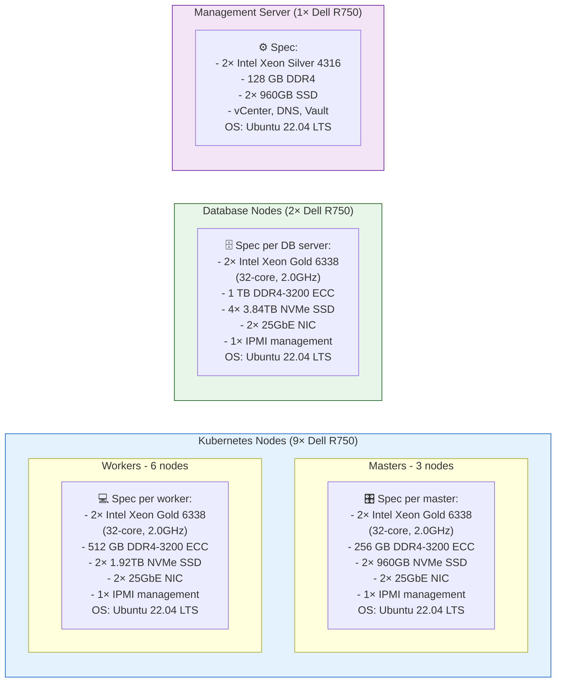
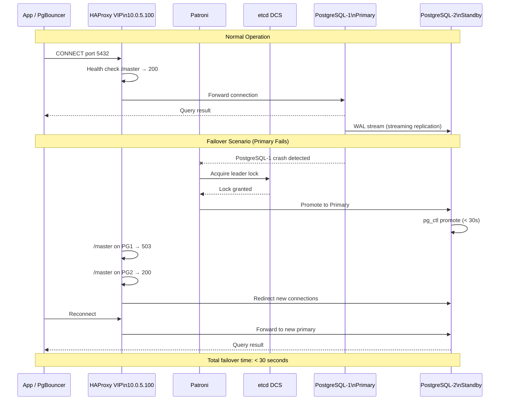
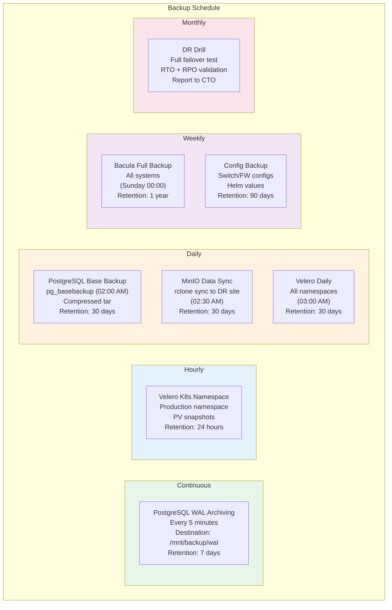

# 🔩 Low Level Design (LLD)
## Azure to On-Premises Migration

---

## 1. IP Address Plan (Complete)

```
╔═══════════════════════════════════════════════════════════════════════════╗
║                      COMPLETE IP ADDRESS PLAN                             ║
╠══════════════╦═══════════════════╦═══════════════════════════════════════╣
║  VLAN 10     ║  Management       ║  10.0.1.0/24                          ║
╠══════════════╬═══════════════════╬═══════════════════════════════════════╣
║  .1          ║  Default Gateway  ║  Core Switch L3 SVI                   ║
║  .2          ║  Palo Alto FW-1   ║  Management interface                 ║
║  .3          ║  Palo Alto FW-2   ║  Management interface (HA)            ║
║  .4          ║  F5 BIG-IP LB-1   ║  Management interface                 ║
║  .5          ║  F5 BIG-IP LB-2   ║  Management interface (HA)            ║
║  .10         ║  vCenter Server   ║  VMware management                    ║
║  .11         ║  ESXi-1           ║  Hypervisor management                ║
║  .12         ║  ESXi-2           ║  Hypervisor management                ║
║  .20         ║  Cisco Core-SW-1  ║  NX-OS management                     ║
║  .21         ║  Cisco Core-SW-2  ║  NX-OS management                     ║
║  .30         ║  Bastion Host     ║  SSH jump server                      ║
║  .50         ║  DNS Server       ║  BIND9 internal DNS                   ║
║  .51         ║  NTP Server       ║  Chrony NTP                           ║
║  .60         ║  LDAP/AD Server   ║  Active Directory                     ║
╠══════════════╬═══════════════════╬═══════════════════════════════════════╣
║  VLAN 20     ║  DMZ              ║  10.0.2.0/24                          ║
╠══════════════╬═══════════════════╬═══════════════════════════════════════╣
║  .1          ║  Default Gateway  ║  Palo Alto internal DMZ interface      ║
║  .10         ║  F5 VIP           ║  Public-facing HTTPS VIP              ║
║  .11         ║  F5 LB-1 self     ║  F5 self IP (active)                  ║
║  .12         ║  F5 LB-2 self     ║  F5 self IP (passive)                 ║
╠══════════════╬═══════════════════╬═══════════════════════════════════════╣
║  VLAN 30     ║  K8s Control      ║  10.0.3.0/24                          ║
╠══════════════╬═══════════════════╬═══════════════════════════════════════╣
║  .1          ║  Gateway          ║  Core switch SVI                      ║
║  .11         ║  k8s-master-1     ║  Control plane node                   ║
║  .12         ║  k8s-master-2     ║  Control plane node                   ║
║  .13         ║  k8s-master-3     ║  Control plane node                   ║
║  .100        ║  K8s API VIP      ║  k8s-api.internal.company.com         ║
╠══════════════╬═══════════════════╬═══════════════════════════════════════╣
║  VLAN 40     ║  K8s Workers      ║  10.0.4.0/24                          ║
╠══════════════╬═══════════════════╬═══════════════════════════════════════╣
║  .21–.26     ║  Workers 1–6      ║  Kubernetes worker nodes              ║
║  .200–.220   ║  MetalLB Pool     ║  LoadBalancer external IPs            ║
║  .200        ║  NGINX Ingress    ║  Main ingress VIP (→F5 backend)       ║
╠══════════════╬═══════════════════╬═══════════════════════════════════════╣
║  VLAN 50     ║  Database         ║  10.0.5.0/24                          ║
╠══════════════╬═══════════════════╬═══════════════════════════════════════╣
║  .1          ║  PostgreSQL-1     ║  Primary / Patroni Leader             ║
║  .2          ║  PostgreSQL-2     ║  Standby-1 / Patroni Follower         ║
║  .3          ║  PostgreSQL-3     ║  Standby-2 / Patroni Follower         ║
║  .11–.13     ║  etcd nodes       ║  Patroni DCS (etcd cluster)           ║
║  .50         ║  Redis Master-1   ║  Redis cluster node                   ║
║  .51         ║  Redis Master-2   ║  Redis cluster node                   ║
║  .52         ║  Redis Master-3   ║  Redis cluster node                   ║
║  .55–.57     ║  Redis Replicas   ║  Redis replica nodes 1–3              ║
║  .100        ║  HAProxy VIP      ║  DB VIP (5432 primary / 5433 replica) ║
║  .200        ║  PgBouncer        ║  Connection pooler (port 6432)        ║
╠══════════════╬═══════════════════╬═══════════════════════════════════════╣
║  VLAN 60     ║  Storage          ║  10.0.6.0/24                          ║
╠══════════════╬═══════════════════╬═══════════════════════════════════════╣
║  .10         ║  NetApp NAS-1     ║  ONTAP cluster node 1                 ║
║  .11         ║  NetApp NAS-2     ║  ONTAP cluster node 2 (HA pair)       ║
║  .20–.23     ║  MinIO Nodes      ║  MinIO distributed 4-node             ║
╠══════════════╬═══════════════════╬═══════════════════════════════════════╣
║  VLAN 70     ║  Monitoring       ║  10.0.7.0/24                          ║
╠══════════════╬═══════════════════╬═══════════════════════════════════════╣
║  .10         ║  Prometheus       ║  Metrics server                       ║
║  .11         ║  Alertmanager     ║  Alert routing                        ║
║  .12         ║  Grafana          ║  Visualization UI                     ║
║  .20         ║  Elasticsearch-1  ║  ELK master node                      ║
║  .21         ║  Elasticsearch-2  ║  ELK data node                        ║
║  .22         ║  Elasticsearch-3  ║  ELK data node                        ║
║  .25         ║  Logstash         ║  Log processing                       ║
║  .26         ║  Kibana           ║  Log visualization                    ║
║  .30         ║  Jaeger           ║  Distributed tracing                  ║
╠══════════════╬═══════════════════╬═══════════════════════════════════════╣
║  VLAN 80     ║  CI/CD & Mgmt     ║  10.0.8.0/24                          ║
╠══════════════╬═══════════════════╬═══════════════════════════════════════╣
║  .10–.12     ║  Vault nodes 1–3  ║  HashiCorp Vault HA cluster           ║
║  .20         ║  GitLab           ║  CI/CD + GitOps repo                  ║
║  .30         ║  Harbor           ║  Container registry                   ║
║  .40         ║  ArgoCD           ║  GitOps deploy engine (in K8s)        ║
╠══════════════╬═══════════════════╬═══════════════════════════════════════╣
║  VLAN 90     ║  Backup           ║  10.0.9.0/24                          ║
╠══════════════╬═══════════════════╬═══════════════════════════════════════╣
║  .10         ║  Bacula Director  ║  Backup job scheduling                ║
║  .11         ║  Bacula Storage   ║  Backup storage daemon                ║
╚══════════════╩═══════════════════╩═══════════════════════════════════════╝
```

---

## 2. Server Hardware Specification



---

## 3. Kubernetes Namespace & Resource Design

```
┌─────────────────────────────────────────────────────────────────────────────┐
│                    KUBERNETES RESOURCE ALLOCATION                           │
├──────────────────┬──────────────────┬─────────────────┬────────────────────┤
│  Namespace       │  ResourceQuota   │  Pods           │  Key Services      │
├──────────────────┼──────────────────┼─────────────────┼────────────────────┤
│  production      │  CPU: 20 cores   │  3–5 webapp     │  webapp, cronjobs  │
│                  │  MEM: 20 Gi      │  + 2 cronjobs   │  HPA: 2→5          │
├──────────────────┼──────────────────┼─────────────────┼────────────────────┤
│  preprod         │  CPU: 8 cores    │  1–2 webapp     │  webapp (preprod)  │
│                  │  MEM: 8 Gi       │                 │  HPA: 1→2          │
├──────────────────┼──────────────────┼─────────────────┼────────────────────┤
│  monitoring      │  CPU: 12 cores   │  Prometheus×2   │  Prometheus        │
│                  │  MEM: 32 Gi      │  Grafana×1      │  Grafana           │
│                  │                  │  Alertmgr×1     │  Alertmanager      │
├──────────────────┼──────────────────┼─────────────────┼────────────────────┤
│  logging         │  CPU: 16 cores   │  ES×3           │  Elasticsearch     │
│                  │  MEM: 48 Gi      │  Logstash×1     │  Logstash          │
│                  │                  │  Kibana×1       │  Kibana            │
│                  │                  │  Filebeat DSet  │  Filebeat          │
├──────────────────┼──────────────────┼─────────────────┼────────────────────┤
│  argocd          │  CPU: 4 cores    │  ArgoCD pods    │  ArgoCD server     │
│                  │  MEM: 4 Gi       │                 │  ArgoCD repo-srv   │
├──────────────────┼──────────────────┼─────────────────┼────────────────────┤
│  vault           │  CPU: 4 cores    │  Vault×3        │  Vault HA cluster  │
│                  │  MEM: 4 Gi       │  Injector×2     │  Vault agent inj.  │
├──────────────────┼──────────────────┼─────────────────┼────────────────────┤
│  ingress-nginx   │  CPU: 4 cores    │  NGINX×3        │  Ingress controller│
│                  │  MEM: 2 Gi       │                 │  (LoadBalancer)    │
├──────────────────┼──────────────────┼─────────────────┼────────────────────┤
│  cert-manager    │  CPU: 1 core     │  Cert-mgr pods  │  TLS cert auto     │
│                  │  MEM: 512 Mi     │                 │                    │
└──────────────────┴──────────────────┴─────────────────┴────────────────────┘
```

---

## 4. PostgreSQL HA Detailed Design



---

## 5. DNS Records Design

```
INTERNAL DNS RECORDS (BIND9 @ 10.0.1.50)
══════════════════════════════════════════════════════════════════
Zone: company.com

# Application
app.company.com.          A     10.0.2.10    ; F5 VIP (public)
api.company.com.          CNAME app.company.com.
www.company.com.          CNAME app.company.com.

# Infrastructure
grafana.company.com.      A     10.0.7.12
kibana.company.com.       A     10.0.7.26
argocd.company.com.       A     10.0.4.200   ; via NGINX ingress
vault.company.com.        A     10.0.4.200   ; via NGINX ingress
harbor.company.com.       A     10.0.8.30

# Kubernetes
k8s-api.internal.company.com.  A  10.0.3.100 ; K8s API VIP
*.cluster.local               ; K8s internal DNS (CoreDNS)

# Database
db.company.com.           A     10.0.5.100   ; HAProxy VIP
db-primary.company.com.   A     10.0.5.1
db-standby1.company.com.  A     10.0.5.2
redis.company.com.        A     10.0.5.50

# Storage
minio.company.com.        A     10.0.6.20
nas.company.com.          A     10.0.6.10
```

---

## 6. TLS Certificate Plan

```
┌───────────────────────────────────────────────────────────────────┐
│                    TLS CERTIFICATE INVENTORY                       │
├───────────────────┬──────────────────┬───────────┬───────────────┤
│  FQDN             │  Issued By       │  Duration │  Auto-Renew?  │
├───────────────────┼──────────────────┼───────────┼───────────────┤
│  app.company.com  │  Let's Encrypt   │  90 days  │  ✅ cert-mgr  │
│  api.company.com  │  Let's Encrypt   │  90 days  │  ✅ cert-mgr  │
│  grafana.*        │  Internal CA     │  1 year   │  ✅ Vault PKI │
│  kibana.*         │  Internal CA     │  1 year   │  ✅ Vault PKI │
│  argocd.*         │  Internal CA     │  1 year   │  ✅ Vault PKI │
│  vault.*          │  Internal CA     │  1 year   │  ✅ Vault PKI │
│  harbor.*         │  Internal CA     │  1 year   │  ✅ Vault PKI │
│  DB node certs    │  Vault PKI       │  90 days  │  ✅ Patroni   │
│  etcd certs       │  Vault PKI       │  1 year   │  ✅ Vault PKI │
│  K8s API cert     │  Kubeadm CA      │  1 year   │  ✅ kubeadm   │
│  Kubelet certs    │  Kubeadm CA      │  1 year   │  ✅ Auto-rotat│
└───────────────────┴──────────────────┴───────────┴───────────────┘
```

---

## 7. Backup Schedule Design



---

## 8. Alerting Runbook Reference

| Alert | Threshold | Severity | On-Call Response |
|-------|-----------|----------|-----------------|
| AppDown | HTTP 5xx > 5% for 2m | 🔴 P1 | Immediate — check K8s pods, DB, ingress |
| PodCrashLoop | Any restart in 15m | 🔴 P1 | `kubectl describe pod` → check logs |
| PostgreSQLDown | pg_up == 0 | 🔴 P1 | Check patroni, HAProxy, failover status |
| HighResponseTime | P95 > 200ms for 5m | 🟠 P2 | Check DB slow queries, Redis hit rate |
| NodeHighCPU | > 85% for 10m | 🟠 P2 | Check workloads, consider scaling |
| NodeHighMemory | > 90% for 5m | 🔴 P1 | Immediate eviction risk — drain node |
| DiskSpaceLow | > 80% | 🟠 P2 | Clean old images, logs, expand volume |
| ReplicationLag | > 30s | 🟠 P2 | Check network between PG nodes |
| BackupFailed | Last backup > 26h ago | 🟠 P2 | Check Bacula, disk space, logs |
| VaultSealed | vault status sealed | 🔴 P1 | Unseal immediately (3-of-5 keys) |
| CertExpirySoon | < 14 days | 🟡 P3 | Force cert-manager renewal |
| HighErrorRate | > 1% for 2m | 🔴 P1 | Check app logs, DB errors, upstream |

---

**Document Version**: 2.0 | **Date**: July 2026 | **Audience**: Engineers, Operations Team
