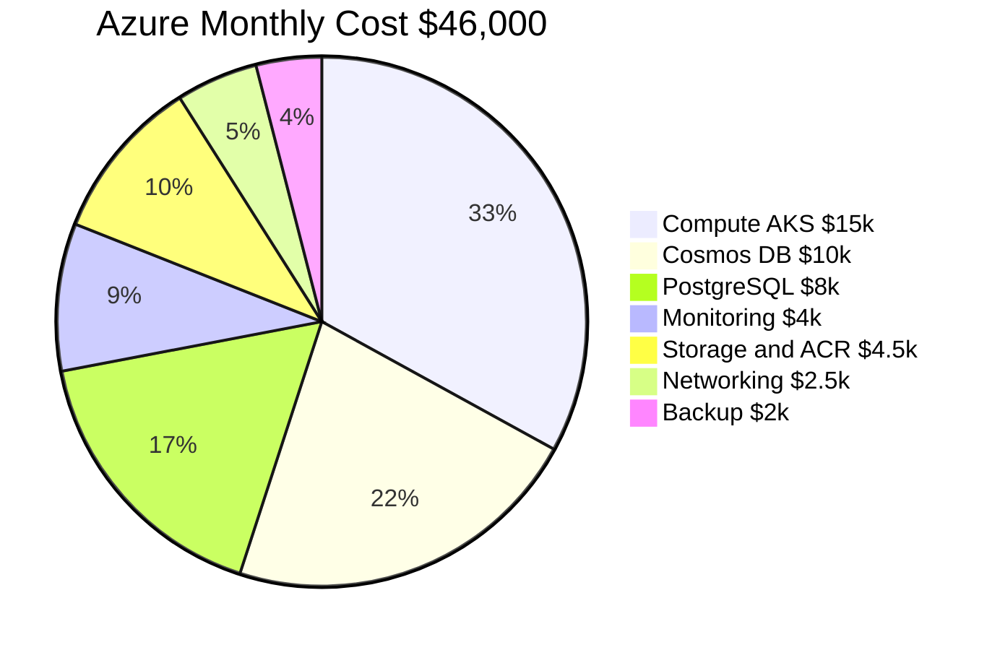
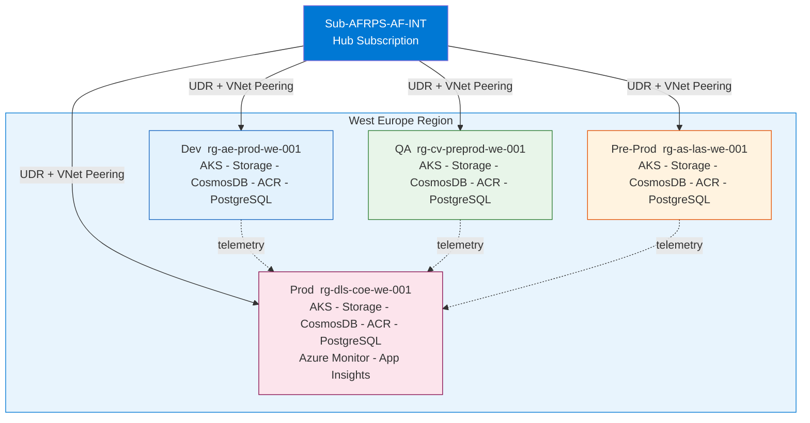
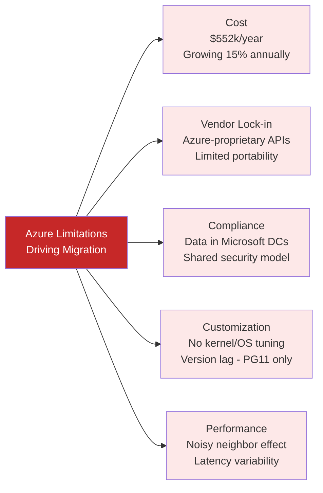

# Volume 1: Executive & Solution Architecture
## Chapter 4: Current Azure Architecture — Visual Reference

> **Purpose**: Exact visual representation of the existing Azure deployment before migration.

---

## Azure Architecture — Full Stack Diagram

> **Note**: Architecture comprises 4 environments (Dev, QA, Pre-Prod, Prod) — each in its own Virtual Network and Resource Group, all connected via the `Sub-AFRPS-AF-INT` hub subscription. Every environment has the identical stack: **AKS + Storage Account + Azure Cosmos DB + Azure Container Registry + Azure Database for PostgreSQL**. Monitoring and Observability are centralised in the shared RG `rg-dls-coe-we-001`.

```mermaid
graph TB
    HUB[Sub-AFRPS-AF-INT\nHub / Shared Subscription]

    subgraph RG1["rg-ae-prod-we-001  Dev Environment"]
        AKS1[Azure Kubernetes Service\nUDR routed]
        SA1[Storage Account\nUDR]
        COSMOS1[(Azure Cosmos DB\nUDR)]
        ACR1[Azure Container Registry\nUDR]
        PG1[(Azure Database\nfor PostgreSQL\nUDR)]
    end

    subgraph RG2["rg-cv-preprod-we-001  QA Environment"]
        AKS2[Azure Kubernetes Service\nUDR routed]
        SA2[Storage Account\nUDR]
        COSMOS2[(Azure Cosmos DB\nUDR)]
        ACR2[Azure Container Registry\nUDR]
        PG2[(Azure Database\nfor PostgreSQL\nUDR)]
    end

    subgraph RG3["rg-as-las-we-001  Pre-Prod Environment"]
        AKS3[Azure Kubernetes Service\nUDR routed]
        SA3[Storage Account\nUDR]
        COSMOS3[(Azure Cosmos DB\nUDR)]
        ACR3[Azure Container Registry\nUDR]
        PG3[(Azure Database\nfor PostgreSQL\nUDR)]
    end

    subgraph RG4["rg-dls-coe-we-001  Production + Shared Monitoring"]
        AKS4[Azure Kubernetes Service\nUDR routed]
        SA4[Storage Account\nUDR]
        COSMOS4[(Azure Cosmos DB\nUDR)]
        ACR4[Azure Container Registry\nUDR]
        PG4[(Azure Database\nfor PostgreSQL\nUDR)]
        MON[Azure Monitor]
        AI[Application Insights]
    end

    HUB -->|VNet Peering / UDR| RG1
    HUB -->|VNet Peering / UDR| RG2
    HUB -->|VNet Peering / UDR| RG3
    HUB -->|VNet Peering / UDR| RG4

    AKS1 --> SA1
    AKS1 --> COSMOS1
    AKS1 --> ACR1
    AKS1 --> PG1

    AKS2 --> SA2
    AKS2 --> COSMOS2
    AKS2 --> ACR2
    AKS2 --> PG2

    AKS3 --> SA3
    AKS3 --> COSMOS3
    AKS3 --> ACR3
    AKS3 --> PG3

    AKS4 --> SA4
    AKS4 --> COSMOS4
    AKS4 --> ACR4
    AKS4 --> PG4
    AKS4 -.->|metrics / logs| MON
    AKS1 -.->|metrics / logs| MON
    AKS2 -.->|metrics / logs| MON
    AKS3 -.->|metrics / logs| MON
    MON --> AI

    style RG1 fill:#e3f2fd,stroke:#1565c0
    style RG2 fill:#e8f5e9,stroke:#2e7d32
    style RG3 fill:#fff3e0,stroke:#e65100
    style RG4 fill:#fce4ec,stroke:#880e4f
```

---

## Azure Cost Breakdown (Current Monthly: ~$46,000)

| Category | Services | Monthly Cost | Share |
|----------|---------|-------------|-------|
| Compute | AKS clusters (4 environments) | $15,000 | 33% |
| Data — SQL | PostgreSQL (4 instances, one per env) | $8,000 | 17% |
| Data — NoSQL | Azure Cosmos DB (4 instances, one per env) | $10,000 | 22% |
| Storage | Storage Accounts (4, one per env) | $3,000 | 7% |
| Registry | Azure Container Registry (4, one per env) | $1,500 | 3% |
| Networking | VNet Peering + UDR + Load Balancers | $2,500 | 5% |
| Monitoring | Azure Monitor + App Insights (shared) | $4,000 | 9% |
| Backup and DR | Backup Vault + Site Recovery | $2,000 | 4% |
| **Total** | | **$46,000/mo** | **100%** |

---

## Azure Network Topology — Hub and Spoke (4 Environments)

---

## Azure Performance Baseline

| Metric | Current Value | SLA Target |
|--------|--------------|------------|
| Response Time P50 | 120 ms | < 100 ms |
| Response Time P95 | 180 ms | < 200 ms |
| Response Time P99 | 500 ms | < 1000 ms |
| Error Rate | 0.1% | < 0.5% |
| Availability | 99.95% | 99.9%+ |
| Throughput | 5,000 req/s | 5,000 req/s |
| Concurrent Users | 3,000 avg | 10,000 peak |
| Page Load Time | 2.5 sec | < 3 sec |
| DB Connections (avg) | 200 | < 400 |
| Storage Used | 2.5 TB | — |
| Database Instances | 4 (one per workload VNet) | — |
| Monthly Cost | $46,000 | — |

---

## Azure Services Limitations (Why We Migrate)

---

**Document Version**: 2.0 | **Date**: July 2026 | **Classification**: Internal Use Only
