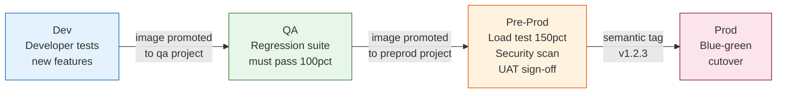

# Volume 1: Executive & Solution Architecture
## Chapter 7: Per-Environment On-Premises Architecture

> **Purpose**: Exact on-premises implementation of the Azure 5-service stack (AKS + Storage + Cosmos DB + ACR + PostgreSQL) replicated across all 4 environments — Dev, QA, Pre-Prod, and Production.

---

## Architecture Philosophy

The Azure architecture runs **4 identical environments** (Dev, QA, Pre-Prod, Prod) each with the same 5 services in separate VNets. The on-premises design mirrors this exactly: each environment gets the **same 5 on-prem equivalents** isolated in its own Kubernetes namespace with dedicated database instances.

```
AZURE (per environment VNet)          ON-PREMISES (per K8s namespace)
─────────────────────────────         ──────────────────────────────────
Azure Kubernetes Service       →      Kubernetes namespace (dev/qa/preprod/prod)
Azure Storage Account          →      MinIO (dedicated bucket prefix per env)
Azure Cosmos DB                →      MongoDB 7.0 ReplicaSet (dedicated DB per env)
Azure Container Registry       →      Harbor (dedicated project per env)
Azure Database for PostgreSQL  →      PostgreSQL 15 (dedicated DB + schema per env)
```

---

## Full 4-Environment On-Premises Diagram

```mermaid
graph TB
    subgraph SHARED["Shared Infrastructure  -  All Environments"]
        FW[Palo Alto PA-5250\nNGFW HA]
        F5[F5 BIG-IP 5200\nHA Load Balancer]
        SW[Cisco Nexus\nVPC Core Switch]
        HARBOR[Harbor Registry\nProjects: dev/qa/preprod/prod]
        VAULT[HashiCorp Vault\nSecrets per env namespace]
        ARGO[ArgoCD\nApp per env]
        PROM[Prometheus\nNamespace labels]
        GRAF[Grafana\nPer-env dashboards]
        ELK[ELK Stack\nIndex per env]
    end

    subgraph DEV["Namespace: dev  -  worker-1/worker-2"]
        D_APP[App Pods dev\nHPA 1-2 replicas]
        D_MINIO[MinIO\nbucket: dev-data]
        D_MONGO[(MongoDB\nDB: dev-cosmos)]
        D_PG[(PostgreSQL\nDB: devdb)]
    end

    subgraph QA["Namespace: qa  -  worker-1/worker-2"]
        Q_APP[App Pods qa\nHPA 2-3 replicas]
        Q_MINIO[MinIO\nbucket: qa-data]
        Q_MONGO[(MongoDB\nDB: qa-cosmos)]
        Q_PG[(PostgreSQL\nDB: qadb)]
    end

    subgraph PREPROD["Namespace: preprod  -  worker-3/worker-4"]
        P_APP[App Pods preprod\nHPA 2-4 replicas]
        P_MINIO[MinIO\nbucket: preprod-data]
        P_MONGO[(MongoDB\nDB: preprod-cosmos)]
        P_PG[(PostgreSQL\nDB: preproddb)]
    end

    subgraph PROD["Namespace: prod  -  worker-5/worker-6  DEDICATED"]
        PR_APP[App Pods prod\nHPA 3-10 replicas]
        PR_MINIO[MinIO\nbucket: prod-data]
        PR_MONGO[(MongoDB ReplicaSet\nDB: prod-cosmos\n3-node HA)]
        PR_PG[(PostgreSQL HA\nPatroni 3-node\nDB: proddb)]
    end

    FW --> F5 --> SW
    SW --> DEV & QA & PREPROD & PROD
    HARBOR -.->|images| D_APP & Q_APP & P_APP & PR_APP
    VAULT -.->|secrets| DEV & QA & PREPROD & PROD
    ARGO -.->|deploy| DEV & QA & PREPROD & PROD
    PROM -.->|scrape| DEV & QA & PREPROD & PROD
    ELK -.->|collect logs| DEV & QA & PREPROD & PROD

    style SHARED fill:#e8eaf6,stroke:#283593
    style DEV fill:#e3f2fd,stroke:#1565c0
    style QA fill:#e8f5e9,stroke:#2e7d32
    style PREPROD fill:#fff3e0,stroke:#e65100
    style PROD fill:#fce4ec,stroke:#880e4f
```



---

## Per-Environment Specifications

### Dev Environment

```
Kubernetes Namespace: dev
Node Assignment:      worker-1, worker-2 (shared with QA)
Priority Class:       low

Application:
  Replicas:   1-2 (HPA, scale on CPU > 70%)
  CPU limit:  500m per pod
  RAM limit:  512Mi per pod

Storage — MinIO:
  Bucket prefix:  dev-
  Buckets:        dev-data, dev-backups, dev-exports
  Quota:          50 GB

NoSQL — MongoDB:
  Database:   dev-cosmos
  Mode:       Standalone (single node, no HA — cost saving)
  Host:       mongo-dev.10.0.5.20
  Port:       27017
  Auth:       dev_user (Vault-injected)
  Collections: sessions, audit_logs, notifications, config, analytics

Relational — PostgreSQL:
  Database:   devdb
  Mode:       Single instance (no standby — cost saving)
  Host:       10.0.5.1 (shared PG server, isolated DB)
  PgBouncer:  dev pool, max 20 connections

Harbor:
  Project:    dev
  Images:     myapp:dev-*
  Scanning:   Trivy on push (block Critical CVEs)

Vault:
  Path:       secret/dev/*
  DB role:    dev-db-role (read/write devdb)
  Mongo role: dev-mongo-role (read/write dev-cosmos)
```

### QA Environment

```
Kubernetes Namespace: qa
Node Assignment:      worker-1, worker-2 (shared with Dev)
Priority Class:       low

Application:
  Replicas:   2-3 (HPA)
  CPU limit:  1000m per pod
  RAM limit:  1Gi per pod

Storage — MinIO:
  Bucket prefix:  qa-
  Buckets:        qa-data, qa-backups, qa-test-data
  Quota:          100 GB

NoSQL — MongoDB:
  Database:   qa-cosmos
  Mode:       Standalone (single node)
  Host:       mongo-qa.10.0.5.21
  Port:       27017
  Auth:       qa_user (Vault-injected)

Relational — PostgreSQL:
  Database:   qadb
  Mode:       Single instance (shared PG server, isolated DB)
  PgBouncer:  qa pool, max 50 connections

Harbor:
  Project:    qa
  Images:     myapp:qa-* (promoted from dev after tests)

Vault:
  Path:       secret/qa/*
```

### Pre-Prod Environment

```
Kubernetes Namespace: preprod
Node Assignment:      worker-3, worker-4 (dedicated)
Priority Class:       medium

Application:
  Replicas:   2-4 (HPA — prod-equivalent scaling)
  CPU limit:  2000m per pod
  RAM limit:  2Gi per pod

Storage — MinIO:
  Bucket prefix:  preprod-
  Buckets:        preprod-data, preprod-backups, preprod-exports
  Quota:          500 GB

NoSQL — MongoDB:
  Database:   preprod-cosmos
  Mode:       ReplicaSet 1 Primary + 1 Secondary (HA for load testing)
  Primary:    mongo-preprod-1.10.0.5.22
  Secondary:  mongo-preprod-2.10.0.5.23
  Port:       27017
  Auth:       preprod_user (Vault-injected)

Relational — PostgreSQL:
  Database:   preproddb
  Mode:       Primary + 1 Standby (Patroni)
  Primary:    10.0.5.4
  Standby:    10.0.5.5
  PgBouncer:  preprod pool, max 100 connections

Harbor:
  Project:    preprod
  Images:     myapp:preprod-* (release candidates)

Vault:
  Path:       secret/preprod/*
```

### Production Environment

```
Kubernetes Namespace: prod
Node Assignment:      worker-5, worker-6 (DEDICATED — no sharing)
Priority Class:       high
PodDisruptionBudget:  min 3 pods always available

Application:
  Replicas:   3-10 (HPA, scale on CPU > 60% or custom metrics)
  CPU request: 1000m / limit: 4000m per pod
  RAM request: 1Gi / limit: 4Gi per pod
  Topology:   Pod anti-affinity (spread across nodes)

Storage — MinIO:
  Bucket prefix:  prod-
  Buckets:        prod-data, prod-backups, prod-exports, prod-archive
  Quota:          2 TB
  Replication:    Cross-datacenter (if available)

NoSQL — MongoDB:
  Database:   prod-cosmos
  Mode:       3-node ReplicaSet (1 Primary + 2 Secondaries)
  Primary:    mongo-prod-1.10.0.5.25  (votes: 1)
  Secondary1: mongo-prod-2.10.0.5.26  (votes: 1, sync)
  Secondary2: mongo-prod-3.10.0.5.27  (votes: 1, async, can be arbiter)
  Port:       27017
  Auth:       prod_user (Vault dynamic credentials, 1h TTL)
  TLS:        Mutual TLS between members
  OpLog size: 10 GB (sufficient for 24h replay)
  Writeconcern: majority (no data loss on primary failure)

Relational — PostgreSQL:
  Database:   proddb
  Mode:       Patroni 3-node HA
  Primary:    10.0.5.1 (HAProxy VIP: 10.0.5.100:5432)
  Standby-1:  10.0.5.2 (sync replica, HAProxy: port 5433)
  Standby-2:  10.0.5.3 (async replica, read offload)
  PgBouncer:  prod pool, max 400 connections, transaction mode
  Failover:   < 30 seconds (Patroni + etcd)

Harbor:
  Project:    prod
  Images:     myapp:v* (semantic versioned releases only)
  Policy:     Immutable tags (no overwriting prod images)

Vault:
  Path:       secret/prod/*
  TTL:        1h (auto-renew)
  Audit:      All access logged to ELK
```

---

## Network Isolation Between Environments

Each namespace has a Kubernetes **NetworkPolicy** that prevents cross-environment database access:

```yaml
# Applied to each namespace — example for prod
apiVersion: networking.k8s.io/v1
kind: NetworkPolicy
metadata:
  name: env-isolation
  namespace: prod
spec:
  podSelector: {}
  policyTypes:
  - Ingress
  - Egress
  ingress:
  # Allow traffic only from same namespace and monitoring
  - from:
    - namespaceSelector:
        matchLabels:
          kubernetes.io/metadata.name: prod
    - namespaceSelector:
        matchLabels:
          kubernetes.io/metadata.name: monitoring
    - namespaceSelector:
        matchLabels:
          kubernetes.io/metadata.name: logging
  egress:
  # Allow to prod databases only
  - to:
    - ipBlock:
        cidr: 10.0.5.0/24    # prod DB VLAN only
  - to:
    - ipBlock:
        cidr: 10.0.6.0/24    # Storage VLAN
  - to:
    - namespaceSelector:
        matchLabels:
          kubernetes.io/metadata.name: monitoring
```

---

## MongoDB Setup per Environment

### Install MongoDB Community 7.0 (all DB nodes)

```bash
# Add MongoDB repo
cat <<EOF | sudo tee /etc/apt/sources.list.d/mongodb-org-7.0.list
deb [ arch=amd64,arm64 signed-by=/usr/share/keyrings/mongodb-server-7.0.gpg ] \
  https://repo.mongodb.org/apt/ubuntu jammy/mongodb-org/7.0 multiverse
EOF

curl -fsSL https://www.mongodb.org/static/pgp/server-7.0.asc | \
  sudo gpg -o /usr/share/keyrings/mongodb-server-7.0.gpg --dearmor

sudo apt-get update && sudo apt-get install -y mongodb-org
sudo systemctl enable mongod && sudo systemctl start mongod
```

### Initialize Production ReplicaSet (3-node)

```bash
# On mongo-prod-1 (primary)
mongosh <<'JS'
rs.initiate({
  _id: "rs-prod",
  members: [
    { _id: 0, host: "10.0.5.25:27017", priority: 2 },
    { _id: 1, host: "10.0.5.26:27017", priority: 1 },
    { _id: 2, host: "10.0.5.27:27017", priority: 1, votes: 1 }
  ]
})
JS

# Create app user
mongosh admin <<'JS'
db.createUser({
  user: "prod_user",
  pwd: "<vault-injected>",
  roles: [
    { role: "readWrite", db: "prod-cosmos" },
    { role: "dbAdmin",   db: "prod-cosmos" }
  ]
})
JS

# Verify replication
mongosh --eval "rs.status().members.map(m => ({name:m.name, state:m.stateStr}))"
```

### Dev/QA Standalone MongoDB

```bash
# Simpler single-node setup for dev and qa
mongosh admin <<'JS'
db.createUser({
  user: "dev_user",
  pwd: "<vault-injected>",
  roles: [{ role: "readWrite", db: "dev-cosmos" }]
})

db.createUser({
  user: "qa_user",
  pwd: "<vault-injected>",
  roles: [{ role: "readWrite", db: "qa-cosmos" }]
})
JS
```

---

## Cosmos DB to MongoDB Migration

Azure Cosmos DB Core (SQL) API is document-based and maps closely to MongoDB collections.

### Migration Tool: Azure Cosmos DB Migrator

```bash
# Option 1: mongodump from Cosmos DB (MongoDB API)
# If Cosmos DB uses MongoDB API:
mongodump \
  --uri "mongodb://<cosmosdb-account>:<key>@<cosmosdb-account>.mongo.cosmos.azure.com:10255/\
?ssl=true&replicaSet=globaldb&retrywrites=false" \
  --db "dev-cosmos" \
  --out /backup/cosmosdb-export/

# Restore to on-prem MongoDB
mongorestore \
  --host 10.0.5.20 \
  --port 27017 \
  --username dev_user \
  --password "<vault-secret>" \
  --authenticationDatabase admin \
  --db "dev-cosmos" \
  /backup/cosmosdb-export/dev-cosmos/

# Option 2: Azure Data Migration Service (for Core SQL API)
# Export to JSON, then import with mongoimport
az cosmosdb sql container list \
  --account-name <cosmos-account> \
  --database-name <db-name> \
  --resource-group <rg-name> \
  --query "[].id" -o tsv | while read container; do
    echo "Exporting: $container"
    # Use Azure CLI data export or dt (data transfer) tool
done
```

### Validate Migration

```bash
# Compare document counts per collection
mongosh --host 10.0.5.20 --eval '
db = db.getSiblingDB("dev-cosmos");
db.getCollectionNames().forEach(c => {
  print(c + ": " + db[c].countDocuments() + " documents");
});
'
```

### Live Change Stream Replication (Production Only)

For zero-downtime production cutover, use Change Streams to keep on-prem MongoDB in sync with Cosmos DB until DNS flip:

```python
# change_stream_sync.py — run during prod migration window
from pymongo import MongoClient

source = MongoClient("mongodb://<cosmosdb-uri>")
target = MongoClient("mongodb://prod_user:<pwd>@10.0.5.25:27017/?replicaSet=rs-prod")

src_db = source["prod-cosmos"]
tgt_db = target["prod-cosmos"]

for collection_name in src_db.list_collection_names():
    src_col = src_db[collection_name]
    tgt_col = tgt_db[collection_name]
    print(f"Streaming changes for: {collection_name}")
    with src_col.watch() as stream:
        for change in stream:
            op = change["operationType"]
            if op == "insert":
                tgt_col.insert_one(change["fullDocument"])
            elif op == "update":
                tgt_col.replace_one(
                    {"_id": change["documentKey"]["_id"]},
                    change["fullDocumentBeforeChange"]
                )
            elif op == "delete":
                tgt_col.delete_one({"_id": change["documentKey"]["_id"]})
```

---

## Environment Promotion Flow



**Image promotion is handled by ArgoCD + Harbor webhooks** — no manual `kubectl` commands are needed.

---

## Quick Reference: Per-Env Endpoints

| Service | Dev | QA | Pre-Prod | Prod |
|---------|-----|----|---------|------|
| Application URL | dev.app.company.com | qa.app.company.com | preprod.app.company.com | app.company.com |
| MongoDB host | 10.0.5.20 | 10.0.5.21 | 10.0.5.22-23 | 10.0.5.25-27 (RS) |
| MongoDB DB | dev-cosmos | qa-cosmos | preprod-cosmos | prod-cosmos |
| PostgreSQL host | 10.0.5.1 (shared) | 10.0.5.1 (shared) | 10.0.5.4 | 10.0.5.100 (VIP) |
| PostgreSQL DB | devdb | qadb | preproddb | proddb |
| MinIO bucket | dev-* | qa-* | preprod-* | prod-* |
| Harbor project | dev | qa | preprod | prod |
| Vault path | secret/dev/ | secret/qa/ | secret/preprod/ | secret/prod/ |
| K8s namespace | dev | qa | preprod | prod |
| K8s nodes | worker-1,2 | worker-1,2 | worker-3,4 | worker-5,6 |
| MongoDB mode | Standalone | Standalone | Primary+1 replica | 3-node ReplicaSet |
| PG mode | Single | Single | Primary+1 standby | Patroni 3-node HA |

---

**Document Version**: 1.0 | **Date**: July 2026 | **Classification**: Internal Use Only
