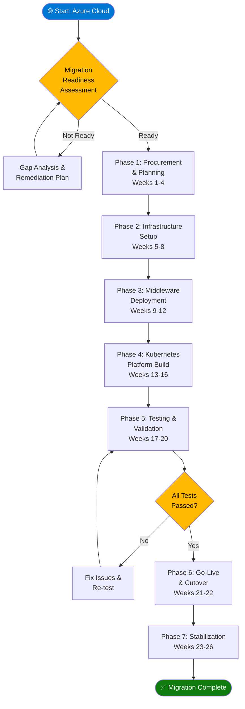
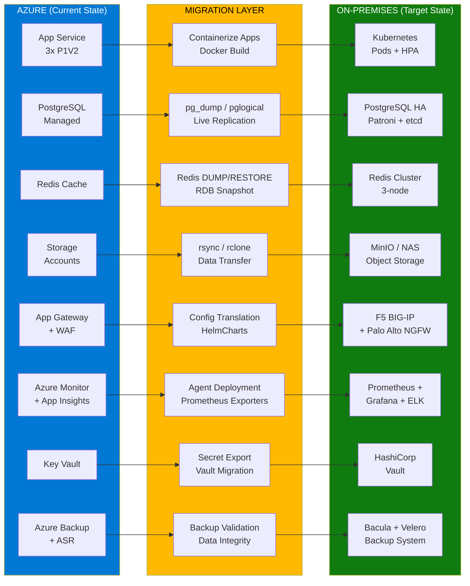
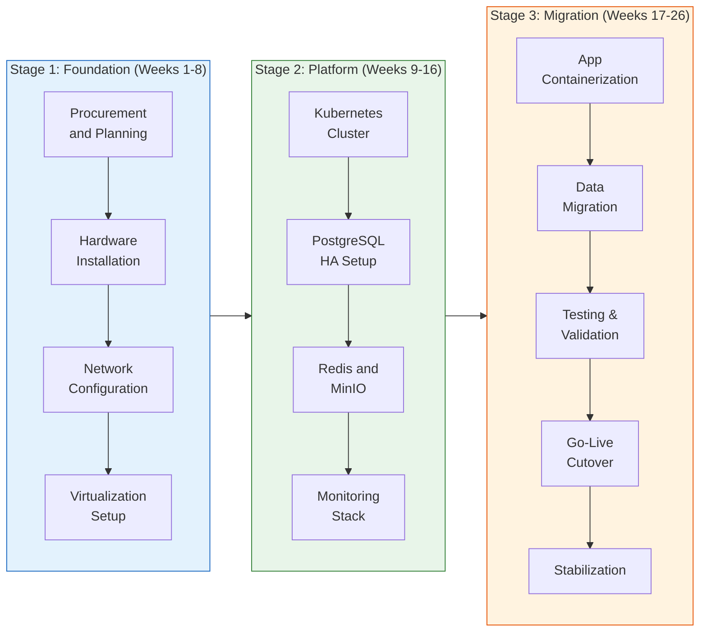
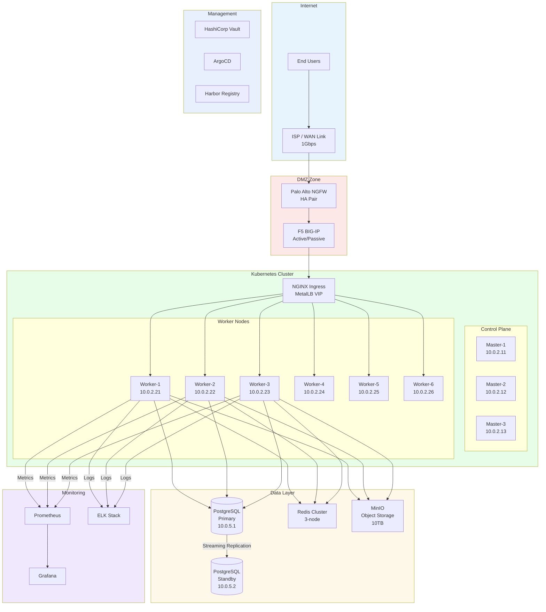
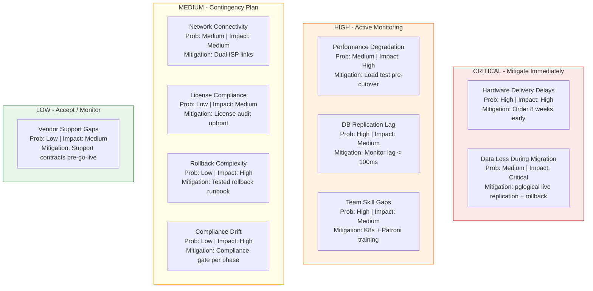
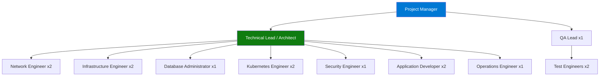

# Volume 2: Migration Strategy
## Chapter 1: Migration Overview & Service Mapping

---

## Azure to On-Premises: Complete Service Mapping

```
┌───────────────────────────────────────────────────────────────────────────────────┐
│                     AZURE ──► ON-PREMISES SERVICE MAPPING                        │
├──────────────────────────┬──────────────────────────────┬────────────────────────┤
│  AZURE SERVICE           │  ON-PREMISES EQUIVALENT      │  MIGRATION TYPE        │
├──────────────────────────┼──────────────────────────────┼────────────────────────┤
│  Azure Front Door        │  F5 BIG-IP + NGINX Ingress   │  Lift & Replace        │
│  Application Gateway     │  F5 BIG-IP LTM               │  Lift & Replace        │
│  WAF                     │  Palo Alto NGFW + F5 ASM     │  Lift & Replace        │
│  App Service (3x P1V2)   │  Kubernetes Pods (6 workers) │  Replatform            │
│  Container Instances     │  K8s CronJobs + Jobs         │  Replatform            │
│  PostgreSQL Managed      │  PostgreSQL + Patroni HA     │  Lift & Shift (data)   │
│  Azure Storage Accounts  │  MinIO Object Storage / NAS  │  Lift & Shift (data)   │
│  Redis Cache             │  Redis Cluster (on-prem)     │  Lift & Shift          │
│  Azure Monitor           │  Prometheus + Alertmanager   │  Replace               │
│  Application Insights    │  Jaeger + Prometheus         │  Replace               │
│  Log Analytics           │  Elasticsearch + Kibana      │  Replace               │
│  Key Vault               │  HashiCorp Vault             │  Replace               │
│  Security Center         │  Wazuh SIEM                  │  Replace               │
│  Azure Sentinel          │  Wazuh + OSSEC               │  Replace               │
│  Azure Backup            │  Bacula + Velero             │  Replace               │
│  Site Recovery           │  Veeam / Zerto               │  Replace               │
│  Virtual Network         │  Cisco Nexus VLANs           │  Replace               │
│  Azure AD / Managed ID   │  LDAP / Active Directory     │  Integrate             │
│  Azure DNS               │  BIND9 / Infoblox DNS        │  Replace               │
│  Azure CDN               │  NGINX Caching / Varnish     │  Replace               │
└──────────────────────────┴──────────────────────────────┴────────────────────────┘
```

---

## High-Level Migration Architecture Flowchart



---

## Detailed Migration Decision Flowchart



---

## Migration Strategy: 3-Stage Approach



---

## Infrastructure Architecture Overview



---

## Network VLAN Layout

```
┌──────────────────────────────────────────────────────────────────────────┐
│                         NETWORK VLAN DESIGN                              │
├────────┬──────────────┬────────────────┬────────────────────────────────┤
│  VLAN  │  Name        │  Subnet        │  Purpose                       │
├────────┼──────────────┼────────────────┼────────────────────────────────┤
│   10   │  Management  │  10.0.1.0/24   │  OOB, IPMI, vCenter, Switches  │
│   20   │  DMZ         │  10.0.2.0/24   │  Firewall, Load Balancer       │
│   30   │  K8s Control │  10.0.3.0/24   │  Kubernetes Master Nodes       │
│   40   │  K8s Workers │  10.0.4.0/24   │  Kubernetes Worker Nodes       │
│   50   │  Database    │  10.0.5.0/24   │  PostgreSQL, Redis             │
│   60   │  Storage     │  10.0.6.0/24   │  NAS, SAN, MinIO              │
│   70   │  Monitoring  │  10.0.7.0/24   │  Prometheus, Grafana, ELK     │
│   80   │  CI/CD       │  10.0.8.0/24   │  GitLab, ArgoCD, Harbor       │
│   90   │  Backup      │  10.0.9.0/24   │  Bacula, Velero               │
├────────┼──────────────┼────────────────┼────────────────────────────────┤
│  KEY SECURITY RULES:                                                     │
│  • Internet → DMZ: Port 443, 80 only                                    │
│  • DMZ → K8s Workers: Port 8080, 8443 only                              │
│  • K8s → Database: Port 5432, 6379 only                                 │
│  • Management → All: SSH (22), HTTPS (443)                               │
│  • Database → Storage: Port 2049 (NFS), 3260 (iSCSI)                   │
│  • Backup → All: Pull-based backup on port 9102                         │
└──────────────────────────────────────────────────────────────────────────┘
```

---

## Risk Register



---

## Migration Risk Register Detail

| Risk | Probability | Impact | Score | Mitigation |
|------|-------------|--------|-------|------------|
| Hardware delivery delays | High (65%) | High | 🔴 Critical | Order 8 weeks early, identify backup vendors |
| Data loss during migration | Medium (35%) | Critical | 🔴 Critical | pglogical live replication, rollback plan |
| Performance degradation | Medium (55%) | High | 🟠 High | Load testing pre-cutover, auto-scaling |
| Database replication lag | High (60%) | Medium | 🟠 High | Monitor lag <100ms before cutover |
| Team skill gaps | High (70%) | Medium | 🟠 High | K8s + Patroni training 4 weeks prior |
| Network connectivity issues | Medium (40%) | Medium | 🟡 Medium | Dual ISP links, tested failover |
| License compliance issues | Low (45%) | Medium | 🟡 Medium | License audit before procurement |
| Rollback complexity | Low (30%) | High | 🟡 Medium | Documented rollback runbook |
| Vendor support gaps | Low (35%) | Medium | 🟢 Low | Support contracts before go-live |
| Compliance drift | Low (25%) | High | 🟡 Medium | Compliance validation gate per phase |

---

## Migration Team Structure



---

## Document Navigation

| Volume | Document | Status |
|--------|----------|--------|
| Vol 1 Ch 1 | [Executive Summary](../Volume-1-Executive-Architecture/01-Executive-Summary.md) | ✅ Complete |
| Vol 1 Ch 2 | [Existing Azure Architecture](../Volume-1-Executive-Architecture/02-Existing-Azure-Architecture.md) | ✅ Complete |
| Vol 1 Ch 3 | [Target Architecture](../Volume-1-Executive-Architecture/03-Target-Architecture.md) | ✅ Complete |
| Vol 2 Ch 1 | Migration Overview & Service Mapping *(this document)* | ✅ Complete |
| Vol 2 Ch 2 | [Phase Implementation Guide](./02-Phase-Implementation-Guide.md) | ✅ Complete |
| Vol 2 Ch 3 | [Timeline & Milestones](./03-Timeline-And-Milestones.md) | ✅ Complete |
| Vol 3 | [Infrastructure Setup](../Volume-3-Infrastructure-Setup/) | ✅ Complete |
| Vol 4 | [Kubernetes Platform](../Volume-4-Kubernetes-Platform/01-Kubernetes-Setup-Guide.md) | ✅ Complete |
| Vol 5 | [Database Migration](../Volume-5-Database-Migration/) | ✅ Complete |
| Vol 6 | [Application Migration](../Volume-6-Application-Migration/) | ✅ Complete |
| Vol 7 | [Monitoring & Security](../Volume-7-Monitoring-Security/) | ✅ Complete |
| Vol 8 | [Go-Live & Operations](../Volume-8-GoLive-Operations/) | ✅ Complete |

---

**Document Version**: 2.0
**Date**: July 2026
**Classification**: Internal Use Only
