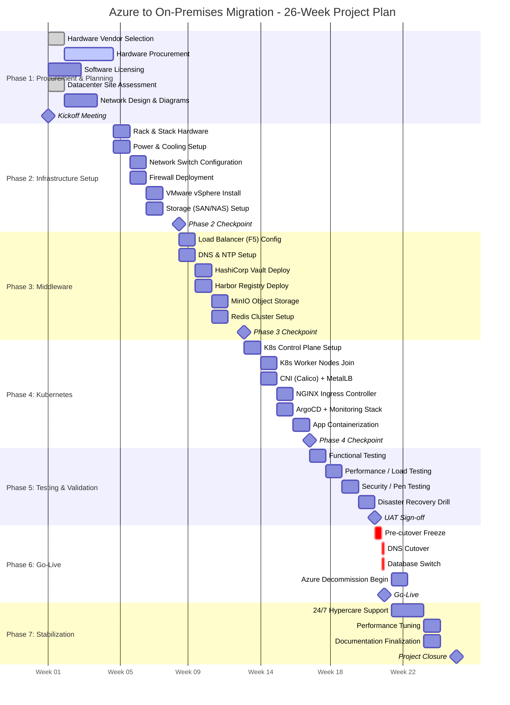
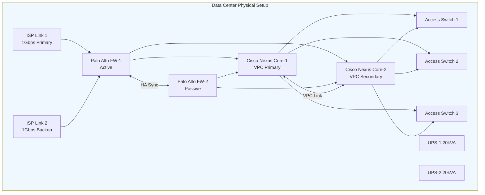
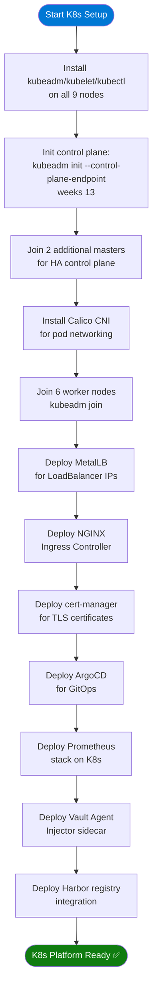
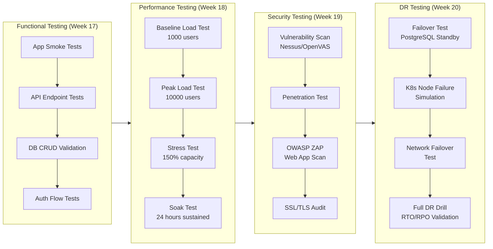
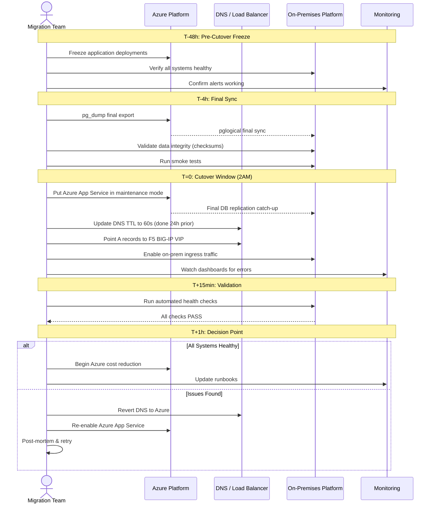

# Volume 2: Migration Strategy
## Chapter 2: Phase-by-Phase Implementation Guide

---

## Migration Phases Overview



---

## Phase 1: Procurement & Planning (Weeks 1–4)

### Objectives
- Finalize hardware specifications and place orders
- Complete network and architecture design
- Prepare datacenter space

### Step-by-Step Actions

```
WEEK 1:
  ┌─ Day 1-2: Project Kickoff
  │   ├─ [ ] Assemble project team
  │   ├─ [ ] Confirm stakeholder roles
  │   ├─ [ ] Review architecture documents
  │   └─ [ ] Set up project tracking (Jira/Confluence)
  │
  ├─ Day 3-5: Site Assessment
  │   ├─ [ ] Survey data center space (rack units available)
  │   ├─ [ ] Confirm power capacity (40kW target)
  │   ├─ [ ] Confirm cooling capacity
  │   └─ [ ] Network patching plan

WEEK 2:
  ├─ Hardware Vendor RFP
  │   ├─ [ ] Issue RFPs to 3+ hardware vendors
  │   ├─ [ ] Evaluate VMware / Cisco / F5 / Palo Alto quotes
  │   ├─ [ ] Review lead times (4-8 weeks typical)
  │   └─ [ ] Select vendors and place orders

WEEK 3:
  ├─ Software Licensing
  │   ├─ [ ] VMware vSphere 8 Enterprise Plus licenses
  │   ├─ [ ] F5 BIG-IP LTM + ASM licenses
  │   ├─ [ ] Palo Alto Threat Prevention subscription
  │   ├─ [ ] RedHat or Ubuntu support subscriptions
  │   └─ [ ] HashiCorp Vault Enterprise (if needed)

WEEK 4:
  └─ Architecture Finalization
      ├─ [ ] IP addressing scheme approved
      ├─ [ ] VLAN design sign-off
      ├─ [ ] DNS naming convention established
      ├─ [ ] Security zones defined
      └─ [ ] Phase 2 runbook prepared
```

### Hardware Bill of Materials

```
┌──────────────────────────────────────────────────────────────────────┐
│                    HARDWARE PROCUREMENT LIST                          │
├──────────────────────┬──────────────┬─────────┬──────────────────────┤
│  Component           │  Model       │  Qty    │  Est. Cost           │
├──────────────────────┼──────────────┼─────────┼──────────────────────┤
│  Compute Servers     │  Dell R750   │  6      │  $300,000            │
│  (K8s Nodes)         │  2x Xeon     │         │                      │
│                      │  28-core     │         │                      │
│                      │  512GB RAM   │         │                      │
├──────────────────────┼──────────────┼─────────┼──────────────────────┤
│  Database Servers    │  Dell R750   │  2      │  $100,000            │
│                      │  2x Xeon     │         │                      │
│                      │  28-core     │         │                      │
│                      │  1TB RAM     │         │                      │
├──────────────────────┼──────────────┼─────────┼──────────────────────┤
│  Storage (NAS)       │  NetApp AFF  │  1      │  $150,000            │
│                      │  A250        │         │                      │
│                      │  10TB usable │         │                      │
├──────────────────────┼──────────────┼─────────┼──────────────────────┤
│  Load Balancer       │  F5 BIG-IP   │  2      │  $80,000             │
│                      │  5200        │  (HA)   │                      │
├──────────────────────┼──────────────┼─────────┼──────────────────────┤
│  Firewall            │  Palo Alto   │  2      │  $120,000            │
│                      │  PA-5250     │  (HA)   │                      │
├──────────────────────┼──────────────┼─────────┼──────────────────────┤
│  Core Switch         │  Cisco Nexus │  2      │  $80,000             │
│                      │  9372PX      │  (VPC)  │                      │
├──────────────────────┼──────────────┼─────────┼──────────────────────┤
│  Access Switches     │  Cisco Nexus │  4      │  $40,000             │
│                      │  9348GC-FXP  │         │                      │
├──────────────────────┼──────────────┼─────────┼──────────────────────┤
│  UPS Systems         │  APC Smart   │  2      │  $30,000             │
│                      │  UPS 20kVA   │         │                      │
├──────────────────────┼──────────────┼─────────┼──────────────────────┤
│  KVM / Crash Cart    │  Raritan     │  1      │  $5,000              │
├──────────────────────┼──────────────┼─────────┼──────────────────────┤
│  Cabling             │  Cat6A/Fiber │  Bulk   │  $15,000             │
├──────────────────────┼──────────────┼─────────┼──────────────────────┤
│                      │  TOTAL       │         │  ~$920,000           │
└──────────────────────┴──────────────┴─────────┴──────────────────────┘
```

---

## Phase 2: Infrastructure Setup (Weeks 5–8)

### Network Topology Setup



### Step-by-Step Infrastructure Setup

```
WEEK 5: Physical Installation
  ├─ [ ] Rack and cable all servers
  ├─ [ ] Connect UPS systems
  ├─ [ ] Cable fiber/copper between switches
  ├─ [ ] Verify power distribution
  └─ [ ] Label all cables (both ends)

WEEK 6: Network Baseline
  ├─ Firewall (Palo Alto PA-5250)
  │   ├─ [ ] Initial bootstrap via console
  │   ├─ [ ] Upload license & update PAN-OS
  │   ├─ [ ] Configure HA (Active/Passive)
  │   ├─ [ ] Create security zones
  │   ├─ [ ] Configure NAT/PAT for internet
  │   └─ [ ] Enable Threat Prevention profiles
  │
  ├─ Core Switches (Cisco Nexus)
  │   ├─ [ ] NX-OS initial setup
  │   ├─ [ ] Configure VPC (Virtual Port Channel)
  │   ├─ [ ] Create VLANs 10-90
  │   ├─ [ ] Configure trunk ports to access switches
  │   └─ [ ] Enable OSPF for L3 routing
  │
  └─ Access Switches
      ├─ [ ] Configure uplinks to core (LACP)
      ├─ [ ] Assign VLANs per port group
      ├─ [ ] Configure STP (Rapid PVST+)
      └─ [ ] Verify connectivity

WEEK 7: VMware vSphere
  ├─ [ ] Install ESXi 8 on all 6 servers
  ├─ [ ] Deploy vCenter Server Appliance
  ├─ [ ] Create datacenter and cluster objects
  ├─ [ ] Configure shared storage (NFS/iSCSI)
  ├─ [ ] Enable HA + DRS on cluster
  ├─ [ ] Configure distributed virtual switch
  └─ [ ] Validate vMotion between hosts

WEEK 8: Storage & Baseline VMs
  ├─ NetApp NAS Setup
  │   ├─ [ ] Initialize ONTAP cluster
  │   ├─ [ ] Create SVMs for NFS and iSCSI
  │   ├─ [ ] Create volumes: k8s-pv, postgres, backup
  │   └─ [ ] Configure snapshots policy
  │
  └─ Baseline VMs
      ├─ [ ] Deploy jump server (bastion host)
      ├─ [ ] Deploy LDAP/AD server
      ├─ [ ] Deploy internal DNS (BIND9)
      ├─ [ ] Deploy NTP server
      └─ [ ] Validate all VMs accessible
```

---

## Phase 3: Middleware Deployment (Weeks 9–12)

```
WEEK 9: Load Balancer & Secrets
  ├─ F5 BIG-IP Setup
  │   ├─ [ ] Initial F5 bootstrap (management IP)
  │   ├─ [ ] Configure HA sync between F5-1 and F5-2
  │   ├─ [ ] Upload SSL certificates from Azure Key Vault
  │   ├─ [ ] Create Virtual Server VIP: 10.0.2.10:443
  │   ├─ [ ] Create backend pool (K8s ingress IPs)
  │   ├─ [ ] Configure health monitor (/health HTTP 200)
  │   ├─ [ ] Enable SSL offloading
  │   └─ [ ] Test failover between F5-1 and F5-2
  │
  └─ HashiCorp Vault
      ├─ [ ] Deploy Vault cluster (3 nodes for HA)
      ├─ [ ] Initialize and unseal Vault
      ├─ [ ] Configure LDAP authentication backend
      ├─ [ ] Create secret engines: kv, pki, database
      ├─ [ ] Migrate secrets from Azure Key Vault
      └─ [ ] Configure Vault Agent for K8s injection

WEEK 10: Container Registry & Object Storage
  ├─ Harbor Registry
  │   ├─ [ ] Deploy Harbor on VM or K8s
  │   ├─ [ ] Configure LDAP authentication
  │   ├─ [ ] Set up project: production, preprod
  │   ├─ [ ] Configure vulnerability scanning (Trivy)
  │   └─ [ ] Pull and push Azure images to Harbor
  │
  └─ MinIO Object Storage (Azure Blob replacement)
      ├─ [ ] Deploy MinIO distributed (4-node)
      ├─ [ ] Create buckets: app-data, backups, logs
      ├─ [ ] Configure access keys / service accounts
      ├─ [ ] Set lifecycle policies (30-day expiry for logs)
      └─ [ ] Begin data sync from Azure Storage

WEEK 11: Cache & Queue
  ├─ Redis Cluster
  │   ├─ [ ] Deploy 3 Redis master + 3 replica nodes
  │   ├─ [ ] Configure Redis Cluster mode
  │   ├─ [ ] Enable AOF persistence
  │   ├─ [ ] Configure TLS between nodes
  │   └─ [ ] Export and import Redis RDB from Azure
  │
  └─ Internal DNS
      ├─ [ ] Create DNS zones for on-prem domains
      ├─ [ ] Add A records for all services
      ├─ [ ] Configure split-horizon DNS
      └─ [ ] Test resolution from all VLANs

WEEK 12: Monitoring Foundation
  ├─ [ ] Deploy Prometheus server
  ├─ [ ] Deploy Grafana with LDAP auth
  ├─ [ ] Import dashboards for infrastructure
  ├─ [ ] Deploy Alertmanager with email/Slack routes
  ├─ [ ] Deploy Elasticsearch + Logstash + Kibana
  └─ [ ] Verify log ingestion from infrastructure
```

---

## Phase 4: Kubernetes Platform Build (Weeks 13–16)



### Kubernetes Commands Reference

```bash
# ── STEP 1: Pre-flight on all nodes ──────────────────────────────────────
sudo swapoff -a
sudo sed -i '/ swap / s/^/#/' /etc/fstab
sudo modprobe overlay br_netfilter
cat <<EOF | sudo tee /etc/sysctl.d/k8s.conf
net.bridge.bridge-nf-call-iptables  = 1
net.bridge.bridge-nf-call-ip6tables = 1
net.ipv4.ip_forward                 = 1
EOF
sudo sysctl --system

# ── STEP 2: Install containerd ────────────────────────────────────────────
sudo apt install -y containerd
sudo mkdir -p /etc/containerd
containerd config default | sudo tee /etc/containerd/config.toml
sudo sed -i 's/SystemdCgroup = false/SystemdCgroup = true/' /etc/containerd/config.toml
sudo systemctl restart containerd

# ── STEP 3: Install kubeadm, kubelet, kubectl ─────────────────────────────
sudo apt install -y apt-transport-https ca-certificates curl
curl -fsSL https://pkgs.k8s.io/core:/stable:/v1.29/deb/Release.key | sudo gpg --dearmor -o /etc/apt/keyrings/kubernetes-apt-keyring.gpg
echo 'deb [signed-by=/etc/apt/keyrings/kubernetes-apt-keyring.gpg] https://pkgs.k8s.io/core:/stable:/v1.29/deb/ /' | sudo tee /etc/apt/sources.list.d/kubernetes.list
sudo apt update && sudo apt install -y kubelet=1.29.0-1.1 kubeadm=1.29.0-1.1 kubectl=1.29.0-1.1
sudo apt-mark hold kubelet kubeadm kubectl

# ── STEP 4: Init control plane (on master-1) ─────────────────────────────
sudo kubeadm init \
  --control-plane-endpoint "k8s-api.internal:6443" \
  --pod-network-cidr "192.168.0.0/16" \
  --upload-certs \
  --kubernetes-version "v1.29.0"

mkdir -p $HOME/.kube
sudo cp -i /etc/kubernetes/admin.conf $HOME/.kube/config

# ── STEP 5: Install Calico CNI ────────────────────────────────────────────
kubectl create -f https://raw.githubusercontent.com/projectcalico/calico/v3.26.0/manifests/tigera-operator.yaml
kubectl apply -f - <<EOF
apiVersion: operator.tigera.io/v1
kind: Installation
metadata:
  name: default
spec:
  calicoNetwork:
    ipPools:
    - blockSize: 26
      cidr: 192.168.0.0/16
      encapsulation: VXLANCrossSubnet
      natOutgoing: Enabled
      nodeSelector: all()
EOF

# ── STEP 6: Install MetalLB ───────────────────────────────────────────────
kubectl apply -f https://raw.githubusercontent.com/metallb/metallb/v0.13.12/config/manifests/metallb-native.yaml
kubectl apply -f - <<EOF
apiVersion: metallb.io/v1beta1
kind: IPAddressPool
metadata:
  name: onprem-pool
  namespace: metallb-system
spec:
  addresses:
  - 10.0.2.200-10.0.2.220
EOF

# ── STEP 7: Install NGINX Ingress ─────────────────────────────────────────
helm repo add ingress-nginx https://kubernetes.github.io/ingress-nginx
helm install ingress-nginx ingress-nginx/ingress-nginx \
  --namespace ingress-nginx --create-namespace \
  --set controller.service.type=LoadBalancer

# ── STEP 8: Install cert-manager ─────────────────────────────────────────
helm repo add jetstack https://charts.jetstack.io
helm install cert-manager jetstack/cert-manager \
  --namespace cert-manager --create-namespace \
  --set installCRDs=true

# ── STEP 9: Install ArgoCD ────────────────────────────────────────────────
kubectl create namespace argocd
kubectl apply -n argocd -f https://raw.githubusercontent.com/argoproj/argo-cd/stable/manifests/install.yaml
```

---

## Phase 5: Testing & Validation (Weeks 17–20)



### Performance Test Targets

```
Test Scenario               Tool          Pass Criteria
────────────────────────────────────────────────────────────
Response time P95           k6 / Gatling  < 200ms
Throughput sustained        k6            > 10,000 req/sec
Error rate under load       k6            < 0.1%
DB query time P95           pgBadger      < 100ms
Redis hit rate              redis-cli     > 85%
K8s pod restart count       kubectl       0 restarts
CPU usage at peak           Prometheus    < 80%
Memory usage at peak        Prometheus    < 85%
Disk I/O at peak            Prometheus    < 5,000 IOPS
Network throughput          iperf3        > 900 Mbps
```

---

## Phase 6: Go-Live & Cutover (Weeks 21–22)

### Cutover Sequence



---

## Phase 7: Stabilization (Weeks 23–26)

```
Week 23-24: Hypercare (24/7 On-Call)
  ├─ [ ] Monitor all dashboards continuously
  ├─ [ ] Daily stand-up with on-call team (7am)
  ├─ [ ] P1 issues: Response < 15 minutes
  ├─ [ ] P2 issues: Response < 1 hour
  └─ [ ] Daily performance reports to stakeholders

Week 25: Optimization
  ├─ [ ] Tune Kubernetes resource limits based on usage
  ├─ [ ] Optimize PostgreSQL (autovacuum, connection pooling)
  ├─ [ ] Review and tighten firewall rules
  ├─ [ ] Adjust auto-scaling thresholds
  └─ [ ] Reduce Azure resource spend progressively

Week 26: Closure
  ├─ [ ] Complete all Azure decommissions
  ├─ [ ] Finalize operations runbooks
  ├─ [ ] Conduct knowledge transfer sessions
  ├─ [ ] Project retrospective meeting
  └─ [ ] Final project report to stakeholders
```

---

**Document Version**: 2.0
**Date**: July 2026
**Classification**: Internal Use Only
