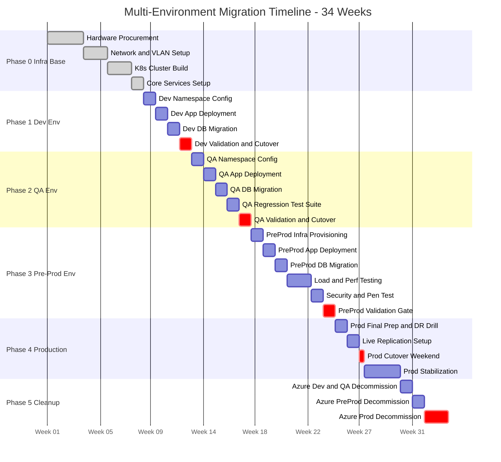
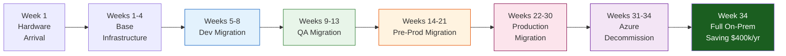

# Volume 2: Migration Strategy
## Chapter 4: Multi-Environment Migration Plan

> **Purpose**: Detailed migration timeline, strategy, and execution steps for each environment — Dev, QA, Pre-Prod, and Production — migrated sequentially with validation gates.

---

## Environment Strategy Overview

Each environment is migrated independently in a **low-risk-first** sequence. Lessons learned in Dev are applied before touching QA, and so on. **Production is never touched until Pre-Prod has been stable for 2+ weeks.**

```
MIGRATION ORDER:  Dev → QA → Pre-Prod → Production
TOTAL DURATION:   34 weeks
ROLLBACK:         Azure stays live for each environment until its on-prem is stable
```

### Environment Mapping

| Environment | Azure Resource Group | On-Prem Namespace | Purpose | Users |
|-------------|---------------------|-------------------|---------|-------|
| Dev | rg-ae-prod-we-001 (dev branch) | `dev` | Feature development and unit testing | Developers only |
| QA | rg-cv-prod-we-001 | `qa` | Functional and regression testing | QA team + developers |
| Pre-Prod | rg-as-las-we-001 | `preprod` | Performance, load, UAT | QA + business users |
| Production | rg-dls-coe-we-001 + prod VNet | `prod` | Live end users | All users |

### On-Premises Kubernetes Namespace Strategy

```
One K8s cluster, four namespaces (dev/qa share workers, preprod/prod get dedicated pools):

Nodes: 9 total
  masters:  3 nodes (shared control plane)
  workers:  6 nodes

Node pool assignment:
  worker-1, worker-2          → dev + qa namespaces (resource-limited)
  worker-3, worker-4          → preprod namespace
  worker-5, worker-6          → prod namespace (dedicated, max performance)

Resource quotas per namespace:
  dev:      4 vCPU,  16 GB RAM,  100 GB storage
  qa:       8 vCPU,  32 GB RAM,  200 GB storage
  preprod: 16 vCPU,  64 GB RAM,  500 GB storage
  prod:    56 vCPU, 256 GB RAM, 2000 GB storage
```

### Database Strategy per Environment

| Environment | Database Tier | PostgreSQL | Redis | Connection Pool |
|-------------|--------------|-----------|-------|-----------------|
| Dev | Shared DB server, isolated schema | PG 15, single instance | Redis DB 0 | PgBouncer (dev pool) |
| QA | Shared DB server, isolated schema | PG 15, single instance | Redis DB 1 | PgBouncer (qa pool) |
| Pre-Prod | Dedicated DB server | PG 15 + 1 standby | Dedicated Redis | PgBouncer (preprod pool) |
| Production | Dedicated Patroni HA cluster | PG 15 + 2 standbys | Redis Cluster 3+3 | PgBouncer + HAProxy |

---

## Full Migration Gantt Timeline



---

## Phase 0: Infrastructure Base Setup (Weeks 1–4)

**Goal**: All shared infrastructure is ready before any environment migration begins.

### Week 1–3: Hardware and Network
```
TASKS:
1. Rack and stack all hardware (Dell R750s, NetApp, Nexus switches)
2. Cable all servers to Nexus VPC pair
3. Configure VLANs 10–90 on Cisco Nexus
4. Configure Palo Alto HA pair (zones, policies, NAT rules)
5. Configure F5 BIG-IP HA pair (VIPs, health monitors)
6. IPMI and out-of-band management setup on all servers

DELIVERABLES:
- All servers pingable from management VLAN
- VLANs isolated and tested
- Firewall policies blocking cross-VLAN except documented flows
```

### Week 4: K8s Cluster and Core Services
```
TASKS:
1. Install Ubuntu 22.04 LTS on all 9 K8s nodes
2. kubeadm init on master-1; join master-2, master-3 (HA control plane)
3. Join all 6 worker nodes
4. Install Calico CNI (network policy enforcement)
5. Install MetalLB (VIP 10.0.4.200 for Ingress)
6. Install NGINX Ingress controller
7. Install cert-manager + connect to HashiCorp Vault PKI
8. Deploy Harbor registry (namespace: infra)
9. Deploy ArgoCD (namespace: argocd)
10. Deploy Prometheus + Grafana + Alertmanager (namespace: monitoring)
11. Deploy ELK Stack (namespace: logging)
12. Create 4 namespaces: dev, qa, preprod, prod
13. Apply resource quotas to each namespace

VALIDATION:
- All nodes in Ready state: kubectl get nodes
- Harbor accessible: https://harbor.internal
- ArgoCD UI accessible: https://argocd.internal
- Grafana shows node metrics
```

---

## Phase 1: Dev Environment Migration (Weeks 5–8)

**Goal**: Migrate the development environment. Developers test functionality on on-prem before it touches QA.

### Timeline

| Week | Activities | Owner | Exit Criteria |
|------|-----------|-------|---------------|
| 5 | Namespace config, CI/CD pipelines pointing to on-prem Harbor | DevOps | GitLab pipeline pushes to Harbor successfully |
| 6 | Deploy app to `dev` namespace via ArgoCD | DevOps + Dev | Pods running, health check passing |
| 7 | Migrate dev database (pg_dump + restore) | DBA | Dev app reads/writes data correctly |
| 8 | DNS cutover for dev, Azure dev decommission | Ops | dev.app.company.com resolves to on-prem |

### Dev Namespace Configuration

```bash
# Create namespace with resource limits
kubectl create namespace dev

cat <<EOF | kubectl apply -f -
apiVersion: v1
kind: ResourceQuota
metadata:
  name: dev-quota
  namespace: dev
spec:
  hard:
    requests.cpu: "4"
    requests.memory: "16Gi"
    limits.cpu: "8"
    limits.memory: "32Gi"
    pods: "20"
    persistentvolumeclaims: "10"
EOF

# Assign to worker-1, worker-2 only
kubectl label node worker-1 env=dev-qa
kubectl label node worker-2 env=dev-qa
```

### Dev Database Migration

**PostgreSQL migration:**
```bash
# On Azure PostgreSQL (source)
pg_dump -h <azure-pg-host> -U adminuser -d devdb \
  --no-password --format=custom --compress=9 \
  -f /tmp/devdb_$(date +%Y%m%d).dump

# Transfer to on-prem (secure copy)
scp /tmp/devdb_*.dump dba@10.0.5.1:/backup/imports/

# On on-prem PostgreSQL
pg_restore -h 10.0.5.1 -U postgres -d devdb \
  --format=custom --jobs=4 \
  /backup/imports/devdb_*.dump

# Verify row counts match
psql -h 10.0.5.1 -U postgres -d devdb \
  -c "SELECT schemaname, tablename, n_live_tup FROM pg_stat_user_tables ORDER BY n_live_tup DESC LIMIT 20;"
```

**Cosmos DB → MongoDB migration (dev):**
```bash
# Export from Azure Cosmos DB (MongoDB API)
mongodump \
  --uri "mongodb://<cosmos-account>:<key>@<cosmos-account>.mongo.cosmos.azure.com:10255/dev-cosmos?ssl=true&replicaSet=globaldb&retrywrites=false" \
  --out /backup/cosmos-export/dev/

# Restore to on-prem MongoDB (standalone dev node)
mongorestore \
  --host 10.0.5.20:27017 \
  --username dev_user \
  --password "$(vault kv get -field=password secret/dev/mongodb)" \
  --authenticationDatabase admin \
  --db dev-cosmos \
  /backup/cosmos-export/dev/dev-cosmos/

# Verify document counts per collection
mongosh --host 10.0.5.20 --eval '
  db = db.getSiblingDB("dev-cosmos");
  db.getCollectionNames().forEach(c => print(c + ": " + db[c].countDocuments()));
'
```

### Go/No-Go Gate — Dev

| Criterion | Pass Condition | Check Method |
|-----------|---------------|-------------|
| All pods running | `kubectl get pods -n dev` = all Running | kubectl |
| App responding | HTTP 200 on /health | curl from inside cluster |
| PostgreSQL data correct | Row counts match Azure | pg_dump + count compare |
| MongoDB data correct | Document counts match Cosmos DB | mongosh count compare |
| CI/CD pipeline | GitLab pushes → ArgoCD deploys | Test commit |
| Logs appearing | ELK receives dev namespace logs | Kibana query |
| Metrics collected | Grafana shows dev pod metrics | Visual check |

---

## Phase 2: QA Environment Migration (Weeks 9–13)

**Goal**: Migrate QA environment. Full regression test suite must pass before proceeding to Pre-Prod.

### Timeline

| Week | Activities | Owner | Exit Criteria |
|------|-----------|-------|---------------|
| 9 | QA namespace config, network policies | DevOps | Network policy blocks dev from qa namespace |
| 10 | Deploy QA app stack via ArgoCD | DevOps | QA pods running with QA-specific config |
| 11 | Migrate QA database (latest Azure backup) | DBA | Row counts match, app queries correct |
| 12 | Run full regression test suite | QA Team | 100% regression tests pass |
| 13 | DNS cutover, Azure QA decommission | Ops | qa.app.company.com → on-prem |

### Network Isolation Between Namespaces

```yaml
# Prevent dev from accessing qa database
apiVersion: networking.k8s.io/v1
kind: NetworkPolicy
metadata:
  name: deny-from-dev
  namespace: qa
spec:
  podSelector: {}
  ingress:
  - from:
    - namespaceSelector:
        matchLabels:
          kubernetes.io/metadata.name: qa
    - namespaceSelector:
        matchLabels:
          kubernetes.io/metadata.name: monitoring
```

### QA-Specific Helm Values

```yaml
# values-qa.yaml
replicaCount: 2
image:
  tag: "latest"
env:
  DB_HOST: "pgbouncer-qa.qa.svc.cluster.local"
  DB_NAME: "qadb"
  REDIS_DB: "1"
  LOG_LEVEL: "DEBUG"
resources:
  requests:
    cpu: "500m"
    memory: "512Mi"
  limits:
    cpu: "1000m"
    memory: "1Gi"
```

### Regression Test Execution

```bash
# Run automated test suite against QA on-prem endpoint
export QA_URL="https://qa.app.company.com"

# Run full regression suite
dotnet test ./tests/regression/ \
  --settings ./tests/qa.runsettings \
  --environment QA_URL=$QA_URL \
  --logger "junit;LogFilePath=./results/qa-regression.xml"

# Assert 100% pass rate
python3 check_results.py ./results/qa-regression.xml --require-pass-rate=100
```

### Go/No-Go Gate — QA

| Criterion | Pass Condition | Check Method |
|-----------|---------------|-------------|
| Regression suite | 100% tests pass (0 failures) | Automated test report |
| Performance baseline | P95 response time < 200ms | Grafana |
| Error rate | < 0.1% for 48 hours | Grafana |
| DB replication | QA DB synced, no data discrepancy | pg_dump comparison |
| Security scan | No critical CVEs in images | Harbor Trivy report |
| Network isolation | Dev pods cannot reach QA DB | kubectl exec + curl test |

---

## Phase 3: Pre-Production Environment Migration (Weeks 14–21)

**Goal**: Validate production-equivalent load, security posture, and DR procedures before touching production.

### Timeline

| Week | Activities | Owner | Exit Criteria |
|------|-----------|-------|---------------|
| 14 | Dedicated preprod DB server provisioning | Infra | PG primary + 1 standby running |
| 15 | Deploy preprod app with prod-equivalent config | DevOps | Pods on worker-3, worker-4 |
| 16 | Migrate preprod DB from Azure (full copy) | DBA | Data parity confirmed |
| 17–18 | Load test to 150% of expected prod traffic | QA + DevOps | No degradation at 15k req/s |
| 19 | External penetration test | Security | Zero critical findings |
| 20 | DR drill (simulate DB failover, K8s node failure) | Ops | RTO < 5 min, RPO < 1 min |
| 21 | UAT sign-off by business users | Business + QA | Written approval |

### Load Testing (k6)

```javascript
// k6 load test script — preprod_load.js
import http from 'k6/http';
import { check, sleep } from 'k6';

export const options = {
  stages: [
    { duration: '5m',  target: 5000  },   // Ramp to normal load
    { duration: '10m', target: 10000 },   // Normal production load
    { duration: '5m',  target: 15000 },   // 150% peak load
    { duration: '5m',  target: 0     },   // Ramp down
  ],
  thresholds: {
    http_req_duration: ['p(95)<200'],     // P95 must be under 200ms
    http_req_failed:   ['rate<0.001'],    // Error rate under 0.1%
  },
};

export default function () {
  const res = http.get('https://preprod.app.company.com/health');
  check(res, { 'status is 200': (r) => r.status === 200 });
  sleep(0.1);
}
```

```bash
# Run load test from dedicated load generator machine
k6 run --out influxdb=http://10.0.7.30:8086/k6 \
  preprod_load.js

# View results in Grafana k6 dashboard
echo "Results: https://grafana.internal/d/k6-results"
```

### DR Drill Procedure

```bash
# Drill 1: PostgreSQL Patroni Failover
echo "=== PATRONI FAILOVER DRILL ==="
# Record current primary
CURRENT_PRIMARY=$(patronictl -c /etc/patroni/config.yml list | grep Leader | awk '{print $2}')
echo "Current primary: $CURRENT_PRIMARY"

# Simulate failure — stop primary
ssh $CURRENT_PRIMARY "sudo systemctl stop postgresql"

# Measure time to failover
START=$(date +%s)
while ! psql -h 10.0.5.100 -U app -d proddb -c "SELECT 1" &>/dev/null; do sleep 1; done
END=$(date +%s)
echo "Failover RTO: $((END-START)) seconds (target: < 30)"

# Drill 2: K8s Node Failure
echo "=== K8S NODE FAILURE DRILL ==="
kubectl cordon worker-5
kubectl drain worker-5 --ignore-daemonsets --delete-emptydir-data
START=$(date +%s)
# Wait for pods to reschedule to worker-6
kubectl wait --for=condition=Ready pod -l app=webapp -n preprod --timeout=300s
END=$(date +%s)
echo "Pod reschedule time: $((END-START)) seconds"
kubectl uncordon worker-5
```

### Go/No-Go Gate — Pre-Prod

| Criterion | Pass Condition | Check Method |
|-----------|---------------|-------------|
| Load test | P95 < 200ms at 15,000 req/s | k6 report |
| Error rate | < 0.1% under peak load | Grafana |
| DB failover | RTO < 30 seconds | DR drill log |
| K8s node failure | Pods reschedule in < 5 minutes | DR drill log |
| Pen test | Zero critical, zero high findings | Security report |
| UAT sign-off | Business approval in writing | Signed UAT report |
| Backup restore | Full restore from backup tested | DBA DR report |

---

## Phase 4: Production Migration (Weeks 22–30)

**Goal**: Zero-downtime cutover of production using live database replication and blue-green DNS switching.

### Timeline

| Week | Activities | Owner | Exit Criteria |
|------|-----------|-------|---------------|
| 22 | Production readiness review | CTO + Leads | All checklist items green |
| 23 | pglogical live replication (Azure → on-prem) | DBA | Lag < 100ms continuously |
| 24 | Production Cutover Weekend (T-day) | All teams | DNS switched, monitoring green |
| 25–27 | Stabilization — 24/7 on-call | Ops | Zero P1 incidents for 7 days |
| 28–29 | Azure prod decommission | Infra | All resources deleted, billing stopped |
| 30 | Project closure | PM | Signed acceptance, lessons-learned doc |

### Pre-Cutover Checklist (T-7 days)

```
INFRASTRUCTURE
[ ] All prod namespace pods running (kubectl get pods -n prod)
[ ] Prod PostgreSQL HA cluster healthy (patronictl list)
[ ] Prod Redis Cluster healthy (redis-cli cluster nodes)
[ ] All monitoring alerts firing to PagerDuty
[ ] Load test at prod traffic completed within 48h
[ ] SSL certificates valid for 90+ days
[ ] Vault PKI certificates valid

OPERATIONS
[ ] Runbook reviewed and signed off by all leads
[ ] Rollback procedure tested (DNS switch takes < 60 seconds)
[ ] On-call roster confirmed for cutover weekend
[ ] Change Advisory Board (CAB) approval obtained
[ ] Customer communication sent (maintenance window notice)
[ ] Azure support ticket opened (keep Azure running 72h post-cutover)
[ ] DBA confirmed: pglogical replication lag consistently < 100ms

DATA
[ ] Data parity check: row counts match Azure ± 0
[ ] Application config matches Azure config (env vars, secrets)
[ ] Redis cache warmed (at least 80% hit rate before cutover)
```

### Live Replication Setup (pglogical)

```bash
# On Azure PostgreSQL (publisher)
psql -h <azure-pg-host> -U postgres <<'SQL'
CREATE EXTENSION IF NOT EXISTS pglogical;
SELECT pglogical.create_node(
    node_name := 'azure_pub',
    dsn := 'host=<azure-host> dbname=proddb user=replication_user'
);
SELECT pglogical.create_replication_set('prod_replication');
SELECT pglogical.replication_set_add_all_tables('prod_replication', ARRAY['public']);
SQL

# On on-prem PostgreSQL (subscriber)
psql -h 10.0.5.1 -U postgres <<'SQL'
CREATE EXTENSION IF NOT EXISTS pglogical;
SELECT pglogical.create_node(
    node_name := 'onprem_sub',
    dsn := 'host=10.0.5.1 dbname=proddb user=postgres'
);
SELECT pglogical.create_subscription(
    subscription_name := 'azure_to_onprem',
    provider_dsn := 'host=<azure-host> dbname=proddb user=replication_user',
    replication_sets := ARRAY['prod_replication'],
    synchronize_data := true
);
SQL

# Monitor replication lag
watch -n5 "psql -h 10.0.5.1 -U postgres -c \"
  SELECT subscription_name,
         received_lsn,
         latest_end_lsn,
         (latest_end_lsn - received_lsn) AS lag_bytes
  FROM pglogical.show_subscription_status();
\""
```

### Cutover Execution (T-Day)

```
CUTOVER RUNBOOK — Execute in order, time each step

T-0:00  Announce maintenance window on status page
T-0:05  Start 5-minute timer — all stakeholders on bridge call
T-0:10  Verify pglogical lag = 0 bytes (run 3 times, all 0)
T-0:12  Put application in maintenance mode (return 503 with retry-after)
T-0:13  Stop all write traffic — zero new writes to Azure PostgreSQL
T-0:14  Final pglogical sync — confirm lag = 0 bytes
T-0:15  Stop pglogical subscription on on-prem
T-0:16  Promote on-prem PostgreSQL to standalone (disable replication)
T-0:17  Flip DNS — app.company.com → F5 VIP (10.0.2.10)
         TTL must have been set to 60s 24h before this step
T-0:18  Verify first 10 requests returning HTTP 200 from on-prem
T-0:19  Take application out of maintenance mode
T-0:20  Monitor error rate in Grafana for 10 minutes
T-0:30  GO/NO-GO decision by CTO

If NO-GO at T-0:30:
  Flip DNS back to Azure (< 60 seconds due to TTL=60)
  Re-enable pglogical replication
  Root cause analysis within 2 hours
```

### Post-Cutover Monitoring (First 7 Days)

```
Hour 0-4:    All leads on call, check every 15 minutes
  - Error rate < 0.1%        (Grafana: prod dashboard)
  - P95 latency < 200ms      (Grafana: response time panel)
  - DB connections stable    (Grafana: PgBouncer panel)
  - No Patroni failover       (patronictl list every 30 min)

Hour 4-24:   Primary on-call, check every hour
  - Daily backup ran          (Bacula report at 06:00)
  - Redis hit rate > 80%      (Grafana: Redis panel)
  - No PagerDuty pages        (PagerDuty silence on-call)

Day 2-7:     Normal monitoring, daily review meeting
  - Review previous day metrics with full team
  - Resolve any lingering issues before Azure decommission
```

---

## Phase 5: Azure Decommission (Weeks 28–34)

**Goal**: Systematically delete Azure resources after on-prem has been stable, stopping all billing.

### Decommission Order (Safest-First)

```
Week 28: Azure Dev and QA (lowest risk — already migrated weeks ago)
  - Delete rg-ae-prod-we-001 (dev)
  - Delete rg-cv-prod-we-001 (qa)
  - Estimated saving: ~$8,000/month

Week 29: Azure Pre-Prod
  - Delete rg-as-las-we-001 (preprod)
  - Estimated saving: ~$10,000/month

Week 31-32: Azure Production (only after 7 days post-cutover stability)
  - Delete AKS production clusters
  - Delete PostgreSQL instances
  - Delete Storage Accounts (export any remaining data first)
  - Delete ACR
  - Disable Azure Monitor and App Insights
  - Delete rg-dls-coe-we-001

Week 33: Hub subscription cleanup
  - Delete Sub-AFRPS-AF-INT VNet peerings
  - Cancel Azure subscriptions

Week 34: Confirm zero billing
  - Azure billing dashboard shows $0
  - Send cost saving report to CFO
```

### Azure Resource Deletion Script

```bash
#!/bin/bash
# Safe Azure decommission script
# Run one resource group at a time, verify before proceeding

RG=$1  # e.g., rg-ae-prod-we-001
SUBSCRIPTION="<your-subscription-id>"

echo "=== Pre-deletion checklist for $RG ==="
echo "1. Confirm on-prem equivalent is stable for 7+ days"
echo "2. Confirm no outstanding tickets related to this environment"
echo "3. Export any data that has not been migrated"
read -p "Type 'CONFIRMED' to proceed with deletion: " CONFIRM

if [ "$CONFIRM" != "CONFIRMED" ]; then
  echo "Aborted."
  exit 1
fi

echo "Listing all resources in $RG..."
az resource list --resource-group $RG --output table

read -p "Proceed with deletion of all resources above? (yes/no): " PROCEED
if [ "$PROCEED" = "yes" ]; then
  az group delete --name $RG --subscription $SUBSCRIPTION --yes --no-wait
  echo "Deletion initiated. Monitor at: https://portal.azure.com"
fi
```

---

## Environment-by-Environment Summary



### Risk per Environment

| Environment | Risk Level | Rollback Time | Max Downtime Allowed |
|-------------|-----------|--------------|---------------------|
| Dev | Low | < 5 min (DNS flip) | 4 hours |
| QA | Low | < 5 min (DNS flip) | 2 hours |
| Pre-Prod | Medium | < 5 min (DNS flip) | 30 minutes |
| Production | High | < 60 seconds (DNS TTL=60) | 0 (zero-downtime requirement) |

---

## RACI by Environment

| Activity | Dev | QA | Pre-Prod | Prod |
|----------|-----|-----|---------|------|
| Infrastructure provisioning | DevOps (R) | DevOps (R) | Infra (R) | Infra (R) + CTO (A) |
| App deployment | Dev team (R) | DevOps (R) | DevOps (R) | DevOps (R) + TL (A) |
| DB migration | DBA (R) | DBA (R) | DBA (R) | Senior DBA (R) + CTO (A) |
| Testing | Dev (R) | QA team (R) | QA + Business (R) | QA (R) + Business (A) |
| DNS cutover | DevOps (R) | DevOps (R) | TL (R) + CTO (A) | CTO (A) + TL (R) |
| Go/No-Go decision | TL (A) | TL (A) | CTO (A) | Board/CTO (A) |

R = Responsible, A = Accountable

---

**Document Version**: 1.0 | **Date**: July 2026 | **Classification**: Internal Use Only
