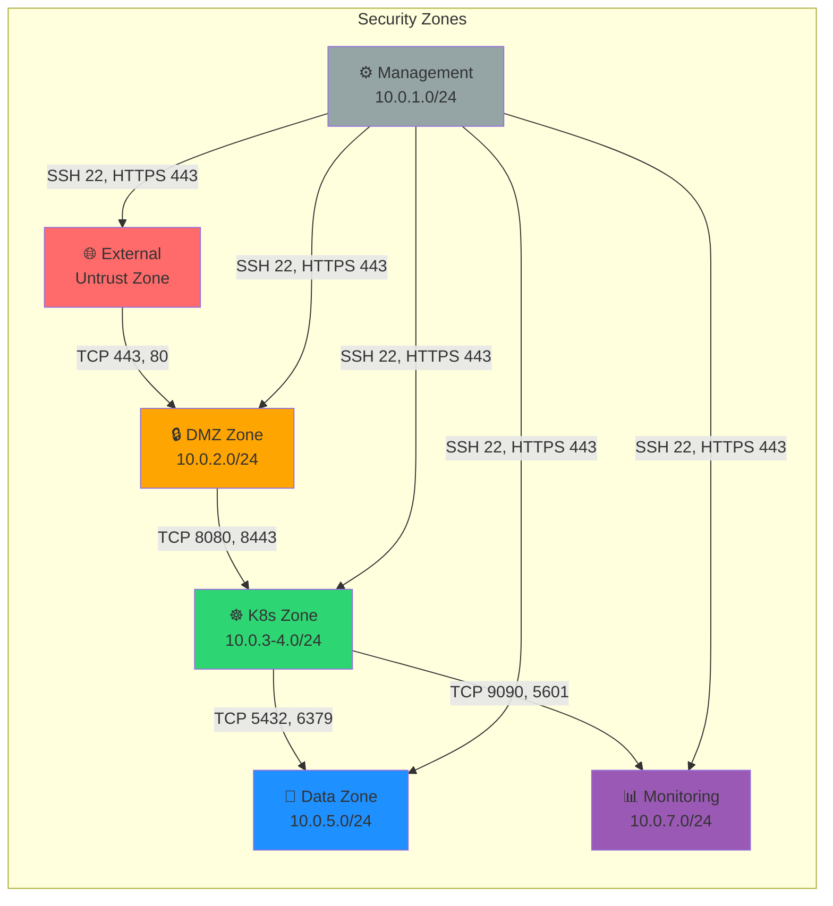
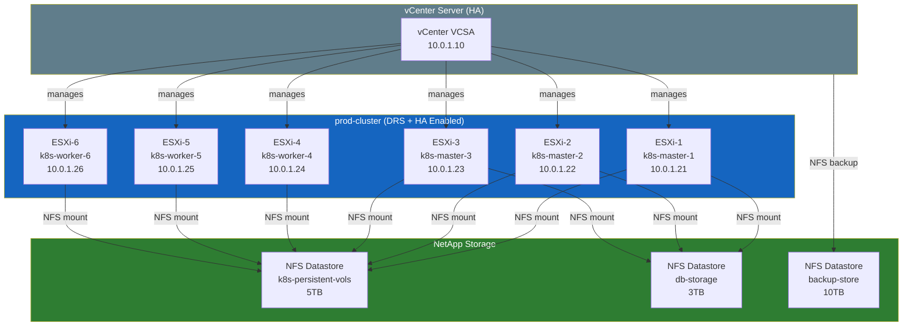

# Volume 3: Infrastructure Setup
## Chapter 1: Network & Compute Configuration Guide

---

## Physical Rack Layout

```
┌─────────────────────────────────────────────────────────────────┐
│                    DATA CENTER RACK LAYOUT                       │
├───────┬────────────────────────────────────────────────────────┤
│  U#   │  RACK A (Network/Security)                             │
├───────┼────────────────────────────────────────────────────────┤
│  U1   │  Patch Panel (Fiber - WAN)                            │
│  U2   │  Palo Alto PA-5250 (FW-1 Active)                      │
│  U3   │  Palo Alto PA-5250 (FW-2 Passive)                     │
│  U4   │  F5 BIG-IP 5200 (LB-1 Active)                        │
│  U5   │  F5 BIG-IP 5200 (LB-2 Passive)                       │
│  U6   │  Cisco Nexus 9372PX (Core-SW-1)                       │
│  U7   │  Cisco Nexus 9372PX (Core-SW-2)                       │
│  U8   │  Cisco Nexus 9348 (Access-SW-1)                       │
│  U9   │  Cisco Nexus 9348 (Access-SW-2)                       │
│  U10  │  Cisco Nexus 9348 (Access-SW-3)                       │
│  U11  │  Cisco Nexus 9348 (Access-SW-4)                       │
│  U12  │  KVM Switch / Console Server                           │
│  U13  │  [Empty]                                               │
│  U14  │  APC Smart-UPS 20kVA (UPS-1)                         │
│  U15  │  APC Smart-UPS 20kVA (UPS-2)                         │
├───────┴────────────────────────────────────────────────────────┤
│  RACK B (Compute Cluster)                                       │
├───────┬────────────────────────────────────────────────────────┤
│  U1   │  Dell R750 (k8s-master-1)  vSphere ESXi               │
│  U2   │  Dell R750 (k8s-master-2)  vSphere ESXi               │
│  U3   │  Dell R750 (k8s-master-3)  vSphere ESXi               │
│  U4   │  Dell R750 (k8s-worker-1)  vSphere ESXi               │
│  U5   │  Dell R750 (k8s-worker-2)  vSphere ESXi               │
│  U6   │  Dell R750 (k8s-worker-3)  vSphere ESXi               │
│  U7   │  Dell R750 (k8s-worker-4)  vSphere ESXi               │
│  U8   │  Dell R750 (k8s-worker-5)  vSphere ESXi               │
│  U9   │  Dell R750 (k8s-worker-6)  vSphere ESXi               │
│  U10  │  Dell R750 (db-primary)                               │
│  U11  │  Dell R750 (db-standby)                               │
│  U12  │  Dell R750 (mgmt-server)  vCenter + DNS + Vault       │
├───────┴────────────────────────────────────────────────────────┤
│  RACK C (Storage)                                               │
├───────┬────────────────────────────────────────────────────────┤
│  U1   │  NetApp AFF A250 (NAS-1)                              │
│  U2   │  NetApp AFF A250 (NAS-2 HA Pair)                     │
│  U3   │  NetApp Disk Shelf (DS224C - 24 NVMe)                 │
│  U4   │  Tape Library (Backup - optional)                     │
│  U5   │  [Storage Expansion - Future]                          │
└───────┴────────────────────────────────────────────────────────┘
```

---

## Firewall Configuration (Palo Alto PA-5250)

### Security Zone Architecture



### Firewall Rules

```
┌─────────────────────────────────────────────────────────────────────────────┐
│                        SECURITY POLICY RULES                                │
├──────┬──────────────┬──────────────┬──────────┬──────────────┬─────────────┤
│ Rule │ Source Zone  │ Dest Zone    │ App/Port │ Action       │ Log         │
├──────┼──────────────┼──────────────┼──────────┼─────────────-┼─────────────┤
│  1   │ External     │ DMZ          │ ssl, web │ Allow        │ Yes         │
│  2   │ DMZ          │ K8s          │ http,8080│ Allow        │ Yes         │
│  3   │ K8s          │ Data         │ pgsql    │ Allow        │ Yes         │
│  4   │ K8s          │ Data         │ redis    │ Allow        │ Yes         │
│  5   │ Management   │ Any          │ ssh,https│ Allow        │ Yes         │
│  6   │ Any          │ Monitoring   │ http     │ Allow+Auth   │ Yes         │
│  7   │ K8s          │ External     │ https    │ Allow        │ Yes         │
│  8   │ Any          │ Any          │ any      │ Deny (log)   │ Yes         │
└──────┴──────────────┴──────────────┴──────────┴──────────────┴─────────────┘
```

### Palo Alto Initial Configuration Commands

```bash
# Connect via console or SSH to management IP
# Default: admin/admin → Change immediately

# Set hostname and management IP
set deviceconfig system hostname fw-onprem-01
set deviceconfig system ip-address 10.0.1.2
set deviceconfig system netmask 255.255.255.0
set deviceconfig system default-gateway 10.0.1.1
set deviceconfig system dns-setting servers primary 10.0.1.50

# Create virtual router
set network virtual-router default
set network virtual-router default routing-table ip static-route default-gw \
    destination 0.0.0.0/0 nexthop ip-address 10.0.1.1

# Enable HA
set high-availability mode active-passive
set high-availability group 1 peer-ip 10.0.1.3
set high-availability group 1 election-option priority 100

# Commit changes
commit
```

---

## Load Balancer Configuration (F5 BIG-IP)

### Virtual Server Setup

```bash
# Create nodes (K8s Ingress IPs)
create ltm node k8s-ingress-1 address 10.0.4.201
create ltm node k8s-ingress-2 address 10.0.4.202
create ltm node k8s-ingress-3 address 10.0.4.203

# Create health monitor
create ltm monitor http app-health-monitor \
  defaults-from http \
  interval 5 timeout 16 \
  send "GET /health HTTP/1.1\r\nHost: app.internal\r\nConnection: close\r\n\r\n" \
  recv "200 OK"

# Create server pool
create ltm pool k8s-ingress-pool \
  members { k8s-ingress-1:8080 k8s-ingress-2:8080 k8s-ingress-3:8080 } \
  monitor app-health-monitor \
  load-balancing-mode least-connections-member

# Create SSL profile
create ltm profile client-ssl app-ssl-profile \
  cert /Common/app.crt \
  key /Common/app.key \
  ciphers "ECDHE+AESGCM:ECDHE+AES256:!aNULL:!MD5"

# Create virtual server (VIP)
create ltm virtual app-vip \
  destination 10.0.2.10:443 \
  ip-protocol tcp \
  pool k8s-ingress-pool \
  profiles add { app-ssl-profile { context clientside } http } \
  source-address-translation { type automap }

# Enable HTTP to HTTPS redirect
create ltm virtual app-vip-http \
  destination 10.0.2.10:80 \
  ip-protocol tcp \
  rules { _sys_https_redirect }
```

---

## VMware vSphere Setup

### Cluster Architecture



### ESXi Installation & vSphere Configuration

```bash
# After ESXi installed on all nodes, configure via esxcli or vSphere web client

# On ESXi node: Set hostname and network
esxcli system hostname set --host=esxi-01.internal.company.com
esxcli network ip interface ipv4 set -i vmk0 -t static \
  -I 10.0.1.21 -N 255.255.255.0 -g 10.0.1.1

# Enable SSH and set NTP
vim-cmd hostsvc/enable_ssh
esxcli system ntp set -s 10.0.1.50 -e yes

# Configure vSAN or NFS storage
# (Run from vSphere Web Client → Storage → New Datastore → NFS)

# Create distributed virtual switch in vCenter
# → Networking → New Distributed Switch → 10Gbps uplinks

# HA Configuration (vCenter UI)
# → Cluster → Configure → vSphere Availability
# → Admission Control: Reserve 25% CPU + Memory
# → Failure Conditions: Restart VMs with High priority

# DRS Configuration  
# → Cluster → Configure → vSphere DRS
# → Automation Level: Fully Automated
# → Migration Threshold: Level 3 (balanced)
```

---

## Storage Configuration (NetApp ONTAP)

```bash
# Initialize ONTAP cluster
cluster setup
# Follow prompts: cluster name, node IPs, admin password

# Create aggregate (storage pool)
storage aggregate create -aggregate aggr1 -diskcount 22 -disktype SSD

# Create SVM (Storage Virtual Machine) for NFS
vserver create -vserver k8s-svm -rootvolume root -rootvolume-security-style unix

# Create NFS volumes
volume create -vserver k8s-svm -volume k8s_pv \
  -aggregate aggr1 -size 5000g -junction-path /k8s_pv

volume create -vserver k8s-svm -volume db_storage \
  -aggregate aggr1 -size 3000g -junction-path /db_storage

volume create -vserver k8s-svm -volume backup_store \
  -aggregate aggr1 -size 10000g -junction-path /backup_store

# Enable NFS on SVM
nfs on -vserver k8s-svm
vserver nfs create -vserver k8s-svm -v3-enabled true -v4.1-enabled true

# Create export policy (allow K8s nodes)
export-policy create -vserver k8s-svm -policyname k8s-nodes
export-policy rule create -vserver k8s-svm -policyname k8s-nodes \
  -clientmatch 10.0.3.0/24,10.0.4.0/24 \
  -rorule sys -rwrule sys -superuser sys

# Enable snapshots
volume snapshot policy create -vserver k8s-svm -policy daily-snapshots \
  -enabled true -schedule daily -count 30

# Set snapshot policy on volumes
volume modify -vserver k8s-svm -volume k8s_pv -snapshot-policy daily-snapshots
```

---

**Document Version**: 2.0
**Date**: July 2026
**Classification**: Internal Use Only
