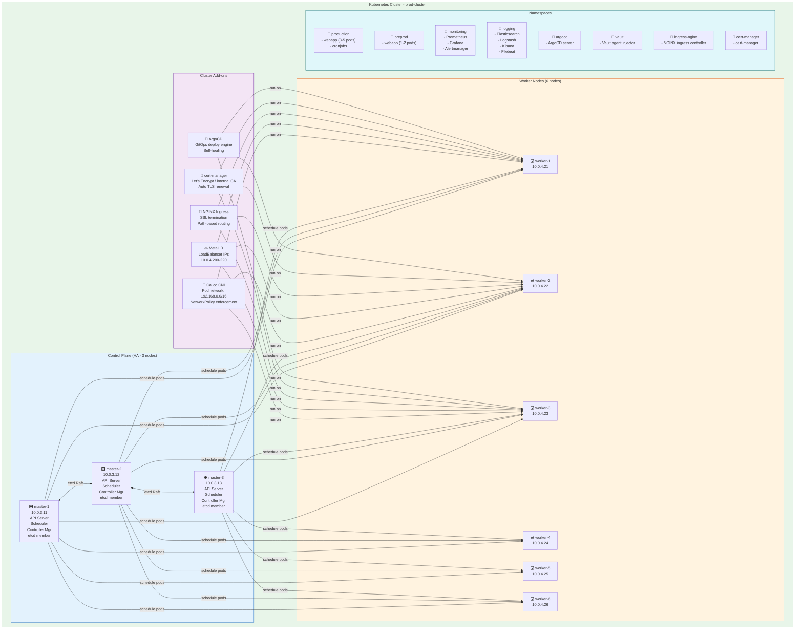

# Volume 4: Kubernetes Platform
## Chapter 1: Complete Kubernetes Setup Guide

---

## Kubernetes Cluster Architecture



---

## Phase 1: Pre-flight on ALL Nodes

```bash
# ── Run on ALL nodes (masters + workers) as root ──────────────────────────
set -euo pipefail

# 1. Disable swap (K8s requirement)
swapoff -a
sed -i '/swap/d' /etc/fstab

# 2. Load required kernel modules
cat <<EOF | tee /etc/modules-load.d/k8s.conf
overlay
br_netfilter
EOF
modprobe overlay
modprobe br_netfilter

# 3. Set kernel parameters
cat <<EOF | tee /etc/sysctl.d/99-k8s.conf
net.bridge.bridge-nf-call-iptables  = 1
net.bridge.bridge-nf-call-ip6tables = 1
net.ipv4.ip_forward                 = 1
EOF
sysctl --system

# 4. Install containerd
apt-get update && apt-get install -y containerd
mkdir -p /etc/containerd
containerd config default | tee /etc/containerd/config.toml
# Enable systemd cgroup (required for K8s)
sed -i 's/SystemdCgroup = false/SystemdCgroup = true/' /etc/containerd/config.toml
systemctl restart containerd && systemctl enable containerd

# 5. Install kubeadm, kubelet, kubectl
apt-get install -y apt-transport-https ca-certificates curl gpg
curl -fsSL https://pkgs.k8s.io/core:/stable:/v1.29/deb/Release.key \
  | gpg --dearmor -o /etc/apt/keyrings/kubernetes-apt-keyring.gpg
echo 'deb [signed-by=/etc/apt/keyrings/kubernetes-apt-keyring.gpg] \
  https://pkgs.k8s.io/core:/stable:/v1.29/deb/ /' \
  | tee /etc/apt/sources.list.d/kubernetes.list
apt-get update
apt-get install -y kubelet=1.29.0-1.1 kubeadm=1.29.0-1.1 kubectl=1.29.0-1.1
apt-mark hold kubelet kubeadm kubectl
systemctl enable kubelet
```

---

## Phase 2: Initialize Control Plane (master-1 ONLY)

```bash
# ── On master-1 only ──────────────────────────────────────────────────────

# Create kubeadm config
cat <<EOF > /root/kubeadm-config.yaml
apiVersion: kubeadm.k8s.io/v1beta3
kind: ClusterConfiguration
kubernetesVersion: v1.29.0
controlPlaneEndpoint: "k8s-api.internal.company.com:6443"
networking:
  podSubnet: "192.168.0.0/16"
  serviceSubnet: "10.96.0.0/12"
etcd:
  local:
    dataDir: /var/lib/etcd
apiServer:
  extraArgs:
    audit-log-maxage: "30"
    audit-log-maxbackup: "3"
    audit-log-maxsize: "100"
    audit-log-path: "/var/log/kube-audit.log"
---
apiVersion: kubelet.config.k8s.io/v1beta1
kind: KubeletConfiguration
cgroupDriver: systemd
EOF

# Initialize cluster
kubeadm init --config /root/kubeadm-config.yaml --upload-certs 2>&1 | tee /root/kubeadm-init.log

# Save the join commands from output — you'll need them for other masters + workers

# Configure kubectl for root
mkdir -p $HOME/.kube
cp /etc/kubernetes/admin.conf $HOME/.kube/config

# Verify control plane
kubectl get nodes        # Should show master-1 (NotReady — CNI not installed yet)
kubectl get pods -n kube-system
```

---

## Phase 3: Join Additional Masters (master-2, master-3)

```bash
# ── On master-2 and master-3 ── (use join command from kubeadm init output)
# Example (replace tokens from your actual output):
kubeadm join k8s-api.internal.company.com:6443 \
  --token <TOKEN> \
  --discovery-token-ca-cert-hash sha256:<HASH> \
  --control-plane \
  --certificate-key <CERT_KEY>

# Configure kubectl on each master
mkdir -p $HOME/.kube
cp /etc/kubernetes/admin.conf $HOME/.kube/config

# Verify from master-1
kubectl get nodes
# Expected: 3 masters, all NotReady (until CNI installed)
```

---

## Phase 4: Install Calico CNI

```bash
# ── On master-1 ───────────────────────────────────────────────────────────

# Install Tigera operator
kubectl create -f https://raw.githubusercontent.com/projectcalico/calico/v3.26.4/manifests/tigera-operator.yaml

# Configure pod network
cat <<EOF | kubectl apply -f -
apiVersion: operator.tigera.io/v1
kind: Installation
metadata:
  name: default
spec:
  calicoNetwork:
    ipPools:
    - blockSize: 26
      cidr: 192.168.0.0/16
      encapsulation: VXLANCrossSubnet
      natOutgoing: Enabled
      nodeSelector: all()
EOF

# Wait for Calico pods
kubectl wait --for=condition=Ready pods -n calico-system --all --timeout=300s

# Verify nodes — should show Ready now
kubectl get nodes -o wide
```

---

## Phase 5: Join Worker Nodes

```bash
# ── On each worker node (worker-1 through worker-6) ──────────────────────
# Use the worker join command from kubeadm init output
kubeadm join k8s-api.internal.company.com:6443 \
  --token <TOKEN> \
  --discovery-token-ca-cert-hash sha256:<HASH>

# Verify from master-1
kubectl get nodes -o wide
# Expected: 3 masters + 6 workers, all Ready

# Label worker nodes
for i in 1 2 3 4 5 6; do
  kubectl label node worker-${i}.internal.company.com node-role.kubernetes.io/worker=worker
done
```

---

## Phase 6: Install MetalLB (LoadBalancer for on-prem)

```bash
kubectl apply -f https://raw.githubusercontent.com/metallb/metallb/v0.13.12/config/manifests/metallb-native.yaml

kubectl wait --for=condition=Ready pods -n metallb-system --all --timeout=120s

# Configure IP pool
cat <<EOF | kubectl apply -f -
apiVersion: metallb.io/v1beta1
kind: IPAddressPool
metadata:
  name: onprem-pool
  namespace: metallb-system
spec:
  addresses:
  - 10.0.4.200-10.0.4.220
---
apiVersion: metallb.io/v1beta1
kind: L2Advertisement
metadata:
  name: onprem-l2
  namespace: metallb-system
spec:
  ipAddressPools:
  - onprem-pool
EOF
```

---

## Phase 7: Install NGINX Ingress Controller

```bash
helm repo add ingress-nginx https://kubernetes.github.io/ingress-nginx
helm repo update

helm install ingress-nginx ingress-nginx/ingress-nginx \
  --namespace ingress-nginx --create-namespace \
  --set controller.service.type=LoadBalancer \
  --set controller.service.loadBalancerIP=10.0.4.200 \
  --set controller.replicaCount=3 \
  --set controller.resources.requests.cpu=500m \
  --set controller.resources.requests.memory=512Mi \
  --set controller.resources.limits.cpu=2 \
  --set controller.resources.limits.memory=1Gi \
  --set controller.metrics.enabled=true \
  --set controller.metrics.serviceMonitor.enabled=true

# Verify
kubectl get svc -n ingress-nginx
# EXTERNAL-IP should be 10.0.4.200
```

---

## Phase 8: Install cert-manager

```bash
helm repo add jetstack https://charts.jetstack.io
helm repo update

helm install cert-manager jetstack/cert-manager \
  --namespace cert-manager --create-namespace \
  --set installCRDs=true \
  --set replicaCount=2

# Create internal ClusterIssuer (using self-signed or internal CA)
cat <<EOF | kubectl apply -f -
apiVersion: cert-manager.io/v1
kind: ClusterIssuer
metadata:
  name: internal-ca
spec:
  ca:
    secretName: internal-ca-key-pair
EOF
```

---

## Phase 9: Install ArgoCD

```bash
kubectl create namespace argocd
kubectl apply -n argocd -f \
  https://raw.githubusercontent.com/argoproj/argo-cd/v2.9.0/manifests/install.yaml

# Wait for ArgoCD
kubectl wait --for=condition=Ready pods -n argocd --all --timeout=300s

# Get initial admin password
kubectl get secret argocd-initial-admin-secret -n argocd \
  -o jsonpath="{.data.password}" | base64 -d && echo

# Expose ArgoCD UI via Ingress
cat <<EOF | kubectl apply -f -
apiVersion: networking.k8s.io/v1
kind: Ingress
metadata:
  name: argocd-ingress
  namespace: argocd
  annotations:
    nginx.ingress.kubernetes.io/backend-protocol: "HTTPS"
    cert-manager.io/cluster-issuer: "internal-ca"
spec:
  ingressClassName: nginx
  tls:
  - hosts:
    - argocd.company.com
    secretName: argocd-tls
  rules:
  - host: argocd.company.com
    http:
      paths:
      - path: /
        pathType: Prefix
        backend:
          service:
            name: argocd-server
            port:
              number: 443
EOF
```

---

## Phase 10: Install Prometheus + Grafana Stack

```bash
helm repo add prometheus-community https://prometheus-community.github.io/helm-charts
helm repo update

# Install kube-prometheus-stack
helm install monitoring prometheus-community/kube-prometheus-stack \
  --namespace monitoring --create-namespace \
  --set prometheus.prometheusSpec.retention=30d \
  --set prometheus.prometheusSpec.storageSpec.volumeClaimTemplate.spec.storageClassName=nfs-sc \
  --set prometheus.prometheusSpec.storageSpec.volumeClaimTemplate.spec.resources.requests.storage=100Gi \
  --set grafana.adminPassword="${GRAFANA_ADMIN_PASSWORD}" \
  --set grafana.persistence.enabled=true \
  --set grafana.persistence.size=10Gi \
  --set alertmanager.alertmanagerSpec.storage.volumeClaimTemplate.spec.resources.requests.storage=10Gi

# Verify
kubectl get pods -n monitoring
kubectl get svc -n monitoring
```

---

## Phase 11: Install HashiCorp Vault

```bash
helm repo add hashicorp https://helm.releases.hashicorp.com
helm repo update

cat <<EOF > vault-values.yaml
server:
  ha:
    enabled: true
    replicas: 3
    raft:
      enabled: true
  storage:
    type: raft
    raft:
      path: /vault/data
  ingress:
    enabled: true
    ingressClassName: nginx
    hosts:
      - host: vault.company.com
        paths: [/]
injector:
  enabled: true
  replicas: 2
EOF

helm install vault hashicorp/vault \
  --namespace vault --create-namespace \
  -f vault-values.yaml

# Initialize Vault
kubectl exec -n vault vault-0 -- vault operator init \
  -key-shares=5 -key-threshold=3 \
  -format=json > /root/vault-init-keys.json

# Store keys SECURELY. Then unseal vault-0, vault-1, vault-2:
for i in 0 1 2 3 4; do
  UNSEAL_KEY=$(cat /root/vault-init-keys.json | jq -r ".unseal_keys_b64[$i]")
  for pod in vault-0 vault-1 vault-2; do
    kubectl exec -n vault $pod -- vault operator unseal $UNSEAL_KEY
  done
done
```

---

## Kubernetes Cluster Verification

```bash
# ── Full cluster health check ─────────────────────────────────────────────

echo "=== NODES ===" && kubectl get nodes -o wide
echo "=== SYSTEM PODS ===" && kubectl get pods -n kube-system
echo "=== MONITORING ===" && kubectl get pods -n monitoring
echo "=== INGRESS ===" && kubectl get pods,svc -n ingress-nginx
echo "=== ARGOCD ===" && kubectl get pods -n argocd
echo "=== VAULT ===" && kubectl get pods -n vault
echo "=== METALLB ===" && kubectl get pods -n metallb-system

# Check Calico networking
kubectl exec -it -n calico-system \
  $(kubectl get pod -n calico-system -l app.kubernetes.io/name=calico-node -o jsonpath='{.items[0].metadata.name}') \
  -- calico-node -bird-ready -felix-ready

# Test pod-to-pod connectivity
kubectl run test-pod --image=busybox --rm -it --restart=Never \
  -- wget -qO- http://kubernetes.default.svc.cluster.local

# Check etcd health
kubectl exec -n kube-system etcd-master-1 -- \
  etcdctl --cacert /etc/kubernetes/pki/etcd/ca.crt \
          --cert /etc/kubernetes/pki/etcd/server.crt \
          --key /etc/kubernetes/pki/etcd/server.key \
          endpoint health --cluster
```

---

**Document Version**: 2.0 | **Date**: July 2026 | **Classification**: Internal Use Only
