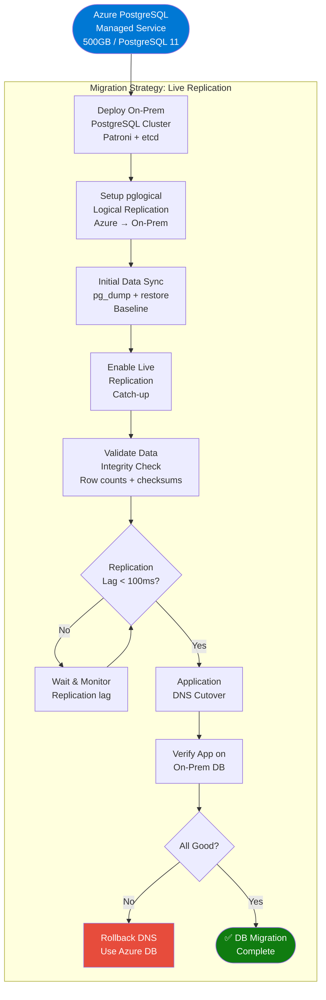

# Volume 5: Database Migration
## Chapter 1: PostgreSQL HA Migration Guide

---

## Database Migration Strategy Overview



---

## Target: PostgreSQL HA Architecture with Patroni

```
┌────────────────────────────────────────────────────────────────────────┐
│               POSTGRESQL HIGH-AVAILABILITY CLUSTER                     │
├────────────────────────────────────────────────────────────────────────┤
│                                                                        │
│   ┌─────────────┐    ┌─────────────┐    ┌─────────────┐              │
│   │   etcd-1    │    │   etcd-2    │    │   etcd-3    │              │
│   │ 10.0.5.11   │◄───►10.0.5.12   │◄───►10.0.5.13   │              │
│   │ (DCS Node)  │    │ (DCS Node)  │    │ (DCS Node)  │              │
│   └──────▲──────┘    └──────▲──────┘    └──────▲──────┘              │
│          │                  │                  │                      │
│          └──────────────────┼──────────────────┘                      │
│                             │ Leader Election                          │
│                    ┌────────▼────────┐                                │
│                    │    Patroni      │  Cluster Manager                │
│                    └────────┬────────┘                                │
│                             │                                         │
│         ┌───────────────────┼───────────────────┐                    │
│         │                   │                   │                    │
│  ┌──────▼──────┐    ┌──────▼──────┐    ┌──────▼──────┐              │
│  │ PostgreSQL  │    │ PostgreSQL  │    │ PostgreSQL  │              │
│  │  PRIMARY   │───►│  STANDBY-1  │    │  STANDBY-2  │              │
│  │ 10.0.5.1   │    │ 10.0.5.2   │    │ 10.0.5.3   │              │
│  │  Leader    │    │  Follower  │    │  Follower  │              │
│  └─────────────┘    └─────────────┘    └─────────────┘              │
│         │                                                            │
│  ┌──────▼──────┐                                                     │
│  │  HAProxy   │  Connection Pooler + VIP: 10.0.5.100               │
│  │ 10.0.5.100 │  Port 5432 → Primary (R/W)                         │
│  │            │  Port 5433 → Replicas (Read-only)                   │
│  └─────────────┘                                                     │
│                                                                        │
│  ┌──────────────────────────────────────────────────────────────┐     │
│  │  PgBouncer Connection Pool  (10.0.5.200)                    │     │
│  │  Max Connections: 400  Pool Mode: Transaction               │     │
│  └──────────────────────────────────────────────────────────────┘     │
└────────────────────────────────────────────────────────────────────────┘
```

---

## Step 1: Deploy PostgreSQL Cluster with Patroni

```bash
# ── ON ALL 3 DB NODES (10.0.5.1, 10.0.5.2, 10.0.5.3) ──────────────────

# Install PostgreSQL 15 (upgrade from Azure's PG11)
sudo apt install -y postgresql-15 postgresql-client-15

# Install etcd
sudo apt install -y etcd
cat > /etc/etcd/etcd.conf.yml <<EOF
name: 'db-node-1'
data-dir: /var/lib/etcd
listen-client-urls: http://10.0.5.11:2379
advertise-client-urls: http://10.0.5.11:2379
listen-peer-urls: http://10.0.5.11:2380
initial-advertise-peer-urls: http://10.0.5.11:2380
initial-cluster: db-node-1=http://10.0.5.11:2380,db-node-2=http://10.0.5.12:2380,db-node-3=http://10.0.5.13:2380
initial-cluster-token: 'db-etcd-cluster'
initial-cluster-state: 'new'
EOF
sudo systemctl enable etcd --now

# Install Patroni
sudo pip3 install patroni[etcd] psycopg2-binary

# Patroni config for db-node-1 (PRIMARY)
cat > /etc/patroni/patroni.yml <<EOF
scope: prod-postgres
namespace: /db/
name: db-node-1

restapi:
  listen: 10.0.5.1:8008
  connect_address: 10.0.5.1:8008

etcd:
  hosts: 10.0.5.11:2379,10.0.5.12:2379,10.0.5.13:2379

bootstrap:
  dcs:
    ttl: 30
    loop_wait: 10
    retry_timeout: 10
    maximum_lag_on_failover: 1048576
    postgresql:
      use_pg_rewind: true
      parameters:
        max_connections: 400
        shared_buffers: 128GB
        effective_cache_size: 384GB
        work_mem: 256MB
        maintenance_work_mem: 4GB
        wal_level: logical
        max_replication_slots: 10
        max_wal_senders: 10
        wal_keep_size: 1GB
        archive_mode: 'on'
        archive_command: 'cp %p /var/lib/postgresql/archive/%f'

  initdb:
    - encoding: UTF8
    - data-checksums

postgresql:
  listen: 10.0.5.1:5432
  connect_address: 10.0.5.1:5432
  data_dir: /var/lib/postgresql/15/data
  bin_dir: /usr/lib/postgresql/15/bin
  authentication:
    replication:
      username: replicator
      password: ${REPL_PASSWORD}
    superuser:
      username: postgres
      password: ${PG_PASSWORD}

tags:
  nofailover: false
  noloadbalance: false
  clonefrom: false
EOF

sudo systemctl enable patroni --now
```

---

## Step 2: Azure to On-Prem Data Migration

```mermaid
sequenceDiagram
    participant AZ as Azure PostgreSQL
    participant ONPREM as On-Prem Primary
    participant APP as Application

    Note over AZ,APP: Phase A: Baseline Snapshot
    AZ->>AZ: pg_dump --format=custom\n--compress=9 production_db
    AZ-->>ONPREM: Transfer via pg_dump pipe\nor scp (encrypted)
    ONPREM->>ONPREM: pg_restore into\nproduction_db

    Note over AZ,APP: Phase B: Live Replication (pglogical)
    AZ->>AZ: CREATE EXTENSION pglogical;\nCREate PUBLICATION
    ONPREM->>AZ: CREATE SUBSCRIPTION\n(pull changes from Azure)
    AZ-->>ONPREM: Stream WAL changes\n(real-time sync)

    Note over AZ,APP: Phase C: Validation
    ONPREM->>ONPREM: SELECT COUNT(*) per table\nmd5 checksums on key tables
    ONPREM-->>APP: Replication lag < 100ms ✅

    Note over AZ,APP: Phase D: Cutover
    APP->>APP: Stop writes (maintenance)\nfor 30 seconds
    APP->>ONPREM: Update DB connection string
    ONPREM-->>APP: Reads/Writes on on-prem ✅
    APP->>AZ: Decommission reads from Azure
```

### Migration Commands

```bash
# ── PHASE A: Baseline Dump from Azure ────────────────────────────────────

# On Azure (or local machine with pg_dump)
AZURE_HOST="your-db.postgres.database.azure.com"
AZURE_USER="adminuser@your-db"
AZURE_DB="production_db"
ONPREM_HOST="10.0.5.1"

# Dump directly into on-prem (streaming via pipe)
pg_dump -h $AZURE_HOST -U $AZURE_USER -d $AZURE_DB \
  --format=custom --compress=9 --no-owner --no-acl \
  | pg_restore -h $ONPREM_HOST -U postgres -d production_db \
    --jobs=8 --no-owner --no-acl

# ── PHASE B: Setup pglogical replication ─────────────────────────────────

# On Azure PostgreSQL:
psql -h $AZURE_HOST -U $AZURE_USER -d $AZURE_DB <<SQL
CREATE EXTENSION pglogical;
SELECT pglogical.create_node(
    node_name := 'azure_publisher',
    dsn := 'host=${AZURE_HOST} port=5432 dbname=production_db user=adminuser password=${AZURE_PASSWORD}'
);
SELECT pglogical.create_replication_set('default');
SELECT pglogical.replication_set_add_all_tables('default', ARRAY['public']);
SQL

# On On-Prem Primary:
psql -h $ONPREM_HOST -U postgres -d production_db <<SQL
CREATE EXTENSION pglogical;
SELECT pglogical.create_node(
    node_name := 'onprem_subscriber',
    dsn := 'host=10.0.5.1 port=5432 dbname=production_db user=postgres password=${PG_PASSWORD}'
);
SELECT pglogical.create_subscription(
    subscription_name := 'from_azure',
    provider_dsn := 'host=${AZURE_HOST} port=5432 dbname=production_db user=adminuser password=${AZURE_PASSWORD}',
    replication_sets := ARRAY['default'],
    synchronize_data := false  -- Already did baseline restore
);
SQL

# ── PHASE C: Monitor Replication Lag ─────────────────────────────────────
# Check lag on Azure side
psql -h $AZURE_HOST -U $AZURE_USER -d $AZURE_DB \
  -c "SELECT application_name, state, sent_lsn, write_lsn, replay_lsn,
             (sent_lsn - replay_lsn) AS replication_lag
      FROM pg_stat_replication;"

# Check on-prem subscriber status
psql -h $ONPREM_HOST -U postgres -d production_db \
  -c "SELECT sub_name, status, received_lsn FROM pglogical.show_subscription_status();"

# ── PHASE D: Validate Data Integrity ─────────────────────────────────────
# Row count comparison script
psql -h $ONPREM_HOST -U postgres -d production_db \
  -c "SELECT schemaname, tablename, n_live_tup
      FROM pg_stat_user_tables ORDER BY n_live_tup DESC LIMIT 20;"
```

---

## Step 3: Setup HAProxy for Connection Load Balancing

```bash
# Install HAProxy
sudo apt install -y haproxy

cat > /etc/haproxy/haproxy.cfg <<EOF
global
    log /dev/log    local0
    log /dev/log    local1 notice
    maxconn 10000

defaults
    log global
    mode tcp
    option tcplog
    timeout connect 5000ms
    timeout client  30000ms
    timeout server  30000ms

# Primary (R/W) - Port 5432
frontend postgres_primary
    bind *:5432
    default_backend postgres_primary_backend

backend postgres_primary_backend
    option httpchk GET /master
    http-check expect status 200
    server db-primary 10.0.5.1:5432 check port 8008 inter 2s fall 3 rise 2
    server db-standby1 10.0.5.2:5432 check port 8008 inter 2s fall 3 rise 2 backup
    server db-standby2 10.0.5.3:5432 check port 8008 inter 2s fall 3 rise 2 backup

# Read Replicas - Port 5433
frontend postgres_replica
    bind *:5433
    default_backend postgres_replica_backend

backend postgres_replica_backend
    option httpchk GET /replica
    http-check expect status 200
    balance roundrobin
    server db-standby1 10.0.5.2:5432 check port 8008 inter 2s
    server db-standby2 10.0.5.3:5432 check port 8008 inter 2s
EOF

sudo systemctl enable haproxy --now
```

---

## Step 4: Setup PgBouncer Connection Pooling

```bash
sudo apt install -y pgbouncer

cat > /etc/pgbouncer/pgbouncer.ini <<EOF
[databases]
production_db = host=10.0.5.100 port=5432 dbname=production_db pool_size=80

[pgbouncer]
listen_addr = 0.0.0.0
listen_port = 6432
auth_type = md5
auth_file = /etc/pgbouncer/userlist.txt
pool_mode = transaction
max_client_conn = 400
default_pool_size = 80
max_db_connections = 400
server_idle_timeout = 600
log_connections = 1
log_disconnections = 1
stats_period = 60
EOF

# Update application DB connection to: pgbouncer-host:6432
```

---

## PostgreSQL Performance Tuning

```sql
-- Applied via postgresql.conf / ALTER SYSTEM

-- Memory
ALTER SYSTEM SET shared_buffers = '128GB';           -- 25% of RAM
ALTER SYSTEM SET effective_cache_size = '384GB';      -- 75% of RAM
ALTER SYSTEM SET work_mem = '256MB';
ALTER SYSTEM SET maintenance_work_mem = '4GB';
ALTER SYSTEM SET huge_pages = 'try';

-- WAL / Replication
ALTER SYSTEM SET wal_level = 'logical';
ALTER SYSTEM SET wal_buffers = '64MB';
ALTER SYSTEM SET checkpoint_completion_target = 0.9;
ALTER SYSTEM SET max_wal_size = '8GB';
ALTER SYSTEM SET min_wal_size = '2GB';
ALTER SYSTEM SET archive_mode = 'on';
ALTER SYSTEM SET archive_command = 'cp %p /mnt/backup/wal/%f';

-- Connections
ALTER SYSTEM SET max_connections = 400;

-- Query Performance
ALTER SYSTEM SET random_page_cost = 1.1;             -- SSD storage
ALTER SYSTEM SET effective_io_concurrency = 200;     -- SSD
ALTER SYSTEM SET default_statistics_target = 500;
ALTER SYSTEM SET parallel_tuple_cost = 0.1;

-- Autovacuum tuning (for high-write workloads)
ALTER SYSTEM SET autovacuum_vacuum_cost_limit = 2000;
ALTER SYSTEM SET autovacuum_vacuum_scale_factor = 0.05;
ALTER SYSTEM SET autovacuum_analyze_scale_factor = 0.02;

SELECT pg_reload_conf();
```

---

## Backup Configuration (Bacula + WAL Archiving)

```bash
# Automated daily backup script
cat > /etc/cron.d/postgres-backup <<EOF
# Daily full backup at 2 AM
0 2 * * * postgres /usr/local/bin/pg-backup-daily.sh

# WAL archiving every 5 minutes
*/5 * * * * postgres /usr/local/bin/pg-wal-archive.sh
EOF

# pg-backup-daily.sh
#!/bin/bash
DATE=$(date +%Y%m%d_%H%M%S)
BACKUP_DIR="/mnt/backup/postgres"
mkdir -p $BACKUP_DIR

pg_basebackup -h 10.0.5.100 -U replicator \
  -D ${BACKUP_DIR}/base_${DATE} \
  --format=tar --compress=9 \
  --checkpoint=fast --label="daily_${DATE}"

# Retain 30 days
find $BACKUP_DIR -name "base_*" -mtime +30 -exec rm -rf {} \;
echo "Backup completed: ${DATE}"
```

---

## Validation Checklist

```
DATABASE MIGRATION VALIDATION
═══════════════════════════════════════════════════════════
Pre-Migration:
  [ ] Azure DB pg_dump successful with no errors
  [ ] On-prem PostgreSQL cluster healthy (all 3 nodes)
  [ ] Patroni showing 1 leader + 2 replicas
  [ ] HAProxy health checks passing for all nodes
  [ ] PgBouncer accepting connections on port 6432

Data Integrity:
  [ ] Row counts match (within 0.001% variance allowed)
  [ ] Table checksums match on 10 largest tables
  [ ] All FK constraints valid (no violations)
  [ ] All sequences reset to correct next values
  [ ] pglogical subscription status = "replicating"

Performance:
  [ ] P95 query time < 100ms (same queries as Azure)
  [ ] Connection pool hit rate > 95%
  [ ] autovacuum running on all tables
  [ ] No long-running queries > 30 seconds

Security:
  [ ] SSL enforced for all connections
  [ ] pg_hba.conf restricts to K8s VLAN only
  [ ] Roles and privileges match Azure configuration
  [ ] Audit logging enabled (pgaudit)

Backup:
  [ ] Daily backup running and tested
  [ ] WAL archiving to /mnt/backup/wal verified
  [ ] Test restore completed successfully
  [ ] RTO tested: < 5 minutes for failover
  [ ] RPO tested: < 1 minute data loss
```

---

**Document Version**: 2.0
**Date**: July 2026
**Classification**: Internal Use Only
