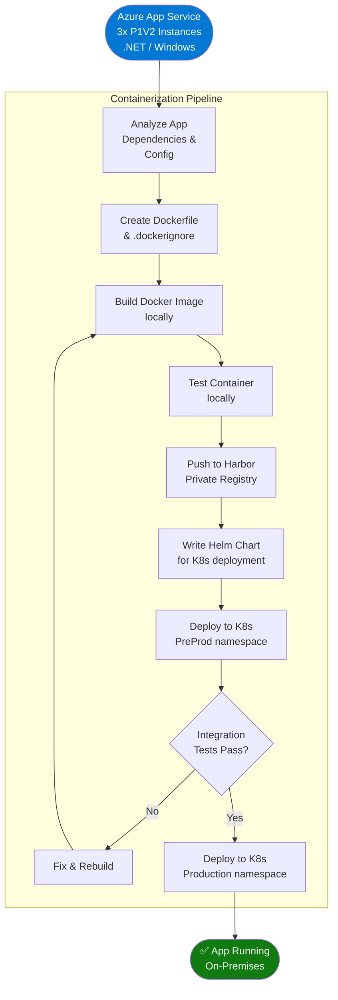
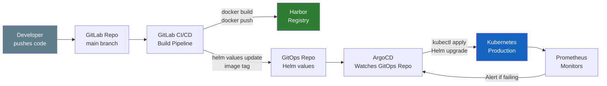

# Volume 6: Application Migration
## Chapter 1: Containerization & Kubernetes Deployment

---

## Application Migration Strategy



---

## Azure App Service → Kubernetes Mapping

```
┌─────────────────────────────────────────────────────────────────────────┐
│             AZURE APP SERVICE → KUBERNETES EQUIVALENTS                  │
├──────────────────────────────┬──────────────────────────────────────────┤
│  Azure Feature               │  Kubernetes Equivalent                   │
├──────────────────────────────┼──────────────────────────────────────────┤
│  App Service Plan (compute)  │  ResourceQuota + LimitRange              │
│  App Service Instance        │  Pod (container)                         │
│  App Service Scale-out 2-5   │  HorizontalPodAutoscaler (min:2, max:5) │
│  Auto-scale on CPU 70%       │  HPA targetCPUUtilization: 70%          │
│  Deployment Slots (3)        │  Namespaces: prod, preprod, qa           │
│  Rolling Deployment          │  RollingUpdate strategy maxSurge:1       │
│  Always On                   │  restartPolicy: Always                   │
│  Health Check /health        │  livenessProbe + readinessProbe          │
│  Managed Identity            │  Vault Agent Injector sidecar            │
│  App Settings                │  K8s ConfigMap + Secrets                 │
│  Connection Strings          │  K8s Secrets (Vault-injected)            │
│  Application Insights SDK    │  OpenTelemetry + Jaeger sidecar          │
│  HTTPS enforced              │  Ingress TLS + cert-manager              │
│  Custom Domain               │  Ingress host: app.company.com           │
│  CDN (Front Door)            │  NGINX cache headers + Varnish           │
└──────────────────────────────┴──────────────────────────────────────────┘
```

---

## Dockerfile (Multi-stage build)

```dockerfile
# ── Stage 1: Build ───────────────────────────────────────────────────────
FROM mcr.microsoft.com/dotnet/sdk:6.0 AS build
WORKDIR /src

# Copy project files and restore dependencies
COPY ["src/WebApp/WebApp.csproj", "src/WebApp/"]
RUN dotnet restore "src/WebApp/WebApp.csproj"

# Copy remaining source and build
COPY . .
WORKDIR "/src/src/WebApp"
RUN dotnet build "WebApp.csproj" -c Release -o /app/build

# Publish release
RUN dotnet publish "WebApp.csproj" -c Release -o /app/publish \
    /p:UseAppHost=false

# ── Stage 2: Runtime ─────────────────────────────────────────────────────
FROM mcr.microsoft.com/dotnet/aspnet:6.0 AS runtime
WORKDIR /app

# Security: non-root user
RUN groupadd -r appuser && useradd -r -g appuser appuser

# Copy published artifacts
COPY --from=build /app/publish .

# Health check
HEALTHCHECK --interval=30s --timeout=10s --start-period=15s --retries=3 \
  CMD curl -f http://localhost:8080/health || exit 1

# Drop privileges
USER appuser

EXPOSE 8080
ENTRYPOINT ["dotnet", "WebApp.dll"]
```

---

## Helm Chart Structure

```
webapp-chart/
├── Chart.yaml
├── values.yaml
├── values-production.yaml
├── values-preprod.yaml
└── templates/
    ├── deployment.yaml
    ├── service.yaml
    ├── ingress.yaml
    ├── hpa.yaml
    ├── configmap.yaml
    ├── secret.yaml        ← Vault-managed
    └── servicemonitor.yaml
```

### Helm values.yaml

```yaml
# values.yaml — base configuration
replicaCount: 3

image:
  repository: harbor.internal.company.com/production/webapp
  tag: "1.0.0"
  pullPolicy: IfNotPresent

imagePullSecrets:
  - name: harbor-registry-secret

service:
  type: ClusterIP
  port: 80
  targetPort: 8080

ingress:
  enabled: true
  className: nginx
  annotations:
    cert-manager.io/cluster-issuer: "letsencrypt-prod"
    nginx.ingress.kubernetes.io/ssl-redirect: "true"
    nginx.ingress.kubernetes.io/proxy-body-size: "50m"
  hosts:
    - host: app.company.com
      paths:
        - path: /
          pathType: Prefix
  tls:
    - secretName: app-tls-secret
      hosts:
        - app.company.com

resources:
  limits:
    cpu: "2"
    memory: "3Gi"
  requests:
    cpu: "500m"
    memory: "1Gi"

autoscaling:
  enabled: true
  minReplicas: 2
  maxReplicas: 5
  targetCPUUtilizationPercentage: 70
  targetMemoryUtilizationPercentage: 80

# Probes
livenessProbe:
  httpGet:
    path: /health/live
    port: 8080
  initialDelaySeconds: 15
  periodSeconds: 20
  failureThreshold: 3

readinessProbe:
  httpGet:
    path: /health/ready
    port: 8080
  initialDelaySeconds: 5
  periodSeconds: 10

# Pod Disruption Budget
pdb:
  enabled: true
  minAvailable: 1

# Anti-affinity for HA
affinity:
  podAntiAffinity:
    preferredDuringSchedulingIgnoredDuringExecution:
      - weight: 100
        podAffinityTerm:
          labelSelector:
            matchLabels:
              app: webapp
          topologyKey: kubernetes.io/hostname

# Vault secrets injection
vault:
  enabled: true
  role: webapp-role
  secrets:
    - path: secret/webapp/db
      key: DB_CONNECTION_STRING
    - path: secret/webapp/redis
      key: REDIS_CONNECTION_STRING
    - path: secret/webapp/api-keys
      key: API_KEY

# Environment from ConfigMap
env:
  - name: ASPNETCORE_ENVIRONMENT
    value: "Production"
  - name: DB_HOST
    value: "10.0.5.100"
  - name: REDIS_HOST
    value: "10.0.6.50"
  - name: LOG_LEVEL
    value: "Information"
```

### Helm Deployment Template

```yaml
# templates/deployment.yaml
apiVersion: apps/v1
kind: Deployment
metadata:
  name: {{ include "webapp-chart.fullname" . }}
  labels:
    {{- include "webapp-chart.labels" . | nindent 4 }}
spec:
  {{- if not .Values.autoscaling.enabled }}
  replicas: {{ .Values.replicaCount }}
  {{- end }}
  strategy:
    type: RollingUpdate
    rollingUpdate:
      maxUnavailable: 0
      maxSurge: 1
  selector:
    matchLabels:
      {{- include "webapp-chart.selectorLabels" . | nindent 6 }}
  template:
    metadata:
      annotations:
        vault.hashicorp.com/agent-inject: "true"
        vault.hashicorp.com/role: {{ .Values.vault.role }}
      labels:
        {{- include "webapp-chart.selectorLabels" . | nindent 8 }}
    spec:
      serviceAccountName: {{ include "webapp-chart.serviceAccountName" . }}
      securityContext:
        runAsNonRoot: true
        runAsUser: 1000
        fsGroup: 2000
      containers:
        - name: {{ .Chart.Name }}
          image: "{{ .Values.image.repository }}:{{ .Values.image.tag }}"
          imagePullPolicy: {{ .Values.image.pullPolicy }}
          ports:
            - name: http
              containerPort: 8080
              protocol: TCP
          {{- with .Values.livenessProbe }}
          livenessProbe: {{- toYaml . | nindent 12 }}
          {{- end }}
          {{- with .Values.readinessProbe }}
          readinessProbe: {{- toYaml . | nindent 12 }}
          {{- end }}
          resources: {{- toYaml .Values.resources | nindent 12 }}
          env: {{- toYaml .Values.env | nindent 12 }}
```

---

## ArgoCD GitOps Deployment



### ArgoCD Application Definition

```yaml
# argocd-application.yaml
apiVersion: argoproj.io/v1alpha1
kind: Application
metadata:
  name: webapp-production
  namespace: argocd
spec:
  project: default
  source:
    repoURL: https://gitlab.internal.company.com/gitops/webapp-deployment.git
    targetRevision: HEAD
    path: helm/production
    helm:
      valueFiles:
        - values-production.yaml
  destination:
    server: https://kubernetes.default.svc
    namespace: production
  syncPolicy:
    automated:
      prune: true
      selfHeal: true
    syncOptions:
      - CreateNamespace=true
    retry:
      limit: 5
      backoff:
        duration: 5s
        factor: 2
        maxDuration: 3m
```

---

## CI/CD Pipeline (GitLab CI)

```yaml
# .gitlab-ci.yml
stages:
  - test
  - build
  - push
  - deploy-preprod
  - integration-test
  - deploy-production

variables:
  HARBOR_REGISTRY: harbor.internal.company.com
  IMAGE_NAME: $HARBOR_REGISTRY/production/webapp
  DOCKER_DRIVER: overlay2

unit-tests:
  stage: test
  image: mcr.microsoft.com/dotnet/sdk:6.0
  script:
    - dotnet test --no-build --verbosity normal /p:CollectCoverage=true
  coverage: '/Total.*?([0-9]{1,3})%/'

build-image:
  stage: build
  image: docker:24.0
  services:
    - docker:24.0-dind
  script:
    - docker login $HARBOR_REGISTRY -u $HARBOR_USER -p $HARBOR_PASSWORD
    - docker build -t $IMAGE_NAME:$CI_COMMIT_SHA -t $IMAGE_NAME:latest .
    - docker push $IMAGE_NAME:$CI_COMMIT_SHA

deploy-preprod:
  stage: deploy-preprod
  image: alpine/helm:3.12
  script:
    - helm upgrade --install webapp-preprod ./helm/webapp-chart
        --namespace preprod --create-namespace
        --set image.tag=$CI_COMMIT_SHA
        --values ./helm/values-preprod.yaml
        --wait --timeout 5m

integration-tests:
  stage: integration-test
  image: postman/newman:latest
  script:
    - newman run tests/integration/webapp.postman_collection.json
        --env-var base_url=https://preprod.company.com

deploy-production:
  stage: deploy-production
  image: alpine/helm:3.12
  when: manual
  only:
    - main
  script:
    - helm upgrade --install webapp-production ./helm/webapp-chart
        --namespace production
        --set image.tag=$CI_COMMIT_SHA
        --values ./helm/values-production.yaml
        --wait --timeout 10m --atomic
```

---

## Container Migration Checklist

```
APPLICATION CONTAINERIZATION CHECKLIST
══════════════════════════════════════════════════════════════
Pre-Build:
  [ ] Application dependencies documented
  [ ] Dockerfile created (multi-stage build)
  [ ] .dockerignore created (exclude node_modules, .git etc.)
  [ ] Environment variables externalized to ConfigMap/Secrets
  [ ] Application health endpoints: /health/live + /health/ready
  [ ] Stateless: no local file system writes for persistent data
  [ ] Logging to stdout/stderr (not file)

Security:
  [ ] Run as non-root user (uid 1000)
  [ ] Read-only root filesystem where possible
  [ ] No secrets baked into image
  [ ] Base image scanned (Trivy): 0 critical CVEs
  [ ] Resource limits defined (CPU + Memory)

Performance:
  [ ] Image size < 500MB (multi-stage build)
  [ ] Startup time < 30 seconds
  [ ] Readiness probe prevents traffic before ready
  [ ] Connection pool configured for K8s (not App Service defaults)

Operations:
  [ ] HPA configured (min:2 max:5, CPU 70%)
  [ ] PodDisruptionBudget: minAvailable 1
  [ ] Anti-affinity rules (spread across nodes)
  [ ] Rolling update: maxUnavailable:0 maxSurge:1
  [ ] ArgoCD Application syncing successfully
```

---

**Document Version**: 2.0
**Date**: July 2026
**Classification**: Internal Use Only
