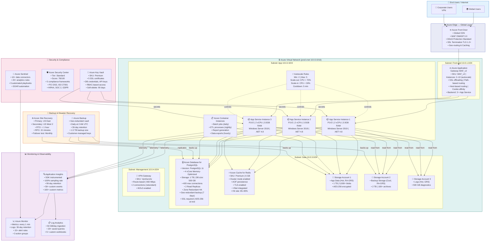
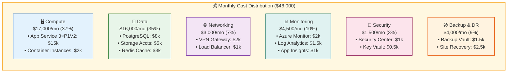
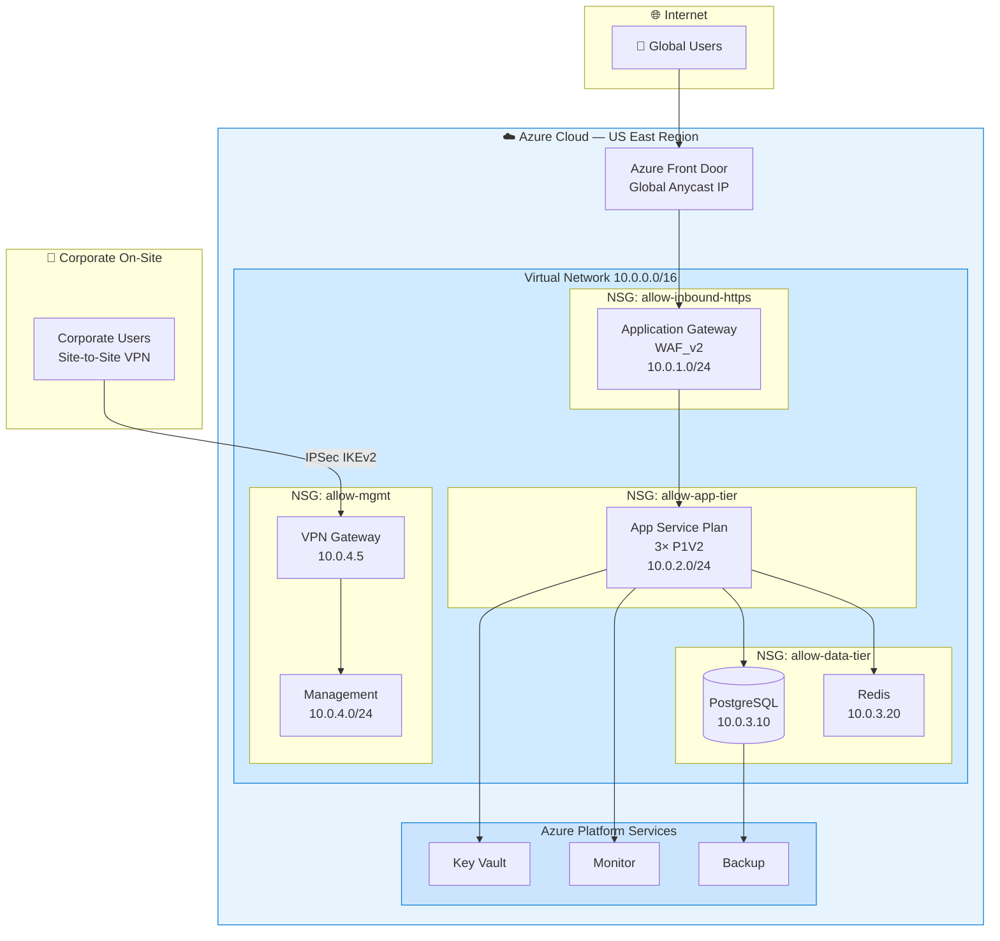
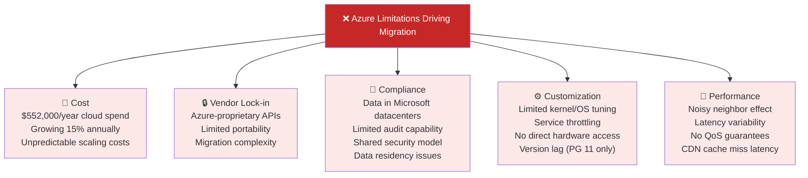

# Volume 1: Executive & Solution Architecture
## Chapter 4: Current Azure Architecture — Visual Reference

> **Purpose**: Exact visual representation of the existing Azure deployment before migration.

---

## Azure Architecture — Full Stack Diagram

---

## Azure Cost Breakdown (Current Monthly: ~$46,000)

---

## Azure Network Topology

---

## Azure Performance Baseline

| Metric | Current Value | SLA Target |
|--------|--------------|------------|
| Response Time P50 | 120 ms | < 100 ms |
| Response Time P95 | 180 ms | < 200 ms |
| Response Time P99 | 500 ms | < 1000 ms |
| Error Rate | 0.1% | < 0.5% |
| Availability | 99.95% | 99.9%+ |
| Throughput | 5,000 req/s | 5,000 req/s |
| Concurrent Users | 3,000 avg | 10,000 peak |
| Page Load Time | 2.5 sec | < 3 sec |
| DB Connections (avg) | 200 | < 400 |
| Redis Hit Rate | 87% | > 85% |
| Storage Used | 2.5 TB | — |
| Database Size | 500 GB | — |
| Monthly Cost | $46,000 | — |

---

## Azure Services Limitations (Why We Migrate)

---

**Document Version**: 2.0 | **Date**: July 2026 | **Classification**: Internal Use Only
