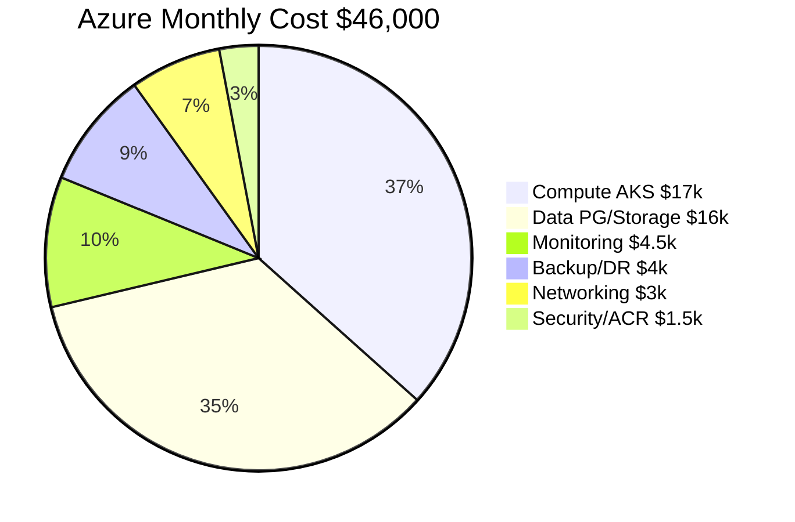
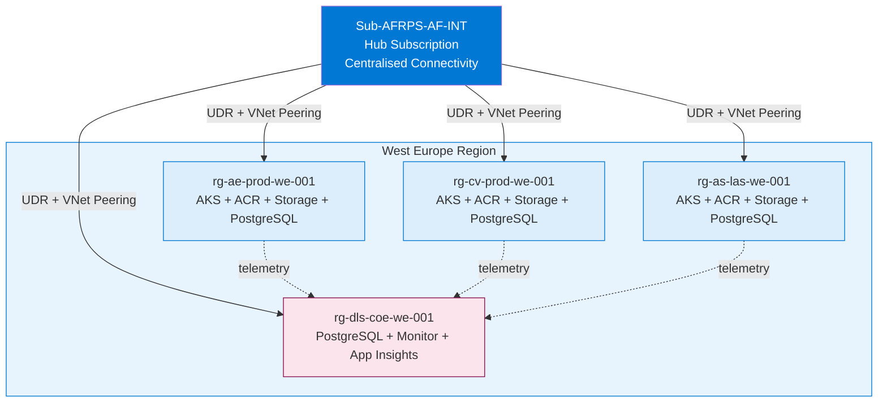
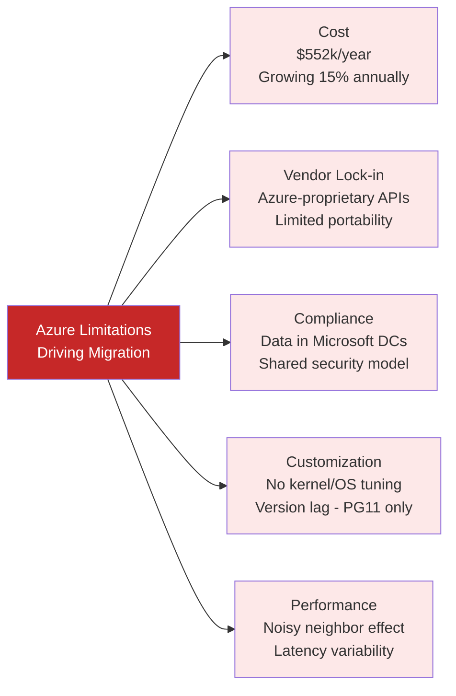

# Volume 1: Executive & Solution Architecture
## Chapter 4: Current Azure Architecture — Visual Reference

> **Purpose**: Exact visual representation of the existing Azure deployment before migration.

---

## Azure Architecture — Full Stack Diagram

> **Note**: Architecture comprises 4 separate Virtual Networks across 4 Resource Groups, all connected via the `Sub-AFRPS-AF-INT` hub subscription. Each workload VNet contains its own AKS cluster, Storage Account, Container Registry, and PostgreSQL database. Monitoring and Observability resources are centralised in the shared RG `rg-dls-coe-we-001`.

```mermaid
graph TB
    HUB[Sub-AFRPS-AF-INT\nHub / Shared Subscription]

    subgraph RG1["rg-ae-prod-we-001  West Europe"]
        VNET1[Virtual Network]
        AKS1[Azure Kubernetes Service\nUDR routed]
        ACR1[Azure Container Registry\nUDR]
        ACI1[Azure Container Instances\nBatch / ETL]
        SA1[Storage Account\nUDR]
        PG1[(Azure Database\nfor PostgreSQL\nUDR)]
    end

    subgraph RG2["rg-cv-prod-we-001  West Europe"]
        VNET2[Virtual Network]
        AKS2[Azure Kubernetes Service\nUDR routed]
        ACR2[Azure Container Registry]
        SA2[Storage Account]
        PG2[(Azure Database\nfor PostgreSQL)]
    end

    subgraph RG3["rg-as-las-we-001  West Europe"]
        VNET3[Virtual Network]
        AKS3[Azure Kubernetes Service\nUDR routed]
        ACR3[Azure Container Registry\nUDR]
        ACI3[Azure Container Instances]
        SA3[Storage Account\nUDR]
        PG3[(Azure Database\nfor PostgreSQL\nUDR)]
    end

    subgraph RG4["rg-dls-coe-we-001  Shared Services"]
        VNET4[Virtual Network]
        PG4[(Azure Database\nfor PostgreSQL\nShared / CoE)]
        UDR4[UDR Route Table]
        MON[Azure Monitor]
        AI[Application Insights]
    end

    HUB -->|VNet Peering / UDR| RG1
    HUB -->|VNet Peering / UDR| RG2
    HUB -->|VNet Peering / UDR| RG3
    HUB -->|VNet Peering / UDR| RG4

    AKS1 --> ACR1
    AKS1 --> SA1
    AKS1 --> PG1
    ACI1 --> PG1

    AKS2 --> ACR2
    AKS2 --> SA2
    AKS2 --> PG2

    AKS3 --> ACR3
    AKS3 --> SA3
    AKS3 --> PG3
    ACI3 --> PG3

    AKS1 -.->|metrics / logs| MON
    AKS2 -.->|metrics / logs| MON
    AKS3 -.->|metrics / logs| MON
    MON --> AI

    style RG1 fill:#e8f4fd,stroke:#0078D4
    style RG2 fill:#e8f5e9,stroke:#107C41
    style RG3 fill:#fff3e0,stroke:#c67b00
    style RG4 fill:#fce4ec,stroke:#880e4f
```

---

## Azure Cost Breakdown (Current Monthly: ~$46,000)

| Category | Services | Monthly Cost | Share |
|----------|---------|-------------|-------|
| Compute | AKS clusters (3× workload VNets) + Container Instances | $17,000 | 37% |
| Data | PostgreSQL (4 instances) + Storage Accounts | $16,000 | 35% |
| Networking | VNet Peering + UDR + Load Balancers | $3,000 | 7% |
| Monitoring | Azure Monitor + App Insights + Log Analytics | $4,500 | 10% |
| Security | Container Registry + Key Vault + Security Center | $1,500 | 3% |
| Backup and DR | Backup Vault + Site Recovery | $4,000 | 9% |
| **Total** | | **$46,000/mo** | **100%** |

---

## Azure Network Topology — Hub and Spoke

---

## Azure Performance Baseline

| Metric | Current Value | SLA Target |
|--------|--------------|------------|
| Response Time P50 | 120 ms | < 100 ms |
| Response Time P95 | 180 ms | < 200 ms |
| Response Time P99 | 500 ms | < 1000 ms |
| Error Rate | 0.1% | < 0.5% |
| Availability | 99.95% | 99.9%+ |
| Throughput | 5,000 req/s | 5,000 req/s |
| Concurrent Users | 3,000 avg | 10,000 peak |
| Page Load Time | 2.5 sec | < 3 sec |
| DB Connections (avg) | 200 | < 400 |
| Storage Used | 2.5 TB | — |
| Database Instances | 4 (one per workload VNet) | — |
| Monthly Cost | $46,000 | — |

---

## Azure Services Limitations (Why We Migrate)

---

**Document Version**: 2.0 | **Date**: July 2026 | **Classification**: Internal Use Only
