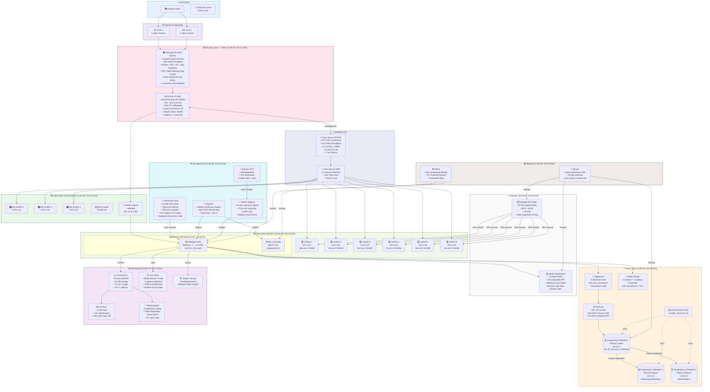
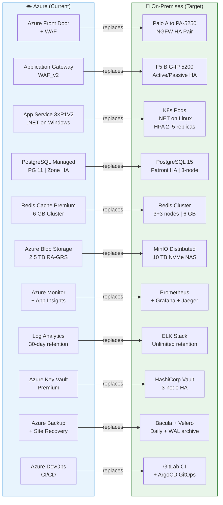
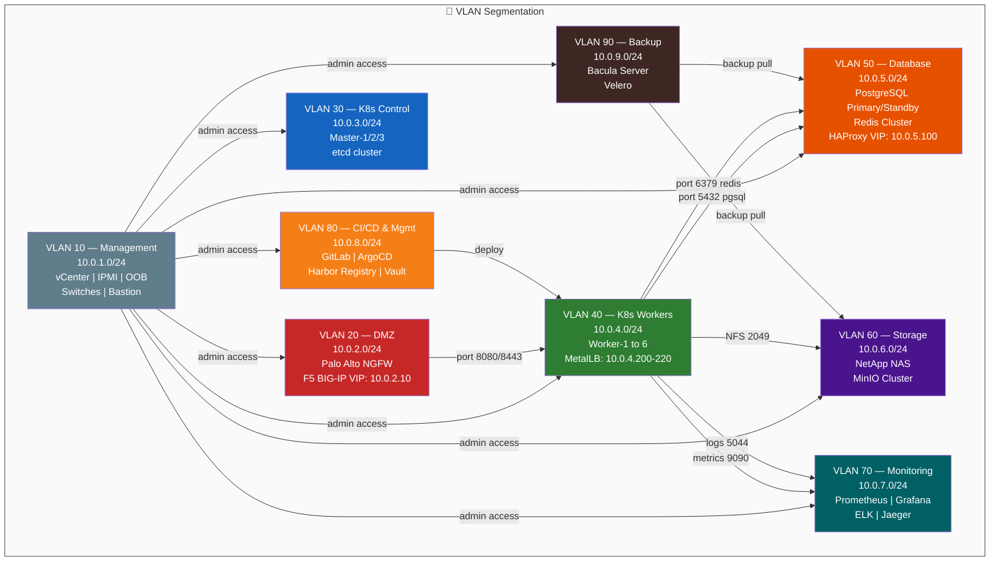

# Volume 1: Executive & Solution Architecture
## Chapter 5: Target On-Premises Architecture — Visual Reference

> **Purpose**: Exact visual representation of the target on-premises deployment after migration.

---

## On-Premises Architecture — Full Stack Diagram

---

## On-Premises vs Azure: Component Comparison

---

## On-Premises Network VLAN Map

---

## On-Premises Hardware Summary

| Component | Model | Qty | Spec | Role |
|-----------|-------|-----|------|------|
| Firewall | Palo Alto PA-5250 | 2 (HA) | 100 Gbps | NGFW, IPS, SSL inspection |
| Load Balancer | F5 BIG-IP 5200 | 2 (HA) | 1.6 Tbps | SSL offload, VIP, health check |
| Core Switch | Cisco Nexus 9372PX | 2 (VPC) | 14.4 Tbps | L3 routing, VLAN trunk |
| Access Switch | Cisco Nexus 9348 | 4 | 25.6 Tbps | Server access ports |
| K8s Masters | Dell R750 | 3 | 2×28-core, 256GB RAM | Control plane + etcd |
| K8s Workers | Dell R750 | 6 | 2×28-core, 512GB RAM | App workloads |
| DB Servers | Dell R750 | 2 | 2×28-core, 1TB RAM | PostgreSQL HA |
| NAS Storage | NetApp AFF A250 | 2 (HA) | 10 TB NVMe | Persistent volumes, DB |
| UPS | APC Smart-UPS | 2 | 20 kVA each | Power protection |

---

## On-Premises Performance Targets

| Metric | Azure Current | On-Prem Target | Improvement |
|--------|--------------|----------------|-------------|
| Response Time P95 | 180 ms | < 150 ms | +17% faster |
| Response Time P99 | 500 ms | < 300 ms | +40% faster |
| Throughput | 5,000 req/s | 10,000 req/s | +100% |
| Concurrent Users | 5,000 | 10,000 | +100% |
| Availability | 99.95% | 99.99% | +4× fewer outages |
| DB Failover RTO | < 15 min | < 5 min | 3× faster |
| DB RPO | 15 min | < 1 min | 15× better |
| Monthly Cost | $46,000 | ~$15,000 (ops) | -67% |

---

**Document Version**: 2.0 | **Date**: July 2026 | **Classification**: Internal Use Only
