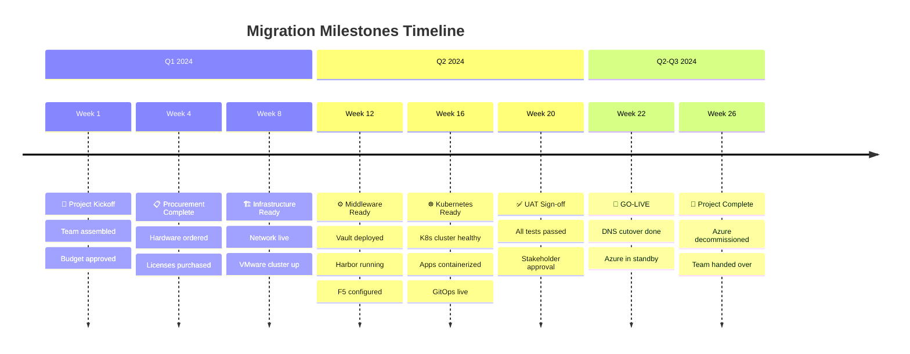
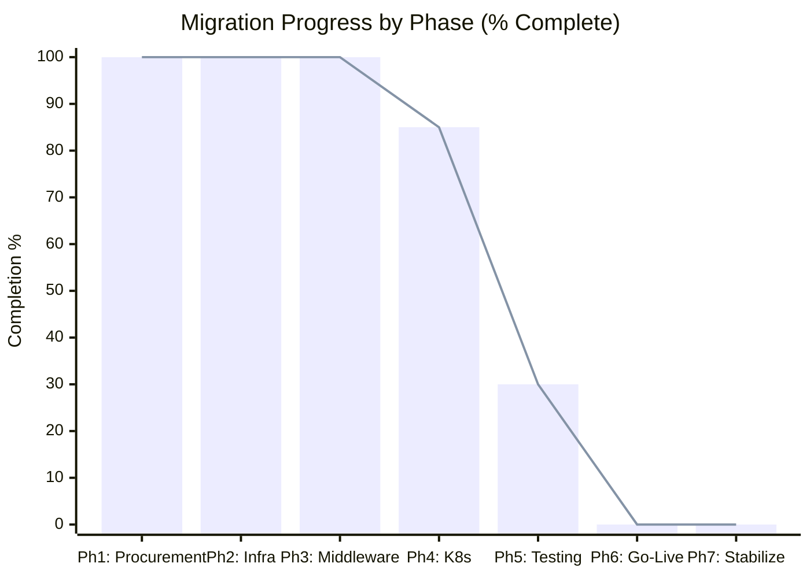

# Volume 2: Migration Strategy
## Chapter 3: Timeline, Milestones & Governance

---

## Master Project Timeline

```
AZURE TO ON-PREMISES MIGRATION — 26-WEEK MASTER TIMELINE
═══════════════════════════════════════════════════════════════════════════════════════

MONTH 1 (Jan 2024)     MONTH 2 (Feb 2024)     MONTH 3 (Mar 2024)
Wk1  Wk2  Wk3  Wk4   Wk5  Wk6  Wk7  Wk8   Wk9  Wk10 Wk11 Wk12
─────────────────────────────────────────────────────────────────────
████ ████ ████ ████   ░░░░ ░░░░ ░░░░ ░░░░   ▒▒▒▒ ▒▒▒▒ ▒▒▒▒ ▒▒▒▒
PHASE 1: PROCUREMENT   PHASE 2: INFRA SETUP   PHASE 3: MIDDLEWARE
     ▲                      ▲                       ▲
     │                      │                       │
  Kickoff              Infra Ready              MW Ready
  Milestone            Milestone                Milestone

MONTH 4 (Apr 2024)     MONTH 5 (May 2024)     MONTH 6 (Jun 2024)
Wk13 Wk14 Wk15 Wk16  Wk17 Wk18 Wk19 Wk20  Wk21 Wk22 Wk23 Wk24 Wk25 Wk26
─────────────────────────────────────────────────────────────────────────────
▓▓▓▓ ▓▓▓▓ ▓▓▓▓ ▓▓▓▓  ████ ████ ████ ████  ████ ████ ░░░░ ░░░░ ░░░░ ░░░░
PHASE 4: KUBERNETES    PHASE 5: TESTING       PH6  PH7: STABILIZATION
                            ▲                  ▲
                            │                  │
                       UAT Sign-off         GO-LIVE
                       Milestone            Milestone

Legend: ████=Critical Path   ▓▓▓▓=K8s Build   ▒▒▒▒=Middleware   ░░░░=Infra/Stable
```

---

## Milestone Tracker



---

## RACI Matrix

```
┌────────────────────────────────┬──────┬────────┬──────┬──────┬──────┬──────┬──────┐
│  Activity                      │  PM  │  Arch  │ Net  │ DBA  │ K8s  │ Dev  │ Sec  │
├────────────────────────────────┼──────┼────────┼──────┼──────┼──────┼──────┼──────┤
│  Architecture design           │  I   │   R    │  C   │  C   │  C   │  C   │  C   │
│  Hardware procurement          │  A   │   R    │  C   │  I   │  I   │  I   │  I   │
│  Network design                │  I   │   C    │  R   │  I   │  I   │  I   │  C   │
│  VMware vSphere setup          │  I   │   C    │  I   │  I   │  R   │  I   │  I   │
│  Kubernetes cluster build      │  I   │   C    │  I   │  I   │  R   │  C   │  I   │
│  PostgreSQL HA setup           │  I   │   C    │  I   │  R   │  I   │  C   │  I   │
│  App containerization          │  I   │   C    │  I   │  I   │  C   │  R   │  I   │
│  Security hardening            │  I   │   C    │  C   │  I   │  I   │  I   │  R   │
│  Performance testing           │  A   │   I    │  I   │  C   │  C   │  R   │  I   │
│  Go-Live cutover               │  A   │   R    │  C   │  C   │  C   │  C   │  C   │
│  Runbook creation              │  A   │   R    │  C   │  C   │  C   │  C   │  C   │
├────────────────────────────────┼──────┼────────┼──────┼──────┼──────┼──────┼──────┤
│  R=Responsible A=Accountable C=Consulted I=Informed                              │
└────────────────────────────────────────────────────────────────────────────────────┘
```

---

## Budget Burn-Down Chart

```
BUDGET BURN-DOWN (26 Weeks)
$2,600,000 ┤
           │█
$2,400,000 ┤█
           │█
$2,200,000 ┤█
           │█ █
$2,000,000 ┤█ █
           │█ █
$1,800,000 ┤█ █ ░
           │█ █ ░
$1,600,000 ┤█ █ ░ ░
           │█ █ ░ ░
$1,400,000 ┤█ █ ░ ░ ░
           │█ █ ░ ░ ░ ░
$1,200,000 ┤█ █ ░ ░ ░ ░
           │█ █ ░ ░ ░ ░ ░
$1,000,000 ┤█ █ ░ ░ ░ ░ ░ ▒
           │█ █ ░ ░ ░ ░ ░ ▒ ▒
$  800,000 ┤█ █ ░ ░ ░ ░ ░ ▒ ▒ ▒
           │█ █ ░ ░ ░ ░ ░ ▒ ▒ ▒ ▒
$  600,000 ┤█ █ ░ ░ ░ ░ ░ ▒ ▒ ▒ ▒ ▓ ▓
           │█ █ ░ ░ ░ ░ ░ ▒ ▒ ▒ ▒ ▓ ▓ ▓ ▓
$  400,000 ┤█ █ ░ ░ ░ ░ ░ ▒ ▒ ▒ ▒ ▓ ▓ ▓ ▓ ▓ ▓
           │█ █ ░ ░ ░ ░ ░ ▒ ▒ ▒ ▒ ▓ ▓ ▓ ▓ ▓ ▓ ▓
$  200,000 ┤█ █ ░ ░ ░ ░ ░ ▒ ▒ ▒ ▒ ▓ ▓ ▓ ▓ ▓ ▓ ▓ ■ ■ ■ ■ ■ ■ ■ ■
$        0 └──────────────────────────────────────────────────────────
           W1 W2 W3 W4 W5 W6 W7 W8 W9 10 11 12 13 14 15 16 17 18 19 20 21 22 23 24 25 26

Legend:  █ = Hardware/CapEx   ░ = Network/Infra   ▒ = Middleware
         ▓ = K8s + Apps       ■ = Testing/GoLive/Stabilization
```

---

## Weekly Status Report Template

```
╔══════════════════════════════════════════════════════════════════════╗
║          MIGRATION PROJECT — WEEKLY STATUS REPORT                   ║
╠══════════════════════════════════════════════════════════════════════╣
║  Week:       [W__]           Phase:  [Phase X: Name]                ║
║  Report Date: [DATE]         PM:     [Name]                         ║
╠══════════════════════════════════════════════════════════════════════╣
║  OVERALL STATUS:    🟢 Green  /  🟡 Amber  /  🔴 Red               ║
╠══════════════════════════════════════════════════════════════════════╣
║  THIS WEEK ACCOMPLISHED:                                             ║
║  1. [Task completed]                                                 ║
║  2. [Task completed]                                                 ║
║  3. [Task completed]                                                 ║
╠══════════════════════════════════════════════════════════════════════╣
║  NEXT WEEK PLANNED:                                                  ║
║  1. [Planned task]                                                   ║
║  2. [Planned task]                                                   ║
╠══════════════════════════════════════════════════════════════════════╣
║  RISKS / ISSUES:                                                     ║
║  • [Issue]: [Impact] — [Mitigation]                                  ║
╠══════════════════════════════════════════════════════════════════════╣
║  BUDGET STATUS:                                                      ║
║  Planned Spend: $______    Actual Spend: $______    Variance: $_____ ║
╠══════════════════════════════════════════════════════════════════════╣
║  DECISIONS REQUIRED:                                                 ║
║  • [Decision needed from whom by when]                               ║
╚══════════════════════════════════════════════════════════════════════╝
```

---

## KPI Dashboard



---

## Azure Cost Reduction Timeline

```
MONTHLY AZURE COST REDUCTION PLAN

Month 1-4  (During setup):   $46,000/month  (Full Azure running in parallel)
Month 5    (Testing phase):  $40,000/month  (Begin reducing non-critical services)
Month 6    (Go-Live):        $15,000/month  (Azure as standby/DR only)
Month 7    (Stabilize):      $5,000/month   (Azure storage/DNS only)
Month 8+   (Decommissioned): $2,000/month   (Final cleanup, support)
Month 9+   (Complete):       $0/month       (Full decommission)

Annual Savings (after cutover): ~$528,000/year
```

---

## Go/No-Go Criteria by Phase

```
┌────────────────────────────────────────────────────────────────────┐
│                 GO/NO-GO GATE CRITERIA                             │
├────────────────────┬───────────────────────────────────────────────┤
│  Gate              │  Criteria (ALL must be ✅)                     │
├────────────────────┼───────────────────────────────────────────────┤
│  Phase 2 Gate      │  ✅ All hardware racked and powered           │
│  (Infra Ready)     │  ✅ Network ping all VLANs verified           │
│                    │  ✅ VMware cluster healthy (all hosts green)   │
│                    │  ✅ Storage accessible from all nodes          │
├────────────────────┼───────────────────────────────────────────────┤
│  Phase 3 Gate      │  ✅ F5 VIP responding on port 443             │
│  (MW Ready)        │  ✅ Vault unsealed and LDAP auth working      │
│                    │  ✅ Harbor registry pull/push verified         │
│                    │  ✅ Redis cluster all 6 nodes healthy          │
│                    │  ✅ MinIO all data synced from Azure           │
├────────────────────┼───────────────────────────────────────────────┤
│  Phase 4 Gate      │  ✅ K8s cluster all nodes Ready               │
│  (K8s Ready)       │  ✅ All app workloads running in pods         │
│                    │  ✅ Ingress routes verified                    │
│                    │  ✅ ArgoCD sync healthy                        │
│                    │  ✅ Monitoring dashboards populated            │
├────────────────────┼───────────────────────────────────────────────┤
│  UAT Gate          │  ✅ All functional tests passed               │
│  (Testing Done)    │  ✅ P95 response time < 200ms at 10k users    │
│                    │  ✅ No critical security vulnerabilities       │
│                    │  ✅ DR drill completed (RTO < 4h, RPO < 1h)  │
│                    │  ✅ Stakeholder UAT sign-off obtained          │
├────────────────────┼───────────────────────────────────────────────┤
│  Go-Live Gate      │  ✅ All UAT criteria met                      │
│  (Cutover)         │  ✅ Rollback plan documented and tested       │
│                    │  ✅ On-call rota confirmed for 2 weeks        │
│                    │  ✅ DNS TTL reduced to 60s (24h prior)        │
│                    │  ✅ Maintenance window approved by business   │
│                    │  ✅ Azure platform on standby (not shutdown)  │
└────────────────────┴───────────────────────────────────────────────┘
```

---

**Document Version**: 2.0
**Date**: July 2026
**Classification**: Internal Use Only
