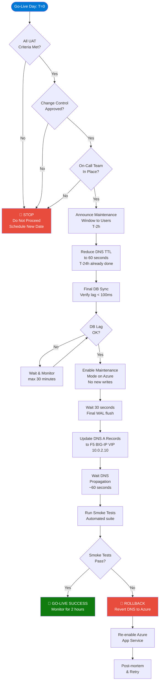
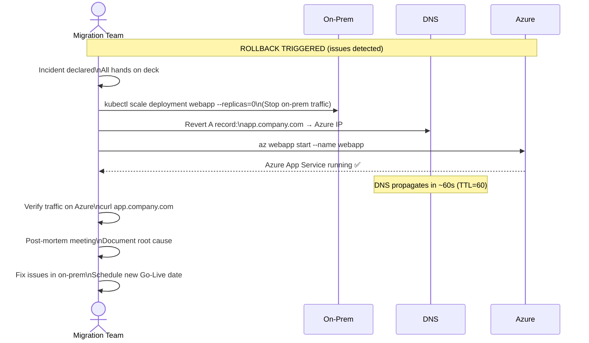
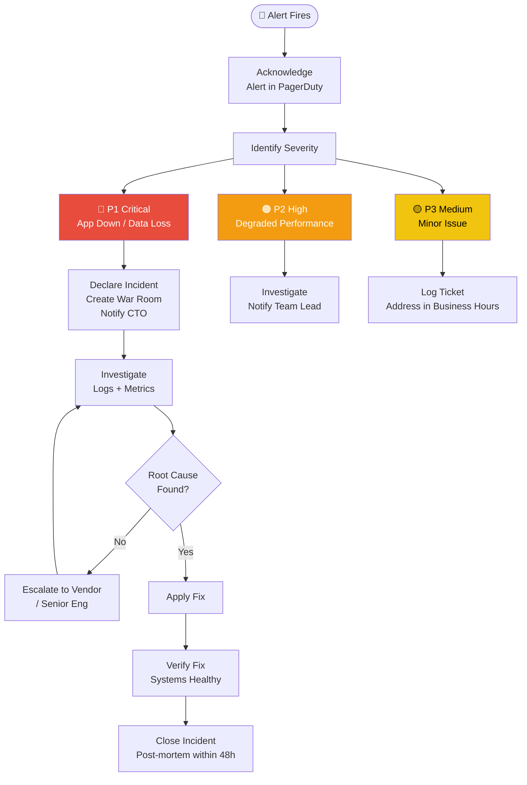

# Volume 8: Go-Live & Operations
## Chapter 1: Production Go-Live Runbook & Operations Guide

---

## Go-Live Decision Tree



---

## Pre-Go-Live Checklist (T-48 Hours)

```
╔══════════════════════════════════════════════════════════════════════════╗
║               PRE-GO-LIVE CHECKLIST — T-48 HOURS                        ║
╠══════════════════════════════════════════════════════════════════════════╣
║  Infrastructure Readiness                                                ║
║  [ ] All K8s nodes in Ready state (kubectl get nodes)                   ║
║  [ ] All pods Running (0 CrashLoopBackOff, 0 Pending)                   ║
║  [ ] Patroni cluster: 1 leader + 2 replicas                             ║
║  [ ] Redis cluster: 6 nodes all OK                                       ║
║  [ ] F5 BIG-IP: both units active, VIP responding                       ║
║  [ ] Palo Alto: HA sync state = synchronized                            ║
║  [ ] Storage: NAS volumes mounted, free space > 30%                     ║
╠══════════════════════════════════════════════════════════════════════════╣
║  Data Readiness                                                           ║
║  [ ] pglogical subscription status = "replicating"                       ║
║  [ ] Replication lag < 100ms (continuous monitor)                        ║
║  [ ] Row counts verified (within 0.001% of Azure)                        ║
║  [ ] MinIO data fully synced from Azure Storage                          ║
║  [ ] Redis data exported and imported                                     ║
╠══════════════════════════════════════════════════════════════════════════╣
║  Application Readiness                                                    ║
║  [ ] All 3 app replicas Running (kubectl -n production get pods)         ║
║  [ ] Health endpoints: /health/live + /health/ready both 200 OK         ║
║  [ ] ArgoCD sync status: Synced (no Out-of-Sync)                        ║
║  [ ] Harbor images: all production tags present                          ║
║  [ ] Vault: secrets accessible from all pods                             ║
╠══════════════════════════════════════════════════════════════════════════╣
║  Monitoring Readiness                                                     ║
║  [ ] Prometheus scraping all targets (0 down)                            ║
║  [ ] Grafana dashboards loading with live data                           ║
║  [ ] Alertmanager routing tested (sent test alert)                       ║
║  [ ] ELK: logs flowing from all pods                                     ║
║  [ ] PagerDuty on-call rota confirmed                                    ║
╠══════════════════════════════════════════════════════════════════════════╣
║  DNS & Network                                                            ║
║  [ ] DNS TTL reduced to 60s (24h ago — verify TTL propagated)           ║
║  [ ] F5 VIP: 10.0.2.10 accessible from internet                         ║
║  [ ] SSL certificate valid (cert-manager): expires > 60 days            ║
║  [ ] Firewall rules verified (allow 443/80 from internet)                ║
╠══════════════════════════════════════════════════════════════════════════╣
║  Rollback Readiness                                                       ║
║  [ ] Azure App Service: still running (don't stop yet)                   ║
║  [ ] Rollback runbook reviewed by team                                    ║
║  [ ] Rollback tested in staging successfully                              ║
║  [ ] Decision criteria documented: "rollback if X within Y minutes"     ║
╠══════════════════════════════════════════════════════════════════════════╣
║  Team Readiness                                                           ║
║  [ ] All team members confirmed available (no PTO)                       ║
║  [ ] War room set up (video call link shared)                            ║
║  [ ] Stakeholders notified of maintenance window                         ║
║  [ ] Vendor support contacts available                                    ║
║                                                                          ║
║  SIGN-OFF: ____________________ DATE: ___________                        ║
╚══════════════════════════════════════════════════════════════════════════╝
```

---

## Go-Live Execution Commands

```bash
# ── T-2h: Announce maintenance ────────────────────────────────────────────
# Send maintenance notification to users

# ── T-60min: Final data sync verification ─────────────────────────────────
# Check replication lag
psql -h 10.0.5.100 -U postgres -d production_db \
  -c "SELECT sub_name, status, received_lsn FROM pglogical.show_subscription_status();"

# ── T-30min: Enable maintenance mode on app ───────────────────────────────
kubectl patch deployment webapp -n production \
  -p '{"spec":{"template":{"metadata":{"annotations":{"maintenance":"true"}}}}}'

# Put Azure App Service in stopped state (via Azure CLI)
az webapp stop --name your-azure-app --resource-group prod-rg

# ── T=0: DNS Cutover ──────────────────────────────────────────────────────
# Update DNS A record (via your DNS provider API or UI)
# Old: app.company.com → 13.x.x.x (Azure Front Door)
# New: app.company.com → 10.0.2.10 (F5 BIG-IP VIP)
# Also update: api.company.com, www.company.com

# Verify DNS propagation
dig +short app.company.com @8.8.8.8  # Should return 10.0.2.10
dig +short app.company.com @1.1.1.1  # Should return 10.0.2.10

# ── T+5min: Enable on-prem traffic ────────────────────────────────────────
# Remove maintenance mode
kubectl patch deployment webapp -n production \
  -p '{"spec":{"template":{"metadata":{"annotations":{"maintenance":"false"}}}}}'

# Verify pods healthy
kubectl get pods -n production -w

# ── T+10min: Run automated smoke tests ────────────────────────────────────
# Newman collection
newman run tests/smoke/production-smoke.postman_collection.json \
  --env-var base_url=https://app.company.com \
  --reporters cli,junit --reporter-junit-export smoke-results.xml

# Test checklist:
# [ ] Homepage loads (200 OK)
# [ ] Login works
# [ ] API endpoints respond
# [ ] Database read/write works
# [ ] Redis session works
# [ ] File upload/download works (MinIO)

# ── T+30min: Continuous monitoring ────────────────────────────────────────
# Watch Grafana: https://grafana.company.com
# Key metrics to watch:
# - Error rate (target < 0.1%)
# - P95 Response time (target < 200ms)
# - K8s pod restarts (target: 0)
# - DB connections (target: < 350)
```

---

## Rollback Procedure



---

## Operations Runbook

### Daily Operations Checklist

```
DAILY OPS CHECKLIST (Run at 9:00 AM)
════════════════════════════════════════════════════════════
Application Health:
  [ ] kubectl get pods -n production  (all Running, 0 restarts)
  [ ] Grafana: Error rate < 0.1% (last 24h)
  [ ] Grafana: P95 response time < 200ms
  [ ] Check PagerDuty: any open incidents?

Infrastructure:
  [ ] kubectl get nodes  (all Ready)
  [ ] patronictl -c /etc/patroni/patroni.yml list  (1 leader)
  [ ] redis-cli cluster info  (cluster_state: ok)
  [ ] df -h  (all mounts < 80% full)

Monitoring:
  [ ] Prometheus targets: 0 down (http://prometheus:9090/targets)
  [ ] Alertmanager: no firing alerts
  [ ] Kibana: log volume normal (no spike/drop)

Security:
  [ ] Review Wazuh alerts (any high severity?)
  [ ] Check firewall logs for anomalies
  [ ] Verify Vault health: vault status

Backup:
  [ ] Verify last backup completed (check /mnt/backup/postgres/)
  [ ] WAL archive last 24h: ls /mnt/backup/wal/ | wc -l  (should be > 200)
```

---

## Incident Response Flowchart



---

## Post-Migration Azure Decommission Plan

```
AZURE DECOMMISSION TIMELINE (After 30-day stabilization)
══════════════════════════════════════════════════════════════════

Day 1-30 (Stabilization): Keep ALL Azure resources running
  • Azure as hot standby
  • Do NOT stop anything
  • Cost: ~$46,000 (full month)

Day 31-60 (Cost Reduction Phase 1):
  [ ] Stop Azure App Service instances (3x P1V2) → Save $15,000/mo
  [ ] Disable Azure Site Recovery replication → Save $2,500/mo
  [ ] Scale down Redis from Premium to Basic → Save $2,000/mo

Day 61-90 (Cost Reduction Phase 2):
  [ ] Break pglogical subscription (Azure DB no longer needed)
  [ ] Stop Azure PostgreSQL → Save $8,000/mo
  [ ] Clean up Azure Storage (migrate remaining data) → Save $3,000/mo
  [ ] Delete Container Instances → Save $2,000/mo

Day 91-120 (Final Cleanup):
  [ ] Delete Azure VNet and subnets
  [ ] Remove Azure Monitor alert rules
  [ ] Export final audit logs from Log Analytics
  [ ] Cancel Azure Backup vault
  [ ] Delete Azure Resource Groups
  [ ] Cancel Azure subscription (or reduce to minimal)

Expected Monthly Cost After Decommission: ~$2,000
(Keeping Azure DNS, minimal monitoring, emergency access)

Total Annual Savings: ~$528,000
```

---

## SLA & Performance Targets Summary

```
┌──────────────────────────────────────────────────────────────────┐
│              PRODUCTION SLA TARGETS (On-Premises)                │
├─────────────────────────────┬────────────────┬───────────────────┤
│  Metric                     │  Target        │  Measurement      │
├─────────────────────────────┼────────────────┼───────────────────┤
│  Application Availability   │  99.99%        │  Monthly          │
│  Response Time P95          │  < 200ms       │  Prometheus       │
│  Response Time P99          │  < 1000ms      │  Prometheus       │
│  Error Rate                 │  < 0.1%        │  Prometheus       │
│  Throughput (sustained)     │  10,000 req/s  │  k6 load test     │
│  Database Availability      │  99.99%        │  Monthly          │
│  DB Failover Time (RTO)     │  < 5 minutes   │  DR drill         │
│  DB Data Loss (RPO)         │  < 1 minute    │  DR drill         │
│  Backup Success Rate        │  100%          │  Bacula reports   │
│  Security Patching          │  < 30 days     │  Monthly audit    │
│  MTTR (P1 Incident)         │  < 30 minutes  │  PagerDuty        │
│  MTTR (P2 Incident)         │  < 4 hours     │  PagerDuty        │
└─────────────────────────────┴────────────────┴───────────────────┘
```

---

**Document Version**: 2.0
**Date**: July 2026
**Classification**: Internal Use Only
