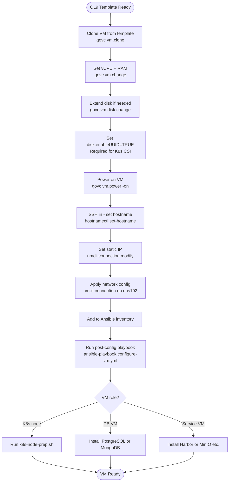

# VM Provisioning on vSphere (VxRail)

## Methods Available
1. **vCenter Web UI** — point-and-click, good for one-off VMs
2. **govc CLI** — scriptable, fast for bulk VM creation
3. **cloud-init + OVA template** — fully automated, recommended for K8s nodes
4. **Terraform + vSphere provider** — infrastructure-as-code (optional)

---

## 1. Prepare Oracle Linux 9 Cloud Image Template

> **VM Operating System: Oracle Linux 9 (OL9)** — your team will use Oracle Linux VMs.  
> For full OL9 template setup, cloud-init, and installation details, see [06-Oracle-Linux-VMs.md](06-Oracle-Linux-VMs.md).

This template is used to clone all K8s and database VMs.

### 1.1 Download and Upload to vSphere

```bash
# On a Linux jump host with govc installed
export GOVC_URL=https://vcenter.internal.company.com
export GOVC_USERNAME=administrator@vsphere.local
export GOVC_PASSWORD="${VCENTER_PASSWORD}"
export GOVC_DATASTORE=vsanDatastore
export GOVC_NETWORK="PG-K8s-Nodes"
export GOVC_RESOURCE_POOL="VxRail-Cluster/Resources"
export GOVC_DATACENTER="Datacenter"

# Download Oracle Linux 9 ISO
wget https://yum.oracle.com/ISOS/OracleLinux/OL9/u4/x86_64/OracleLinux-R9-U4-x86_64-dvd.iso \
  -O /tmp/OracleLinux-9.4-x86_64.iso

# Upload ISO to vSAN datastore
govc datastore.upload -ds=vsanDatastore \
  /tmp/OracleLinux-9.4-x86_64.iso \
  iso/OracleLinux-9.4-x86_64.iso

# Create base VM with Oracle Linux guest type
govc vm.create \
  -c=4 -m=8192 -disk=60GB \
  -net="PG-K8s-Nodes" \
  -g=oracleLinux9_64Guest \
  -on=false \
  ol9-base-template

# Install OL9 via vCenter console, then customize (dnf update, open-vm-tools, cloud-init)
# See 06-Oracle-Linux-VMs.md Section 1.4 for full post-install steps

# Mark as template
govc vm.markastemplate ol9-base-template
```

### 1.2 Template Packages (Oracle Linux 9 dnf)

---

## 2. Create K8s Control Plane VMs (govc)

### 2.1 Bulk VM Creation Script

```bash
#!/bin/bash
# create-k8s-vms.sh — create all K8s node VMs on VxRail

set -e

export GOVC_URL=https://vcenter.internal.company.com
export GOVC_USERNAME=administrator@vsphere.local
export GOVC_PASSWORD="${VCENTER_PASSWORD}"
export GOVC_DATASTORE=vsanDatastore
export GOVC_DATACENTER=Datacenter
export GOVC_INSECURE=0

TEMPLATE="ubuntu-22.04-template"
FOLDER="/Datacenter/vm/K8s"
CLUSTER="VxRail-Cluster"

# Create VM folder
govc folder.create /Datacenter/vm/K8s 2>/dev/null || true

# VM definitions: NAME|CPUS|MEM_MB|DISK_GB|HOST|NETWORK
VMS=(
  "k8s-master-1|4|8192|80|vxrail-1.internal.company.com|PG-K8s-Nodes"
  "k8s-master-2|4|8192|80|vxrail-2.internal.company.com|PG-K8s-Nodes"
  "k8s-master-3|4|8192|80|vxrail-3.internal.company.com|PG-K8s-Nodes"
  "k8s-worker-1|8|16384|100|vxrail-4.internal.company.com|PG-K8s-Nodes"
  "k8s-worker-2|8|16384|100|vxrail-4.internal.company.com|PG-K8s-Nodes"
  "k8s-worker-3|12|32768|150|vxrail-5.internal.company.com|PG-K8s-Nodes"
  "k8s-worker-4|12|32768|150|vxrail-5.internal.company.com|PG-K8s-Nodes"
  "k8s-worker-5|16|65536|200|vxrail-6.internal.company.com|PG-K8s-Nodes"
  "k8s-worker-6|16|65536|200|vxrail-6.internal.company.com|PG-K8s-Nodes"
)

for entry in "${VMS[@]}"; do
  IFS='|' read -r NAME CPUS MEM DISK HOST NETWORK <<< "$entry"
  
  echo "Creating VM: $NAME on $HOST"
  
  # Clone from template
  govc vm.clone \
    --vm="$TEMPLATE" \
    --name="$NAME" \
    --folder="$FOLDER" \
    --host="$HOST" \
    --datastore=vsanDatastore \
    --on=false
  
  # Resize CPU and memory
  govc vm.change \
    --vm="$FOLDER/$NAME" \
    --cpu="$CPUS" \
    --memory="$MEM"
  
  # Resize disk
  govc vm.disk.change \
    --vm="$FOLDER/$NAME" \
    --disk.label="Hard disk 1" \
    --size="${DISK}GB"
  
  # Set storage policy (k8s-production for workers, k8s-dev-qa for Phase 1)
  # govc vm.policy.apply -vm="$FOLDER/$NAME" -storage-policy="k8s-production"
  
  echo "  Created: $NAME"
done

echo "All K8s VMs created. Configure cloud-init before powering on."
```

### 2.2 Create Database VMs

```bash
#!/bin/bash
# create-db-vms.sh

export GOVC_URL=https://vcenter.internal.company.com
export GOVC_USERNAME=administrator@vsphere.local
export GOVC_PASSWORD="${VCENTER_PASSWORD}"
export GOVC_DATASTORE=vsanDatastore
export GOVC_DATACENTER=Datacenter

TEMPLATE="ubuntu-22.04-template"
FOLDER="/Datacenter/vm/Databases"

govc folder.create /Datacenter/vm/Databases 2>/dev/null || true

# NAME|CPUS|MEM_MB|DISK_GB|HOST|NETWORK
DB_VMS=(
  # Phase 1
  "db-dev-01|4|8192|200|vxrail-1.internal.company.com|PG-Databases"
  "db-qa-01|4|8192|200|vxrail-2.internal.company.com|PG-Databases"
  "mongo-dev-01|2|4096|100|vxrail-1.internal.company.com|PG-Databases"
  "mongo-qa-01|2|4096|100|vxrail-2.internal.company.com|PG-Databases"
  # Phase 2 (create later)
  "db-preprod-01|4|16384|500|vxrail-3.internal.company.com|PG-Databases"
  "db-preprod-02|4|16384|500|vxrail-4.internal.company.com|PG-Databases"
  "db-prod-01|8|32768|1024|vxrail-4.internal.company.com|PG-Databases"
  "db-prod-02|8|32768|1024|vxrail-5.internal.company.com|PG-Databases"
  "db-prod-03|8|32768|1024|vxrail-6.internal.company.com|PG-Databases"
  "mongo-preprod-01|4|8192|300|vxrail-3.internal.company.com|PG-Databases"
  "mongo-preprod-02|4|8192|300|vxrail-5.internal.company.com|PG-Databases"
  "mongo-prod-01|4|16384|500|vxrail-4.internal.company.com|PG-Databases"
  "mongo-prod-02|4|16384|500|vxrail-5.internal.company.com|PG-Databases"
  "mongo-prod-03|4|16384|500|vxrail-6.internal.company.com|PG-Databases"
)

for entry in "${DB_VMS[@]}"; do
  IFS='|' read -r NAME CPUS MEM DISK HOST NETWORK <<< "$entry"
  echo "Creating DB VM: $NAME"
  govc vm.clone --vm="$TEMPLATE" --name="$NAME" --folder="$FOLDER" \
    --host="$HOST" --datastore=vsanDatastore --on=false
  govc vm.change --vm="$FOLDER/$NAME" --cpu="$CPUS" --memory="$MEM"
  govc vm.disk.change --vm="$FOLDER/$NAME" --disk.label="Hard disk 1" --size="${DISK}GB"
  echo "  Created: $NAME"
done
```

---

## 3. Configure cloud-init for Each VM

cloud-init runs at first boot to set hostname, IP, SSH keys, and base packages.

### 3.1 Mount cloud-init ISO via govc

```bash
#!/bin/bash
# inject-cloud-init.sh — create and attach cloud-init ISO to a VM

VM_NAME=$1
HOSTNAME=$2
IP=$3
GATEWAY="10.0.3.1"
DNS="10.0.1.5"
SSH_PUBKEY="ssh-rsa AAAAB3Nza... your-key-here"

# Create cloud-init directory
mkdir -p /tmp/cloud-init/${VM_NAME}

# user-data
cat > /tmp/cloud-init/${VM_NAME}/user-data << USERDATA
#cloud-config
hostname: ${HOSTNAME}
fqdn: ${HOSTNAME}.internal.company.com
users:
  - name: ubuntu
    sudo: ALL=(ALL) NOPASSWD:ALL
    shell: /bin/bash
    ssh_authorized_keys:
      - ${SSH_PUBKEY}
package_update: true
package_upgrade: true
packages:
  - curl
  - wget
  - vim
  - htop
  - net-tools
  - open-vm-tools
  - nfs-common
  - qemu-guest-agent
runcmd:
  - systemctl enable qemu-guest-agent
  - systemctl start qemu-guest-agent
  - swapoff -a
  - sed -i '/swap/d' /etc/fstab
  - modprobe overlay
  - modprobe br_netfilter
  - echo 'net.bridge.bridge-nf-call-iptables = 1' >> /etc/sysctl.d/k8s.conf
  - echo 'net.bridge.bridge-nf-call-ip6tables = 1' >> /etc/sysctl.d/k8s.conf
  - echo 'net.ipv4.ip_forward = 1' >> /etc/sysctl.d/k8s.conf
  - sysctl --system
power_state:
  mode: reboot
  delay: "+1"
  message: "Rebooting after cloud-init setup"
USERDATA

# network-config
cat > /tmp/cloud-init/${VM_NAME}/network-config << NETCFG
version: 2
ethernets:
  ens192:
    dhcp4: false
    addresses:
      - ${IP}/24
    gateway4: ${GATEWAY}
    nameservers:
      addresses: [${DNS}]
      search: [internal.company.com]
NETCFG

# meta-data
cat > /tmp/cloud-init/${VM_NAME}/meta-data << METADATA
instance-id: ${VM_NAME}
local-hostname: ${HOSTNAME}
METADATA

# Create ISO
cloud-localds /tmp/cloud-init/${VM_NAME}-seed.iso \
  /tmp/cloud-init/${VM_NAME}/user-data \
  /tmp/cloud-init/${VM_NAME}/meta-data \
  --network-config /tmp/cloud-init/${VM_NAME}/network-config

# Upload ISO to vSAN datastore
govc datastore.upload \
  --ds=vsanDatastore \
  /tmp/cloud-init/${VM_NAME}-seed.iso \
  "cloud-init/${VM_NAME}-seed.iso"

# Attach ISO to VM as CD-ROM
govc vm.cdrom.add --vm="/Datacenter/vm/K8s/${VM_NAME}" --type=cdrom
govc vm.cdrom.insert \
  --vm="/Datacenter/vm/K8s/${VM_NAME}" \
  --device="CD/DVD drive 1" \
  "vsanDatastore/cloud-init/${VM_NAME}-seed.iso"

echo "cloud-init ISO attached to ${VM_NAME}"
```

### 3.2 Create and Boot All Phase 1 K8s VMs

```bash
#!/bin/bash
# boot-phase1-vms.sh

# NAME|HOSTNAME|IP
PHASE1_VMS=(
  "k8s-master-1|k8s-master-1|10.0.3.11"
  "k8s-master-2|k8s-master-2|10.0.3.12"
  "k8s-master-3|k8s-master-3|10.0.3.13"
  "k8s-worker-1|k8s-worker-1|10.0.4.21"
  "k8s-worker-2|k8s-worker-2|10.0.4.22"
  "db-dev-01|db-dev-01|10.0.5.11"
  "db-qa-01|db-qa-01|10.0.5.12"
  "mongo-dev-01|mongo-dev-01|10.0.5.21"
  "mongo-qa-01|mongo-qa-01|10.0.5.22"
  "minio-01|minio-01|10.0.6.11"
  "harbor-01|harbor-01|10.0.6.12"
  "monitoring-01|monitoring-01|10.0.6.13"
)

for entry in "${PHASE1_VMS[@]}"; do
  IFS='|' read -r VM_NAME HOSTNAME IP <<< "$entry"
  echo "Injecting cloud-init and powering on: $VM_NAME ($IP)"
  bash inject-cloud-init.sh "$VM_NAME" "$HOSTNAME" "$IP"
  govc vm.power -on "/Datacenter/vm/K8s/$VM_NAME" 2>/dev/null || \
  govc vm.power -on "/Datacenter/vm/Databases/$VM_NAME" 2>/dev/null || true
  sleep 5
done

echo ""
echo "Waiting 3 minutes for VMs to boot and configure..."
sleep 180

# Verify VMs are reachable
for entry in "${PHASE1_VMS[@]}"; do
  IFS='|' read -r VM_NAME HOSTNAME IP <<< "$entry"
  ping -c 1 -W 2 "$IP" > /dev/null 2>&1 && \
    echo "  REACHABLE: $VM_NAME ($IP)" || \
    echo "  NOT REACHABLE: $VM_NAME ($IP) — check VM console"
done
```

---

## 4. vSphere HA and DRS Settings

Configure these in vCenter before going live:

### 4.1 Enable vSphere HA

```
vCenter > Cluster > Configure > vSphere Availability > Edit
  ✅ Turn on vSphere HA
  ✅ Host monitoring
  ✅ VM monitoring (restart failed VMs)
  Admission control: "Percentage of cluster resources" — 25% reserved
  VM restart priority for K8s masters: HIGH
  VM restart priority for K8s workers: MEDIUM
  VM restart priority for databases:   HIGH
```

### 4.2 Configure DRS Anti-Affinity Rules

Ensure K8s masters are on different hosts (prevents split-brain):

```bash
# Create anti-affinity rule via PowerCLI (run on Windows PowerCLI host)
# Install-Module -Name VMware.PowerCLI
Connect-VIServer -Server vcenter.internal.company.com

$cluster = Get-Cluster -Name "VxRail-Cluster"
$masters = Get-VM -Name "k8s-master-*"

New-DrsVMHostRule -Cluster $cluster \
  -Name "k8s-masters-anti-affinity" \
  -VMGroup "k8s-masters" \
  -Type SeparateVMs \
  -Enabled:$true

# Or via vCenter UI:
# Cluster > Configure > VM/Host Rules > Add
# Type: "Separate virtual machines"
# Add: k8s-master-1, k8s-master-2, k8s-master-3
```

---

## 5. VM Network Interface on vSphere

Ubuntu 22.04 on VMware uses `ens192` (VMXNET3 adapter). Verify on each VM:

```bash
# On each VM after first boot
ip addr show ens192
ip route show

# Verify cloud-init applied the static IP correctly
cat /etc/netplan/50-cloud-init.yaml

# If IP not applied, re-run netplan
sudo netplan apply

# Verify DNS
resolvectl status
nslookup vcenter.internal.company.com
```

---

## 6. VMware Tools Verification

VMware open-vm-tools must be running for vSphere HA to properly detect VM health:

```bash
# On each VM
sudo systemctl status open-vm-tools
sudo vmware-toolsd --version

# Check vCenter sees tools as running
govc vm.info -dc="Datacenter" k8s-master-1 | grep -i "tools"
```

---

## 7. Snapshot Before K8s Install

Take a snapshot of all VMs in clean base state. This gives a fast rollback point if K8s install fails:

```bash
#!/bin/bash
# snapshot-base-vms.sh

ALL_VMS=(
  "k8s-master-1" "k8s-master-2" "k8s-master-3"
  "k8s-worker-1" "k8s-worker-2"
  "db-dev-01" "db-qa-01" "mongo-dev-01" "mongo-qa-01"
  "minio-01" "harbor-01" "monitoring-01"
)

for VM in "${ALL_VMS[@]}"; do
  echo "Snapshotting $VM..."
  govc snapshot.create \
    -m=false \
    -dc="Datacenter" \
    -vm="$VM" \
    "base-os-ready-$(date +%Y%m%d)"
done

echo "All base snapshots created."
```

---

## Complete VM Sizing Table — All 27 VMs

| VM Name | Role | vCPU | RAM (GB) | Disk (GB) | Network | IP | Storage Policy |
|---------|------|------|----------|-----------|---------|-----|----------------|
| **K8s Control Plane** | | | | | | | |
| k8s-master-1 | K8s API/etcd/scheduler | 4 | 8 | 60 | PG-K8s-Nodes | 10.0.3.11 | vsan-production |
| k8s-master-2 | K8s API/etcd/scheduler | 4 | 8 | 60 | PG-K8s-Nodes | 10.0.3.12 | vsan-production |
| k8s-master-3 | K8s API/etcd/scheduler | 4 | 8 | 60 | PG-K8s-Nodes | 10.0.3.13 | vsan-production |
| **K8s Workers** | | | | | | | |
| k8s-worker-1 | Dev workloads | 8 | 16 | 100 | PG-K8s-Nodes | 10.0.4.21 | vsan-dev-qa |
| k8s-worker-2 | QA workloads | 8 | 16 | 100 | PG-K8s-Nodes | 10.0.4.22 | vsan-dev-qa |
| k8s-worker-3 | PreProd workloads | 8 | 32 | 100 | PG-K8s-Nodes | 10.0.4.23 | vsan-production |
| k8s-worker-4 | PreProd workloads | 8 | 32 | 100 | PG-K8s-Nodes | 10.0.4.24 | vsan-production |
| k8s-worker-5 | Prod workloads | 16 | 32 | 100 | PG-K8s-Nodes | 10.0.4.25 | vsan-production |
| k8s-worker-6 | Prod workloads | 16 | 32 | 100 | PG-K8s-Nodes | 10.0.4.26 | vsan-production |
| **PostgreSQL** | | | | | | | |
| db-dev-01 | PostgreSQL 15 Dev | 2 | 8 | 100 | PG-Databases | 10.0.5.11 | vsan-dev-qa |
| db-qa-01 | PostgreSQL 15 QA | 2 | 8 | 100 | PG-Databases | 10.0.5.12 | vsan-dev-qa |
| db-preprod-01 | PostgreSQL 15 PreProd primary | 4 | 16 | 200 | PG-Databases | 10.0.5.13 | vsan-databases |
| db-preprod-02 | PostgreSQL 15 PreProd replica | 4 | 16 | 200 | PG-Databases | 10.0.5.14 | vsan-databases |
| db-prod-01 | PostgreSQL 15 Prod primary | 8 | 32 | 500 | PG-Databases | 10.0.5.15 | vsan-databases |
| db-prod-02 | PostgreSQL 15 Prod replica 1 | 8 | 32 | 500 | PG-Databases | 10.0.5.16 | vsan-databases |
| db-prod-03 | PostgreSQL 15 Prod replica 2 | 8 | 32 | 500 | PG-Databases | 10.0.5.17 | vsan-databases |
| **MongoDB** | | | | | | | |
| mongo-dev-01 | MongoDB 7 Dev | 2 | 8 | 100 | PG-Databases | 10.0.5.21 | vsan-dev-qa |
| mongo-qa-01 | MongoDB 7 QA | 2 | 8 | 100 | PG-Databases | 10.0.5.22 | vsan-dev-qa |
| mongo-preprod-01 | MongoDB 7 PreProd member | 4 | 16 | 200 | PG-Databases | 10.0.5.23 | vsan-databases |
| mongo-preprod-02 | MongoDB 7 PreProd member | 4 | 16 | 200 | PG-Databases | 10.0.5.24 | vsan-databases |
| mongo-prod-01 | MongoDB 7 Prod Primary | 8 | 32 | 500 | PG-Databases | 10.0.5.25 | vsan-databases |
| mongo-prod-02 | MongoDB 7 Prod Secondary | 8 | 32 | 500 | PG-Databases | 10.0.5.26 | vsan-databases |
| mongo-prod-03 | MongoDB 7 Prod Secondary | 8 | 32 | 500 | PG-Databases | 10.0.5.27 | vsan-databases |
| **Shared Services** | | | | | | | |
| minio-01 | MinIO S3 object storage | 4 | 16 | 200 | PG-Services | 10.0.6.11 | vsan-production |
| harbor-01 | Harbor container registry | 4 | 16 | 200 | PG-Services | 10.0.6.12 | vsan-production |
| monitoring-01 | Prometheus + Grafana | 4 | 8 | 100 | PG-Services | 10.0.6.13 | vsan-production |
| **Infrastructure** | | | | | | | |
| jump-host | Management workstation | 2 | 4 | 60 | PG-Management | 10.0.1.20 | vsan-production |

**Total resource requirements:**
- vCPU: ~174 vCPU across all 27 VMs
- RAM: ~530 GB RAM across all 27 VMs
- Storage: ~5.4 TB raw (policy-adjusted usable depends on FTT settings)

---

## VM Deployment Workflow



---

## Anti-Affinity Rules (Spread VMs Across Hosts)

```bash
# Create DRS anti-affinity rule: K8s masters must be on different hosts
govc cluster.rule.create \
  -cluster=VxRail-Cluster \
  -name="K8s-Masters-AntiAffinity" \
  -vm-anti-affinity \
  k8s-master-1 k8s-master-2 k8s-master-3

# Anti-affinity for Prod DB primary and replicas
govc cluster.rule.create \
  -cluster=VxRail-Cluster \
  -name="Prod-DB-AntiAffinity" \
  -vm-anti-affinity \
  db-prod-01 db-prod-02 db-prod-03

# Anti-affinity for MongoDB Prod replicas
govc cluster.rule.create \
  -cluster=VxRail-Cluster \
  -name="Prod-Mongo-AntiAffinity" \
  -vm-anti-affinity \
  mongo-prod-01 mongo-prod-02 mongo-prod-03

# Verify rules
govc cluster.rule.ls -cluster=VxRail-Cluster
```

---

## vCenter VM Folder Structure

```
vCenter → Datacenter → VMs and Templates
├── Infrastructure/
│   ├── dns-server-01
│   ├── jump-host
│   └── monitoring-01
├── Dev/
│   ├── k8s-worker-1
│   ├── db-dev-01
│   └── mongo-dev-01
├── QA/
│   ├── k8s-worker-2
│   ├── db-qa-01
│   └── mongo-qa-01
├── PreProd/
│   ├── k8s-worker-3
│   ├── k8s-worker-4
│   ├── db-preprod-01
│   ├── db-preprod-02
│   ├── mongo-preprod-01
│   └── mongo-preprod-02
├── Prod/
│   ├── k8s-worker-5
│   ├── k8s-worker-6
│   ├── db-prod-01
│   ├── db-prod-02
│   ├── db-prod-03
│   ├── mongo-prod-01
│   ├── mongo-prod-02
│   └── mongo-prod-03
├── K8s-ControlPlane/
│   ├── k8s-master-1
│   ├── k8s-master-2
│   └── k8s-master-3
└── SharedServices/
    ├── minio-01
    └── harbor-01
```

```bash
# Create folders via govc
for FOLDER in Infrastructure Dev QA PreProd Prod K8s-ControlPlane SharedServices; do
  govc folder.create /Datacenter/vm/$FOLDER
done

# Move VMs to their folders
govc vm.move -folder=/Datacenter/vm/K8s-ControlPlane k8s-master-1 k8s-master-2 k8s-master-3
govc vm.move -folder=/Datacenter/vm/Dev k8s-worker-1 db-dev-01 mongo-dev-01
govc vm.move -folder=/Datacenter/vm/QA k8s-worker-2 db-qa-01 mongo-qa-01
# etc.
```

