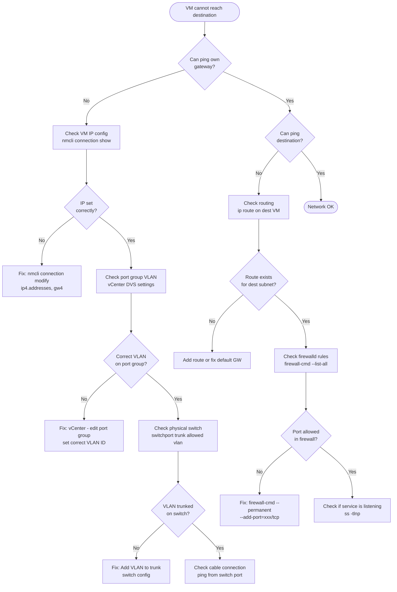

# Network Configuration — VMware DVS on VxRail

## Overview

VxRail comes with a pre-configured Distributed Virtual Switch (DVS) managed by vCenter.
All VM networking is defined through **Port Groups** on this DVS — no per-host config needed.

```
VxRail DVS (Distributed Virtual Switch)
├── Uplink: 25 GbE LACP bonded (vmnic0 + vmnic1 per host)
├── PG-Management    (VLAN 10)  — ESXi/vCenter management
├── PG-K8s-Nodes     (VLAN 20)  — K8s VMs (masters + workers)
├── PG-Databases     (VLAN 30)  — DB VMs
├── PG-Services      (VLAN 40)  — Harbor, MinIO, monitoring
└── (vSAN and vMotion VMkernels use dedicated VLANs 80/90 — pre-configured by VxRail)
```

---

## 1. Create Port Groups on VxRail DVS

### 1.1 Via vCenter UI

```
vCenter → Networking → VxRail-DVS → Actions → Add Distributed Port Group

For each port group:
  Name: PG-K8s-Nodes
  Number of ports: 128
  VLAN type: VLAN
  VLAN ID: 20

  Name: PG-Databases
  VLAN ID: 30

  Name: PG-Services
  VLAN ID: 40
```

### 1.2 Via govc CLI

```bash
export GOVC_URL=https://vcenter.internal.company.com
export GOVC_USERNAME=administrator@vsphere.local
export GOVC_PASSWORD="${VCENTER_PASSWORD}"
export GOVC_DATACENTER=Datacenter

DVS="VxRail-DVS"

# Create port groups
for PG_SPEC in \
  "PG-K8s-Nodes:20" \
  "PG-Databases:30" \
  "PG-Services:40"; do
  
  PG_NAME=$(echo $PG_SPEC | cut -d: -f1)
  VLAN_ID=$(echo $PG_SPEC | cut -d: -f2)
  
  govc dvs.portgroup.add \
    -dvs="${DVS}" \
    -type=earlyBinding \
    -nports=128 \
    -vlan="${VLAN_ID}" \
    "${PG_NAME}"
  
  echo "Created port group: $PG_NAME (VLAN $VLAN_ID)"
done
```

---

## 2. Physical Switch Requirements

VxRail's physical switch (ToR — Top of Rack) must have these VLANs trunked:

```
# On your physical switch (Cisco, Dell, Juniper — adapt syntax):

interface GigabitEthernet1/0/1   # Uplink from VxRail-1
  description VxRail-1-Uplink
  switchport mode trunk
  switchport trunk allowed vlan 10,20,30,40,80,90
  channel-group 1 mode active    # LACP if bonded uplinks

# Repeat for all 6 nodes' uplinks
```

---

## 3. Firewall / Security Group Rules

VxRail DVS supports Port Group security policies. For K8s nodes:

### 3.1 Port Group Security Policy

```
vCenter → PG-K8s-Nodes → Settings → Security
  Promiscuous mode: Reject        (default)
  MAC address changes: Accept     (needed for MetalLB gratuitous ARP)
  Forged transmits: Accept        (needed for MetalLB and keepalived VIPs)
```

> **Important:** MetalLB in ARP mode requires **Forged transmits: Accept** and **MAC address changes: Accept** on the port group, otherwise VIP advertisement will be silently dropped by DVS.

### 3.2 Host-Based Firewall on K8s Nodes (firewalld — Oracle Linux 9)

```bash
# Apply on all K8s nodes — masters and workers
# Run via ssh loop or Ansible
# Oracle Linux 9 uses firewalld, NOT ufw

NODES=(10.0.3.11 10.0.3.12 10.0.3.13 10.0.4.21 10.0.4.22)

for NODE in "${NODES[@]}"; do
ssh oracle@"$NODE" 'sudo bash -s' << 'SCRIPT'
# Enable firewalld
systemctl enable --now firewalld

# SSH from management subnet
firewall-cmd --permanent --add-rich-rule='rule family=ipv4 source address="10.0.1.0/24" port port=22 protocol=tcp accept'

# Kubernetes API server
firewall-cmd --permanent --add-port=6443/tcp

# etcd (control plane only)
firewall-cmd --permanent --add-rich-rule='rule family=ipv4 source address="10.0.3.0/24" port port="2379-2380" protocol=tcp accept'

# Kubelet API
firewall-cmd --permanent --add-port=10250/tcp

# NodePort services (accessed by load balancer and internal users)
firewall-cmd --permanent --add-port=30000-32767/tcp

# Calico BGP + VXLAN
firewall-cmd --permanent --add-port=179/tcp
firewall-cmd --permanent --add-port=4789/udp
firewall-cmd --permanent --add-port=5473/tcp

# MetalLB member communication
firewall-cmd --permanent --add-port=7946/tcp
firewall-cmd --permanent --add-port=7946/udp

# Allow all inter-node traffic within K8s subnets
firewall-cmd --permanent --add-rich-rule='rule family=ipv4 source address="10.0.3.0/24" accept'
firewall-cmd --permanent --add-rich-rule='rule family=ipv4 source address="10.0.4.0/24" accept'
firewall-cmd --permanent --add-rich-rule='rule family=ipv4 source address="192.168.0.0/16" accept'
firewall-cmd --permanent --add-rich-rule='rule family=ipv4 source address="10.96.0.0/12" accept'

# VRRP for keepalived
firewall-cmd --permanent --add-rich-rule='rule protocol value="vrrp" accept'

firewall-cmd --reload
firewall-cmd --list-all
SCRIPT
done
```

---

## 4. keepalived — K8s API VIP (10.0.3.100)

The Kubernetes API server VIP floats across the 3 control plane VMs.

### 4.1 Install on All 3 Masters

```bash
# On master-1, master-2, master-3
sudo dnf install -y keepalived

# Configure keepalived — run on EACH master, changing PRIORITY and STATE
# master-1: MASTER, priority 101
# master-2: BACKUP, priority 100
# master-3: BACKUP, priority 99
```

### 4.2 keepalived Config (master-1)

```bash
sudo tee /etc/keepalived/keepalived.conf << 'EOF'
! Configuration for k8s-master-1
global_defs {
  router_id k8s-master-1
}

vrrp_script chk_apiserver {
  script "/usr/bin/curl -sk https://localhost:6443/healthz -o /dev/null && exit 0 || exit 1"
  interval 3
  timeout 10
  fall 2
  rise 2
}

vrrp_instance k8s-vip {
  state MASTER            # BACKUP on master-2 and master-3
  interface ens192        # VMware VMXNET3 NIC on vSphere
  virtual_router_id 51
  priority 101            # 100 on master-2, 99 on master-3
  authentication {
    auth_type PASS
    auth_pass K8sVIPauth2026!
  }
  virtual_ipaddress {
    10.0.3.100/24 dev ens192
  }
  track_script {
    chk_apiserver
  }
}
EOF

sudo systemctl enable keepalived
sudo systemctl start keepalived
```

---

## 5. MetalLB — LoadBalancer Services

MetalLB provides `LoadBalancer` type Services in the bare-metal Kubernetes cluster.

### 5.1 Install MetalLB

```bash
kubectl apply -f https://raw.githubusercontent.com/metallb/metallb/v0.14.8/config/manifests/metallb-native.yaml
kubectl wait --namespace metallb-system \
  --for=condition=ready pod \
  --selector=app=metallb \
  --timeout=120s
```

### 5.2 Configure IP Pool and L2 Advertisement

```yaml
# metallb-config.yaml
apiVersion: metallb.io/v1beta1
kind: IPAddressPool
metadata:
  name: k8s-lb-pool
  namespace: metallb-system
spec:
  addresses:
    - 10.0.4.200-10.0.4.220    # IPs advertised by MetalLB on PG-K8s-Nodes VLAN 20
---
apiVersion: metallb.io/v1beta1
kind: L2Advertisement
metadata:
  name: k8s-l2-advert
  namespace: metallb-system
spec:
  ipAddressPools:
    - k8s-lb-pool
  interfaces:
    - ens192    # VMware VMXNET3 interface on all K8s nodes
```

```bash
kubectl apply -f metallb-config.yaml
```

> **VMware Requirement:** Port Group `PG-K8s-Nodes` must have **Forged Transmits** and **MAC Address Changes** set to **Accept** (see section 3.1).

---

## 6. Internal DNS Setup

All on-prem VMs need DNS entries. Add these records to your internal DNS server:

```bash
# Add to /etc/bind/db.internal.company.com (or your DNS provider)
# K8s control plane
k8s-master-1        IN A  10.0.3.11
k8s-master-2        IN A  10.0.3.12
k8s-master-3        IN A  10.0.3.13
k8s-api             IN A  10.0.3.100   ; VIP

# K8s workers
k8s-worker-1        IN A  10.0.4.21
k8s-worker-2        IN A  10.0.4.22
k8s-worker-3        IN A  10.0.4.23
k8s-worker-4        IN A  10.0.4.24
k8s-worker-5        IN A  10.0.4.25
k8s-worker-6        IN A  10.0.4.26

# Databases
db-dev-01           IN A  10.0.5.11
db-qa-01            IN A  10.0.5.12
db-preprod-01       IN A  10.0.5.13
db-preprod-02       IN A  10.0.5.14
db-prod-01          IN A  10.0.5.15
db-prod-02          IN A  10.0.5.16
db-prod-03          IN A  10.0.5.17
mongo-dev-01        IN A  10.0.5.21
mongo-qa-01         IN A  10.0.5.22
mongo-preprod-01    IN A  10.0.5.23
mongo-preprod-02    IN A  10.0.5.24
mongo-prod-01       IN A  10.0.5.25
mongo-prod-02       IN A  10.0.5.26
mongo-prod-03       IN A  10.0.5.27

# Services
harbor              IN A  10.0.6.12
minio               IN A  10.0.6.11
monitoring          IN A  10.0.6.13

# App endpoints (MetalLB IPs)
app-dev             IN A  10.0.4.200
app-qa              IN A  10.0.4.201
app-preprod         IN A  10.0.4.202
app-prod            IN A  10.0.4.210
```

---

## 7. Troubleshooting Network

| Problem | Check | Fix |
|---------|-------|-----|
| VMs can't reach each other | `ping` between VMs; check VLAN on port group | Ensure same VLAN on source/dest port groups; check physical switch VLAN trunk |
| MetalLB VIP not responding | `arping -I ens192 10.0.4.200` from worker | Set Forged Transmits=Accept on DVS port group |
| keepalived VIP not floating | `journalctl -u keepalived`; `ip addr show ens192` | Check VRRP priority; ensure `virtual_router_id` matches on all 3 masters |
| K8s nodes can't reach API VIP | `curl -k https://10.0.3.100:6443/healthz` | Check keepalived on masters; check ufw allows 6443 |
| DNS not resolving | `nslookup k8s-master-1.internal.company.com` | Check `/etc/resolv.conf`; verify cloud-init network-config DNS setting |
| vSAN traffic hitting VM NIC | Check VMkernel vmk1 has VLAN 90 and dedicated vmnic | Use vCenter Network I/O Control to prioritize vSAN traffic |

---

## 8. Physical Network Architecture

```
                         INTERNET / WAN
                              |
                         [FIREWALL]
                         (Cisco ASA / FortiGate)
                              |
                       [CORE SWITCH / ROUTER]
                         (Layer 3 routing)
                        /                \
          [ToR Switch-1]              [ToR Switch-2]
          Dell S5248F-ON              Dell S5248F-ON
          (Primary)                   (Secondary/Redundant)
          LACP VLT Stack              LACP VLT Stack
               |                            |
    +----------+----------+   +----------+----------+
    |          |          |   |          |          |
[VxRail-1] [VxRail-2] [VxRail-3] [VxRail-4] [VxRail-5] [VxRail-6]
  vmnic0    vmnic0    vmnic0    vmnic0    vmnic0    vmnic0
  vmnic1    vmnic1    vmnic1    vmnic1    vmnic1    vmnic1
 (25GbE)  (25GbE)  (25GbE)  (25GbE)  (25GbE)  (25GbE)

Each VxRail node:
  vmnic0 → uplink to ToR Switch-1
  vmnic1 → uplink to ToR Switch-2
  LACP 802.3ad active/active bond = 50Gbps effective bandwidth

Switch connectivity:
  Inter-switch link: 4x 100GbE QSFP28 between Switch-1 and Switch-2
  Management network: OOB mgmt port on each switch → management VLAN
```

---

## 9. Cisco IOS Switch Configuration (Full)

If your ToR switches are Cisco Catalyst, use this configuration:

```cisco
! =====================================================================
! Cisco Catalyst 9300 — VxRail Uplink Configuration
! Configure on BOTH switches (Switch-1 and Switch-2)
! =====================================================================

! Step 1: Create VLANs
vlan 10
 name Management
vlan 20
 name K8s-Nodes
vlan 30
 name Databases
vlan 40
 name Services
vlan 80
 name vSAN
vlan 90
 name vMotion

! Step 2: Set MTU to 9216 globally (jumbo frames for vSAN)
system mtu jumbo 9216

! Step 3: Configure LACP port-channel for VxRail-1 (repeat for nodes 2-6)
interface GigabitEthernet1/0/1
 description VxRail-1-vmnic0
 no shutdown
 switchport mode trunk
 switchport trunk native vlan 10
 switchport trunk allowed vlan 10,20,30,40,80,90
 mtu 9216
 channel-group 1 mode active
 spanning-tree portfast trunk

interface GigabitEthernet1/0/2
 description VxRail-1-vmnic1
 no shutdown
 switchport mode trunk
 switchport trunk native vlan 10
 switchport trunk allowed vlan 10,20,30,40,80,90
 mtu 9216
 channel-group 1 mode active
 spanning-tree portfast trunk

interface Port-channel1
 description VxRail-1-Bond
 switchport mode trunk
 switchport trunk native vlan 10
 switchport trunk allowed vlan 10,20,30,40,80,90
 mtu 9216

! Repeat for VxRail-2 through VxRail-6:
! VxRail-2: Gi1/0/3 + Gi1/0/4 → port-channel 2
! VxRail-3: Gi1/0/5 + Gi1/0/6 → port-channel 3
! VxRail-4: Gi1/0/7 + Gi1/0/8 → port-channel 4
! VxRail-5: Gi1/0/9 + Gi1/0/10 → port-channel 5
! VxRail-6: Gi1/0/11 + Gi1/0/12 → port-channel 6

! Step 4: Inter-switch uplinks (100GbE QSFP28)
interface TenGigabitEthernet1/1/1
 description Inter-Switch-Uplink-1
 no shutdown
 switchport mode trunk
 switchport trunk allowed vlan 10,20,30,40,80,90
 mtu 9216
 channel-group 100 mode active

interface Port-channel100
 description Inter-Switch-Stack-Link
 switchport mode trunk
 switchport trunk allowed vlan 10,20,30,40,80,90
 mtu 9216

! Step 5: Save config
copy running-config startup-config
```

---

## 10. Dell PowerSwitch OS10 Configuration (Full)

If your ToR switches are Dell PowerSwitch (recommended for VxRail):

```
! =====================================================================
! Dell PowerSwitch S5248F-ON — OS10 Configuration
! =====================================================================

! Step 1: Create VLANs
interface vlan 10
 description Management
 no shutdown
interface vlan 20
 description K8s-Nodes
 no shutdown
interface vlan 30
 description Databases
 no shutdown
interface vlan 40
 description Services
 no shutdown
interface vlan 80
 description vSAN
 no shutdown
interface vlan 90
 description vMotion
 no shutdown

! Step 2: Configure port-channel (LACP) for VxRail-1
interface port-channel 1
 description VxRail-1-LACP-Bond
 no shutdown
 switchport mode trunk
 switchport trunk allowed vlan 10,20,30,40,80,90
 mtu 9216

interface ethernet 1/1/1
 description VxRail-1-vmnic0
 no shutdown
 switchport mode trunk
 switchport trunk allowed vlan 10,20,30,40,80,90
 mtu 9216
 channel-group 1 mode active
 flowcontrol receive off
 spanning-tree portfast

interface ethernet 1/1/2
 description VxRail-1-vmnic1
 no shutdown
 switchport mode trunk
 switchport trunk allowed vlan 10,20,30,40,80,90
 mtu 9216
 channel-group 1 mode active
 flowcontrol receive off
 spanning-tree portfast

! Repeat for VxRail-2 through VxRail-6:
! VxRail-2: eth1/1/3 + eth1/1/4 → port-channel 2
! VxRail-3: eth1/1/5 + eth1/1/6 → port-channel 3
! etc.

! Step 3: Inter-switch VLT link
vlt-domain 1
 backup destination 192.168.0.2
 discovery-interface ethernet 1/1/49,1/1/50
 vlt-mac aa:bb:cc:dd:ee:ff

interface ethernet 1/1/49
 description VLT-Peer-Link-1
 no shutdown
 no switchport
 
interface ethernet 1/1/50
 description VLT-Peer-Link-2
 no shutdown
 no switchport

! Step 4: Save
copy running-configuration startup-configuration
```

---

## 11. MTU Verification (Jumbo Frames Test)

After configuring switches, verify jumbo frames work end-to-end:

```bash
# Test from ESXi host using vmkping (MTU 9000 = payload 8972 bytes)
# Run on each ESXi host via SSH

# SSH to ESXi host (enable SSH in vCenter first)
ssh root@10.0.1.21

# Test vSAN VMkernel can reach all other hosts with jumbo frames
# vmk1 = vSAN VMkernel
vmkping -I vmk1 -d -s 8972 10.0.80.22
vmkping -I vmk1 -d -s 8972 10.0.80.23
vmkping -I vmk1 -d -s 8972 10.0.80.24
vmkping -I vmk1 -d -s 8972 10.0.80.25
vmkping -I vmk1 -d -s 8972 10.0.80.26
# -d = don't fragment, -s = payload size
# All should show: "Ping 10.0.80.xx succeeded"
# If any fail: MTU is not set to 9000 end-to-end (switch or VMkernel)

# Test from a Linux VM (K8s node to K8s node)
ping -M do -s 8972 10.0.3.12
# -M do = don't fragment, -s = payload size (8972 + 28 byte header = 9000 MTU)
# Should succeed if DVS MTU is set correctly
```

---

## 12. Network Troubleshooting Flowchart



---

## 13. Port Reference Table — All Required Ports

| Port | Protocol | Source | Destination | Purpose |
|------|----------|--------|-------------|---------|
| 22 | TCP | Management VLAN (10.0.1.0/24) | All VMs | SSH management |
| 53 | TCP/UDP | All VMs | 10.0.1.5 | DNS |
| 123 | UDP | All VMs | 10.0.1.5 | NTP |
| 443 | TCP | All | vCenter (10.0.1.10) | vCenter HTTPS |
| 443 | TCP | All | Harbor (10.0.6.12) | Container registry |
| 443 | TCP | All | ArgoCD (MetalLB IP) | GitOps UI |
| 443 | TCP | All | MinIO (10.0.6.11) | S3-compatible storage |
| 2379-2380 | TCP | K8s masters | K8s masters | etcd cluster communication |
| 3000 | TCP | Monitoring VLAN | 10.0.6.13 | Grafana dashboard |
| 5432 | TCP | K8s workers, DBs | 10.0.5.11-17 | PostgreSQL |
| 6443 | TCP | All K8s nodes, kubectl clients | 10.0.3.100 (VIP) | Kubernetes API |
| 7946 | TCP/UDP | K8s workers | K8s workers | MetalLB member communication |
| 8443 | TCP | Monitoring | All K8s nodes | Kubelet HTTPS metrics |
| 9090 | TCP | Monitoring VLAN | 10.0.6.13 | Prometheus |
| 9100 | TCP | Prometheus | All nodes | Node exporter metrics |
| 10250 | TCP | K8s masters | K8s workers | Kubelet API |
| 10255 | TCP | Monitoring | K8s nodes | Kubelet read-only metrics |
| 27017 | TCP | K8s workers, DBs | 10.0.5.21-27 | MongoDB |
| 30000-32767 | TCP | Load balancers | K8s workers | NodePort services |
| 179 | TCP | K8s nodes | K8s nodes | Calico BGP |
| 4789 | UDP | K8s nodes | K8s nodes | Calico VXLAN overlay |

